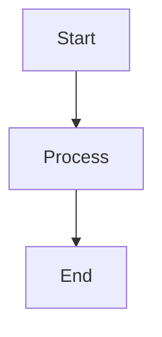

# Build Tales Automation Setup Guide

This guide will help you set up automated publishing to Medium, Substack, and other social media platforms via Zapier using **GitHub's free image hosting**.

## Overview

The automation system:
1. Renders Mermaid diagrams to SVG/PNG
2. **Saves images to your repository** (free GitHub hosting)
3. Generates GitHub image URLs automatically
4. Compiles Markdown with image fallbacks
5. Generates social media snippets
6. Publishes to Medium (via API)
7. Prepares Substack content (manual publishing)
8. Triggers Zapier for other platforms

## Why GitHub Images?

- **💰 Completely Free**: No storage or bandwidth costs
- **🚀 Integrated**: Works seamlessly with your GitHub workflow
- **🌐 Global CDN**: GitHub serves images worldwide
- **📝 Versioned**: Images are tied to your repository commits
- **🔒 Reliable**: GitHub's infrastructure handles the heavy lifting

## Prerequisites

- Node.js 20+ installed
- GitHub repository with Actions enabled
- Medium API access (optional)

## Quick Start

1. **Install dependencies:**
   ```bash
   npm ci
   ```

2. **Test locally:**
   ```bash
   npm run ci:all
   ```

3. **Check output:**
   - `assets/diagrams/` - Rendered SVG/PNG images
   - `assets/diagrams-manifest.json` - GitHub image URLs
   - `dist/` - Compiled Markdown with image fallbacks
   - `dist/social-snippets.json` - Social media snippets
   - `dist/medium-publish-results.json` - Medium publishing results
   - `dist/substack/` - Substack-ready markdown files

## Environment Variables

### Required for Medium Publishing

```bash
MEDIUM_ACCESS_TOKEN=your_medium_token
MEDIUM_USER_ID=your_medium_user_id
```

### Optional for Zapier

```bash
ZAPIER_HOOK_URL=https://hooks.zapier.com/hooks/catch/your-webhook
```

## Medium API Setup

1. **Get Access Token:**
   - Go to [Medium Settings > Integration tokens](https://medium.com/me/settings)
   - Generate a new integration token
   - Copy the token

2. **Get User ID:**
   - Make a request to: `https://api.medium.com/v1/me`
   - Use your access token in Authorization header
   - Extract `data.id` from the response

3. **Test API Access:**
   ```bash
   curl -H "Authorization: Bearer YOUR_TOKEN" \
        -H "Content-Type: application/json" \
        https://api.medium.com/v1/me
   ```

## GitHub Setup

### Repository Structure

Your repository will automatically create:
```
assets/
  diagrams/           # Rendered Mermaid diagrams
  diagrams-manifest.json  # GitHub image URLs
dist/                 # Compiled content
  *.md               # Markdown with image fallbacks
  social-snippets.json
  medium-publish-results.json
  substack/
```

### Image URLs

Images are automatically available at:
```
https://raw.githubusercontent.com/USERNAME/REPO/main/assets/diagrams/filename.svg
```

## GitHub Secrets Setup

1. **Go to your repository settings**
2. **Navigate to Secrets and variables > Actions**
3. **Add the following secrets:**

   ```
   MEDIUM_ACCESS_TOKEN
   MEDIUM_USER_ID
   ZAPIER_HOOK_URL (optional)
   ```

## Zapier Setup

### Trigger Options

1. **Webhook Trigger (Recommended):**
   - Use "Catch Hook" from Webhooks by Zapier
   - Copy the webhook URL to `ZAPIER_HOOK_URL` secret
   - GitHub Actions will POST to this URL

2. **GitHub Actions Artifact Trigger:**
   - Use "New Artifact in GitHub Actions" trigger
   - Select your repository and workflow
   - Trigger on new artifacts

### Action Mappings

#### LinkedIn
- **App:** LinkedIn
- **Action:** Create post
- **Content:** `{{snippets[0].linkedin}}`

#### Twitter/X
- **App:** Twitter
- **Action:** Create multiple tweets (thread)
- **Tweets:** 
  - Tweet 1: `{{snippets[0].twitter_thread[0]}}`
  - Tweet 2: `{{snippets[0].twitter_thread[1]}}`
  - Tweet 3: `{{snippets[0].twitter_thread[2]}}`

#### Facebook
- **App:** Facebook Pages
- **Action:** Create page post
- **Content:** `{{snippets[0].facebook}}`

#### Mastodon
- **App:** Webhooks by Zapier
- **Action:** Custom request
- **URL:** `https://your-instance.com/api/v1/statuses`
- **Method:** POST
- **Data:** `{"status": "{{snippets[0].mastodon}}"}`

## Content Structure

### Frontmatter Requirements

For best results, include these fields in your Markdown frontmatter:

```yaml
---
title: "Your Article Title"
tags: ["engineering-leadership", "fintech", "payments"]
categories: ["payments"]
canonical_url: "https://buildtales.dev/your-article-url"
---
```

### Mermaid Diagrams

The system automatically:
- Renders ````mermaid` blocks to SVG
- Saves to `assets/diagrams/` in your repo
- Generates GitHub image URLs
- Inserts image fallbacks
- Maintains original mermaid blocks

Example:
````markdown

````

## Workflow Commands

### Local Development

```bash
# Render diagrams only
npm run ci:render

# Generate GitHub image URLs only
npm run ci:github-urls

# Build markdown only
npm run ci:build

# Generate snippets only
npm run ci:snippets

# Publish to Medium only
npm run ci:medium

# Prepare Substack content only
npm run ci:substack

# Run complete pipeline
npm run ci:all

# Run complete pipeline + publishing
npm run ci:publish
```

### GitHub Actions

The workflow runs automatically on:
- Push to `main` branch
- Changes to `content/**/*.md`
- Changes to `tools/**`
- Changes to `package.json`

**Automatically commits:**
- Generated diagrams to `assets/diagrams/`
- Updated image manifest
- Built artifacts to `dist/`

## How It Works

1. **Push article** → GitHub Actions triggers
2. **Mermaid renders** → SVG files saved to `assets/diagrams/`
3. **GitHub URLs generated** → `assets/diagrams-manifest.json`
4. **Markdown compiles** → Images linked via GitHub raw URLs
5. **Content builds** → Ready for publishing
6. **Medium publishes** → Via API (optional)
7. **Substack prepared** → Markdown files ready
8. **Zapier triggered** → For other platforms

## Troubleshooting

### Common Issues

1. **Medium API Errors:**
   - Verify access token is valid
   - Check user ID is correct
   - Ensure token has write permissions

2. **Images Not Loading:**
   - Check `assets/diagrams-manifest.json` exists
   - Verify images were committed to repository
   - Check GitHub raw URLs are accessible

3. **Mermaid Rendering Issues:**
   - Check Chromium installation
   - Verify mermaid syntax
   - Check output directory permissions

4. **Zapier Not Triggering:**
   - Verify webhook URL is correct
   - Check GitHub Actions are running
   - Test webhook manually

### Debug Mode

Enable verbose logging:

```bash
DEBUG=* npm run ci:all
```

### Manual Testing

Test individual components:

```bash
# Test Medium API
curl -H "Authorization: Bearer $MEDIUM_ACCESS_TOKEN" \
     -H "Content-Type: application/json" \
     https://api.medium.com/v1/me

# Check generated images
ls -la assets/diagrams/
cat assets/diagrams-manifest.json
```

## Customization

### Adding New Platforms

1. **Create new tool:** `tools/publish-platform.mjs`
2. **Add script:** Update `package.json`
3. **Update workflow:** Add step to `.github/workflows/publish.yml`
4. **Add environment variables:** Update secrets

### Custom Content Processing

Modify `tools/compile-markdown.mjs` to:
- Add custom frontmatter
- Transform content format
- Insert platform-specific metadata

### Custom Diagram Themes

Update `tools/render-mermaid.mjs`:
```bash
npm run ci:render -- --theme dark
npm run ci:render -- --image-type png
```

## Performance Considerations

- **Rate Limiting:** Medium allows 10 requests/minute
- **File Sizes:** Large diagrams may slow rendering
- **GitHub Limits:** Repository size limits apply
- **Parallel Processing:** Consider for large article sets

## Security Notes

- Never commit API tokens to version control
- GitHub Actions run in isolated environment
- Images are publicly accessible (by design)
- Monitor repository size and commit history

## Support

For issues or questions:
1. Check GitHub Actions logs
2. Review generated artifacts
3. Test individual components
4. Check environment variables
5. Verify API permissions

## Next Steps

1. Set up Medium API access (optional)
2. Configure GitHub secrets
3. Test locally with `npm run ci:all`
4. Push to trigger GitHub Actions
5. Set up Zapier workflows
6. Monitor and optimize

## Cost Comparison

| Service | GitHub Images | S3 + CloudFront |
|---------|---------------|------------------|
| Storage | **Free** | $0.023/GB/month |
| Bandwidth | **Free** | $0.085/GB |
| CDN | **Free** | $0.0075/10k requests |
| Setup | **None** | IAM, bucket policies |
| **Total** | **$0/month** | **$5-50+/month** |

**GitHub Images save you $60-600+ annually!**
