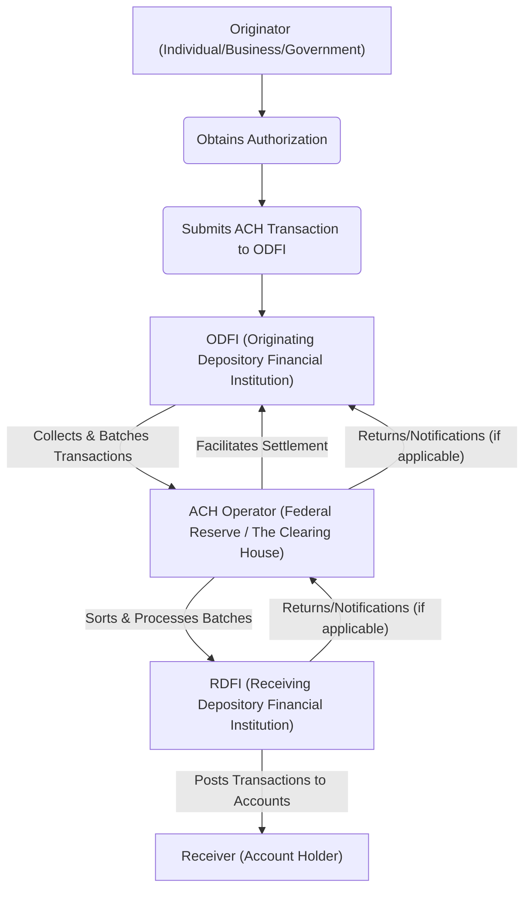

# How Money Moves In and Out of Your Bank Account
*The ACH network - the $72 trillion backbone of American banking.*




**Audience:** Fintech engineers, payroll developers, backend integrators  
**Reading Time:** 10 minutes  
**Prerequisites:** Basic knowledge of bank accounts, payment systems  
**Why Now:** ACH moves over $72 trillion annually. If you build anything involving U.S. money movement, you’ll touch it. Misunderstanding ACH leads to failed payroll runs, rejected files, and customer frustration.

> **TL;DR:**
> - ACH is the **batch processing backbone** of U.S. money movement
> - Debits = pull (bills, subscriptions), Credits = push (payroll, refunds)
> - ✅ Learn both flows with **working Ruby examples**
> - 🛠️ Validate routing, account formatting, and settlement before production

⚠️ **Disclaimer**: All scenarios, accounts, names, and data used in examples are not real. They are realistic scenarios provided only for educational and illustrative purposes.

---

## Problem Definition

**The challenge:** Engineers integrating ACH often struggle with **why transactions fail silently** or why settlement doesn’t happen as expected. Without knowing how ACH batches and routes transactions, you risk outages.

**Who faces this:** Payroll systems, billers, fintech apps, B2B payment platforms.

**Cost of inaction:** Failed payroll runs, compliance penalties, customer churn.

**Why standard tutorials fail:** They describe ACH as “a batch system” but don’t show **real code, routing numbers, or return handling.**

---

## What Is ACH?

**Automated Clearing House (ACH)** is a batch network that banks use to transfer money electronically. Unlike wire transfers, ACH trades speed for **efficiency and scale**.

💡 **Tip:** Think of it as a **postal service for money**. Banks gather transactions all day, bundle them into batches, and the ACH operator sorts and delivers them overnight.

### Flow Overview




ℹ️ **Note:** There are two ACH operators: [FedACH (Federal Reserve)](https://www.frbservices.org/financial-services/ach) and [EPN (The Clearing House)](https://www.theclearinghouse.org/payment-systems/ach).

---

## Paying Bills (ACH Debit)

When you pay your electric bill, you authorize the utility to **pull funds**.

### The Flow

1. You authorize the debit.
2. Your bank (ODFI) validates and sends to ACH.
3. The ACH operator routes it via FedACH (80%) or EPN (20%).
4. The utility’s bank (RDFI) posts the debit.
5. The utility credits your account.

```ruby
require 'ach'

# Create ACH debit for $125 utility bill
ach_file = ACH::ACHFile.new
ach_file.immediate_dest = '091000019'        # FedACH
ach_file.immediate_origin = '123456789'      # Utility’s bank
ach_file.immediate_dest_name = 'FEDERAL RESERVE BANK'
ach_file.immediate_origin_name = 'ELECTRIC COMPANY'

batch = ACH::Batch.new
batch.service_class_code = '225'             # Debits only
batch.company_name = 'ELECTRIC CO'
batch.company_identification = '1234567890'
batch.standard_entry_class_code = 'WEB'
batch.company_entry_description = 'UTIL BILL'
batch.effective_entry_date = Date.tomorrow.strftime('%y%m%d')

entry = ACH::EntryDetail.new
entry.transaction_code = ACH::CHECKING_DEBIT   # 27 = Debit
entry.routing_number = '061000052'             # Bank of America (example RDFI)
entry.account_number = '123456789'             # Customer account
entry.amount = 12500                           # $125 in cents
entry.individual_id_number = 'BILL202408'
entry.individual_name = 'JOHN DOE'

batch.entries << entry
ach_file.batches << batch

File.write('electric_bill_debits.ach', ach_file.to_s)
```

❗ **Warning:** ACH debits carry higher fraud risk. Unauthorized debits can be disputed.

---

## Receiving Salary (ACH Credit)

Payroll uses **credits** to push funds to employees.

### The Flow

1. Employer submits payroll instructions.
2. Employer’s bank (ODFI) creates credits.
3. ACH operator processes the batch.
4. Your bank (RDFI) posts deposits.
5. You see funds available.

```ruby
require 'ach'

# Payroll credit of $2,500
ach_file = ACH::ACHFile.new
ach_file.immediate_dest = '091000019'        # FedACH
ach_file.immediate_origin = '987654321'      # Employer’s bank
ach_file.immediate_dest_name = 'FEDERAL RESERVE BANK'
ach_file.immediate_origin_name = 'TECH STARTUP INC'

batch = ACH::Batch.new
batch.service_class_code = '220'             # Credits only
batch.company_name = 'TECH STARTUP'
batch.company_identification = '9876543210'
batch.standard_entry_class_code = 'PPD'
batch.company_entry_description = 'PAYROLL'
batch.effective_entry_date = Date.tomorrow.strftime('%y%m%d')

entry = ACH::EntryDetail.new
entry.transaction_code = ACH::CHECKING_CREDIT # 22 = Credit
entry.routing_number = '061000052'            # Bank of America
entry.account_number = '987654321'            # Employee account
entry.amount = 250000                         # $2,500 in cents
entry.individual_id_number = 'EMP001'
entry.individual_name = 'JANE SMITH'

batch.entries << entry
ach_file.batches << batch

File.write('payroll_credits.ach', ach_file.to_s)
```

ℹ️ **Note:** Payroll ACH batches are usually submitted **2 days before payday** to ensure timely settlement.

---

## Debit vs Credit Quick View

| Aspect | ACH Debit | ACH Credit |
|--------|-----------|------------|
| **Direction** | Pull money | Push money |
| **Initiator** | Receiver (biller) | Sender (employer) |
| **Use Cases** | Bills, subscriptions | Payroll, refunds |
| **Transaction Codes** | 27 (Debit) | 22 (Credit) |
| **Risk** | Higher (fraud disputes) | Lower |

---

## Validation & Monitoring

### How to Test
- Generate NACHA files and run through [FedACH test services](https://www.frbservices.org/financial-services/ach).
- Validate 94-character line lengths.
- Confirm routing numbers using ABA lookup.

### Success Metrics
- ✅ File accepted by ODFI.
- ✅ Settlement confirmed within expected window.
- ✅ No return codes (R01 = insufficient funds, R03 = no account).

### Common Failure Modes
- ❌ Wrong date format (must be YYMMDD).
- ❌ Incorrect transaction code.
- ❌ Invalid routing number.

💡 **Tip:** Monitor NACHA return codes. They are your early-warning system for broken billing or stale account info.

---

## Why ACH Matters

ACH processes **29B+ transactions annually**, worth **$72 trillion** with **99.95% reliability**. It powers:
- 93% of payroll via direct deposit ([NACHA](https://www.nacha.org/rules/ach-operations-bulletins-and-advisories))
- $2.3T in B2B payments ([BIS Quarterly Review](https://www.bis.org/cpmi/publ/d105.htm))
- 98% of U.S. government benefits ([Federal Reserve](https://www.frbservices.org/financial-services/ach))

It’s the **invisible backbone** of American money movement.

---

## Key Takeaways

- **ACH = postal service for money**: reliable, batch-processed, efficient.
- **Debits vs Credits:** Know the difference (pull vs push).
- **Every field matters:** Routing, account padding, transaction code.
- **Validate before production:** Use ODFI tools + settlement checks.
- **Monitor returns:** ACH return codes keep your system healthy.

---

## Acronyms

- **ACH** – Automated Clearing House
- **ODFI** – Originating Depository Financial Institution
- **RDFI** – Receiving Depository Financial Institution
- **PPD** – Prearranged Payment and Deposit
- **WEB** – Internet-Initiated Entry
- **EPN** – Electronic Payments Network
- **FedACH** – Federal Reserve Automated Clearing House
- **NACHA** – National Automated Clearing House Association
- **R01, R03** – Common ACH return codes (insufficient funds, no account)

---

## References

1. NACHA ACH Volume Stats - [NACHA ACH Volume Statistics, 2024](https://www.nacha.org/rules/ach-operations-bulletins-and-advisories)
2. FedACH - [Federal Reserve FedACH Services](https://www.frbservices.org/financial-services/ach)
3. EPN Overview - [The Clearing House EPN Overview](https://www.theclearinghouse.org/payment-systems/ach)
4. NACHA Operating Rules - [NACHA Operating Rules, 2024](https://www.nacha.org/rules)
5. Ruby ACH Gem - [Ruby ACH Gem Documentation](https://github.com/jm81/ach)
6. FRED ACH Credit Stats - [FRED ACH Credit Statistics](https://fred.stlouisfed.org/series/ACHCREDIT)
7. BIS Payment Systems - [BIS Payment Systems in the U.S.](https://www.bis.org/cpmi/publ/d105.htm)

---
