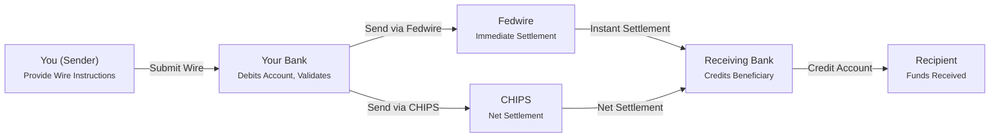

# Wire Transfers Explained: Fast, Final, and Expensive
*The express lane of money movement — immediate, final, and irreversible.*




**Audience:** Fintech engineers, payment architects, compliance developers  
**Reading Time:** 14 minutes  
**Prerequisites:** Familiarity with [ACH]() and payment APIs, basic Ruby/HTTP skills
**Why Now:** Wire transfers remain the backbone for large-value, urgent payments. With ACH same-day growing, engineers must know when (and why) wires still dominate.

> **TL;DR:**
> - Wire transfers settle **immediately** via Fedwire/CHIPS (domestic) or SWIFT (international).
> - They are **irreversible** — once funds move, there’s no clawback.
> - Costs are **high**: $15–$75 per transfer plus hidden fees.
> - Use cases: real estate, securities, international trade, emergency funds.

⚠️ **Disclaimer**: All scenarios, accounts, names, and data used in examples are not real. They are realistic scenarios provided only for educational and illustrative purposes.

---

## Problem Definition

**The challenge:** Moving large sums of money quickly and securely across banks.  
**Who faces this:** Businesses closing deals, individuals buying homes, institutions settling securities.  
**Cost of inaction:** Delays can derail closings, stall trades, or breach contracts.  
**Why standard approaches fail:** ACH is cheap but slow (1–3 days). Cards are fast but capped in value. Only wires guarantee immediate, final settlement.

---

## Solution Implementation

### What a Wire Transfer Is
A **wire transfer** is a direct, real-time, bank-to-bank electronic payment. Unlike ACH’s batch processing, wires move individually and settle immediately.

**Key properties:**
- ⚡ **Real-time** (minutes, not days)
- 🔒 **Final** (irreversible once sent)
- 💵 **High-value** (used for six-figure+ amounts)
- 💰 **Expensive** (fees stack across the chain)

---

### Networks That Power Wire Transfers

| Type | Network | Operator | Use Case |
|------|---------|----------|----------|
| **Domestic (U.S.)** | Fedwire | Federal Reserve | Real-time gross settlement |
| **Domestic (Private)** | CHIPS | The Clearing House | Net settlement for large-value USD wires |
| **International** | SWIFT | Belgium-based SWIFT | Cross-border wire messaging |  

- **Fedwire:** Instant settlement, central bank–backed.
- **CHIPS:** Netting system for high-value USD wires.
- **SWIFT:** Messaging rails for cross-border routing.

---

### How a Domestic Wire Transfer Works



*Domestic Wire Transfer Flow — processed either through Fedwire or CHIPS.*

---

### Implementation Example: Ruby Wire Request

Below is a **runnable Ruby implementation** for submitting a wire transfer. It validates inputs, formats as SWIFT MT103, and submits to a bank API.

```ruby
require 'net/http'
require 'json'

class WireTransfer
  FEDWIRE_ROUTING_PREFIX = %w[01 02 03 04 05 06 07 08 09 10 11 12].freeze
  
  def initialize(params)
    @sender_name = params[:sender_name]
    @sender_account = params[:sender_account]
    @sender_routing = params[:sender_routing_number]
    @amount_cents = params[:amount_cents]
    @currency = params[:currency] || 'USD'
    @recipient_name = params[:recipient_name]
    @recipient_account = params[:recipient_account]
    @recipient_routing = params[:recipient_routing_number]
    @purpose = params[:purpose]
  end
  
  def validate!
    raise "Invalid amount" if @amount_cents <= 0
    raise "Invalid sender routing" unless valid_routing?(@sender_routing)
    raise "Invalid recipient routing" unless valid_routing?(@recipient_routing)
    raise "Purpose required for wires" if @purpose.nil? || @purpose.empty?
    true
  end
  
  def to_wire_format
    {
      message_type: "MT103", # Standard SWIFT wire message
      sender: { name: @sender_name, account: @sender_account, routing: @sender_routing },
      recipient: { name: @recipient_name, account: @recipient_account, routing: @recipient_routing },
      amount: { value: @amount_cents, currency: @currency },
      purpose: @purpose,
      settlement_method: fedwire_eligible? ? "FEDWIRE" : "CHIPS"
    }
  end
  
  def submit_to_bank(api_endpoint, api_key)
    validate!
    uri = URI(api_endpoint)
    http = Net::HTTP.new(uri.host, uri.port)
    http.use_ssl = true
    
    request = Net::HTTP::Post.new(uri.path, {
      'Content-Type' => 'application/json',
      'Authorization' => "Bearer #{api_key}"
    })
    request.body = to_wire_format.to_json
    response = http.request(request)
    
    case response.code.to_i
    when 200..299 then JSON.parse(response.body)
    else raise "Wire submission failed: #{response.code} - #{response.body}"
    end
  end
  
  private
  
  def valid_routing?(routing)
    routing.length == 9 && routing.match?(/\A\d{9}\z/)
  end
  
  def fedwire_eligible?
    @currency == 'USD' && FEDWIRE_ROUTING_PREFIX.include?(@recipient_routing[0..1])
  end
end

# Example usage
wire = WireTransfer.new(
  sender_name: "Suma Manjunath",
  sender_account: "123456789",
  sender_routing_number: "021000021", # JPMorgan Chase
  amount_cents: 2_500_000, # $25,000
  recipient_name: "Tech Supplier Inc.",
  recipient_account: "987654321",
  recipient_routing_number: "031000053", # Wells Fargo
  purpose: "Hardware payment Q3"
)

begin
  result = wire.submit_to_bank("https://api.yourbank.com/v1/wire_transfers", "your_api_key_here")
  puts "✅ Wire initiated! Reference: #{result['wire_reference']}, Status: #{result['status']}"
rescue => e
  puts "❌ Wire failed: #{e.message}"
end
```

💡 **Tip:** In production, always enforce **dual authorization** for wires above $10,000 to reduce fraud risk.

---

## Validation & Monitoring

### How to Test Wire Transfers Safely
- Use **sandbox APIs** (e.g., Modern Treasury, SWIFT developer portal).
- Never test wires in production with real funds.

### Success Metrics
- ✅ Wire reference returned
- ✅ Settlement confirmation received
- ✅ Beneficiary confirmation

### Failure Modes
- ❗ Invalid routing/account number → rejected wire
- ❗ OFAC/sanctions hit → frozen until cleared
- ❗ Cutoff missed → delayed to next business day

---

## Takeaways

- **Wire = final, fast, expensive.**
- Use wires only when **speed + certainty** outweigh cost.
- ACH is smarter for recurring, non-urgent, or reversible payments.
- Always **validate recipient details** and **triple-check purpose** before sending.

---

## References

1. Federal Reserve — [Fedwire Funds Service](https://www.frbservices.org/financial-services/wires)
2. The Clearing House — [CHIPS Payment System](https://www.theclearinghouse.org/payment-systems/chips)
3. SWIFT — [Messaging Standards](https://www.swift.com/our-solutions/messaging)
4. Modern Treasury — [Wire Transfer API Docs](https://docs.moderntreasury.com/docs/wire-transfers)
5. OFAC (Treasury) — [Sanctions Compliance](https://ofac.treasury.gov/compliance)  

---
