# SEC Codes in ACH: Authorization, Compliance, and How to Not Get Burned
*The hidden three letters that determine whether your ACH payments pass — or put you on the regulator’s radar.*




**Audience:** Fintech engineers, compliance architects, payment ops teams  
**Reading time:** 14 minutes  
**Prerequisites:** Familiarity with [ACH]() [file formats](), basic NACHA rules  
**Why now:** Banks are tightening enforcement of SEC codes, and misclassification can mean immediate fines or processing restrictions.

> **TL;DR:**
> - SEC codes define *how authorization was obtained* for ACH payments.
> - Misclassification removes Reg E protections, leaving you liable.
> - Banks run **automated checks** for SEC code misuse — you will be flagged.
> - Implement business detection logic, retain authorizations 2+ years, validate WEB accounts before debit.

⚠️ **Disclaimer**: All scenarios, accounts, names, and data used in examples are not real. They are realistic scenarios provided only for educational and illustrative purposes.

---

## Problem Definition

**The challenge:** Many fintechs and businesses misclassify ACH transactions (e.g., treating payroll as CCD instead of PPD). This creates hidden compliance liability.

**Who faces this:** Payment startups, payroll providers, subscription billers, and any developer implementing ACH logic.

**Cost of inaction:**
- Disputes automatically lost due to incorrect classification.
- Bank audits → compliance warnings → potential cut-off from ACH.
- Financial losses from unrecoverable chargebacks.

**Why standard approaches fail:** Most developers only map “transaction type” (e.g., web, payroll, vendor) without encoding *authorization method* or *entity type* in SEC codes.

---

## Solution Implementation

### What SEC Codes Do

An ACH batch header always carries a **Standard Entry Class (SEC)** code:

```
5220TECH STARTUP    1234567890PPDPAYROLL    250816   1091000019000001
```

Here `PPD` means *consumer payment with signed authorization*. Change it to `CCD`, and you’ve **misrepresented the authorization basis**.

ℹ️ **Note:** SEC codes are **contract shorthand**. They define the ruleset (Reg E vs commercial agreements) that governs disputes.

---

### Core SEC Codes You’ll Use

| SEC Code | When to Use | Authorization | Dispute Risk | Example |
|----------|-------------|---------------|--------------|---------|
| **PPD** | Consumer recurring/single | Signed authorization | High (60-day Reg E) | Payroll |
| **CCD** | B2B payments | Corporate agreement | Low | Vendor settlement |
| **WEB** | Consumer online payments | Online + account validation | High fraud risk | E-commerce |
| **TEL** | Consumer phone payments | Recorded OR written confirmation | High | Call center bill pay |
| **ARC** | Check-by-mail converted to ACH | Implied via check | Moderate | Insurance premiums |
| **POP** | In-person check conversion | Implied at POS | Moderate | Legacy retail |

❗ **Warning:** Misclassify consumer payments as CCD and you strip away **Reg E protections** — leaving you liable for any customer disputes.

---

### Detecting Business vs Consumer

💡 **Tip:** Banks auto-flag mismatched patterns (e.g., business names in WEB payments). Build entity detection into your ACH logic.

```ruby
def determine_sec_code(account_holder_name, transaction_type, account_type = nil)
  business_indicators = ['LLC','INC','CORP','LTD','CO','COMPANY','LP','LLP']
  is_business = business_indicators.any? { |i| account_holder_name.upcase.include?(i) }

  if is_business || account_type == 'business'
    'CCD'
  else
    case transaction_type
    when 'web_authorization' then 'WEB'
    when 'recurring_payment' then 'PPD'
    when 'phone_authorization' then 'TEL'
    when 'check_conversion' then 'ARC'
    else
      raise "Unsupported transaction type: #{transaction_type}"
    end
  end
end
```

---

### Example: WEB Authorization Flow

```ruby
class WebACHAuthorization
  def capture_authorization(customer_params)
    verify_customer_identity(customer_params)
    present_nacha_disclosures
    
    authorization = build_authorization_record(customer_params)
    validate_account_before_first_debit(authorization)
    store_authorization_record(authorization)
  end

  private

  def build_authorization_record(customer_params)
    {
      customer_id: customer_params[:id],
      account_number: mask_account(customer_params[:account]),
      routing_number: customer_params[:routing],
      amount: customer_params[:amount],
      consent_timestamp: Time.current,
      ip_address: request.remote_ip,
      user_agent: request.user_agent,
      sec_code: 'WEB',
      nacha_disclosure_shown: true,
      customer_consent: customer_params[:i_agree] == 'true'
    }
  end

  def validate_account_before_first_debit(auth)
    AccountValidationService.verify(
      routing: auth[:routing_number],
      account: auth[:account_number]
    )
  end

  def store_authorization_record(authorization)
    AuthorizationRecord.create!(authorization)
  end
end
```

❗ **Warning:** Nacha requires account validation (e.g., microdeposits, Plaid) **before first WEB debit**.

---

## Validation & Monitoring

### Success Metrics
- ✅ 0% misclassified transactions (cross-check name vs SEC code).
- ✅ All WEB entries validated before first debit.
- ✅ Authorization evidence stored for **2+ years** with access logs.

### Failure Modes
- **Mismatched code:** Bank issues compliance warning within 72 hours.
- **Lost authorization evidence:** Automatic loss in Reg E disputes.
- **Improper TEL handling:** Missing recording → invalid debit.

### Troubleshooting
- Monitor SEC code mix monthly — spikes in WEB/TEL indicate fraud.
- Run random audits of stored authorizations.
- Cross-validate entity type vs SEC code.

---

## SEC Code Compliance Checklist

**Pre-Implementation**
- [ ] Map all flows to correct SEC codes
- [ ] Implement business detection logic
- [ ] Build retention system for 2 years

**Operational**
- [ ] Automate SEC assignment
- [ ] Validate WEB accounts before first debit
- [ ] Record TEL calls or send confirmations

**Ongoing**
- [ ] Audit records quarterly
- [ ] Monitor bank compliance feedback
- [ ] Respond to disputes within 10 days

---

## 📋 Decision Tree (SEC Code Selection)

```mermaid
flowchart TD
  A["Start: Identify Account Holder Type"] --> B["Is the account holder a business entity? (LLC, INC, CORP, etc.)"]
  B -- Yes --> C["Use CCD (or CCD+/CTX if remittance data required)"]
  B -- No --> D["How was authorization obtained?"]

  D -- Online form / website --> E["Use WEB (with account validation)"]
  D -- Phone call --> F["Use TEL (with recording or written confirmation)"]
  D -- Signed agreement --> G["Use PPD"]
  D -- Mailed check --> H["Use ARC"]
  D -- In-person check at register --> I["Use POP"]

  E --> J["Need remittance data? → PPD+ or CCD+; Full EDI → CTX"]
  F --> J
  G --> J
  H --> J
  I --> J
```




---

## Key Takeaways

- SEC codes are **legal encodings of authorization** — not just labels.
- Misclassification = **compliance liability + financial loss**.
- Build **entity detection + authorization retention** into your systems.
- Validate WEB entries before debit; retain evidence 2+ years.
- Monitor transaction patterns; banks run automated SEC compliance checks.

---

## References

1. NACHA. *Operating Rules & Guidelines* (2024) - [https://www.nacha.org/rules](https://www.nacha.org/rules)
2. Federal Reserve. *Regulation E: Electronic Fund Transfers* (2024) - [https://www.federalreserve.gov/regulations/](https://www.federalreserve.gov/regulations/)
3. NACHA. *Standard Entry Class Codes* (2024) - [https://www.nacha.org/products/ach-standard-entry-class-sec-code-quick-reference-cards-set-8](https://www.nacha.org/products/ach-standard-entry-class-sec-code-quick-reference-cards-set-8)

---
