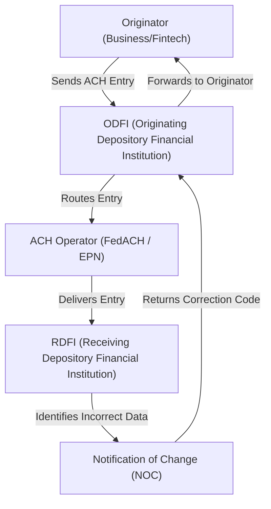

# ACH Correction Codes: Fix It, Log It, Prove It
*98% of ACH originators receive NOCs annually. Only the compliant ones avoid audit flags and mounting per-correction fees.*




**For:** Fintech engineers, ACH operations managers, compliance leads  
**Reading time:** 9 minutes  
**Prerequisites:** Familiarity with [ACH]() [file formats]() (PPD/CCD), basic NACHA rule knowledge  
**Why now:** NACHA’s compliance audits are more rigorous than ever, and repeated NOC mishandling can cost fintechs thousands in fees plus reputational damage.

> **TL;DR:**
> - NOCs are **mandatory corrections**, not optional suggestions.
> - Corrections must be applied **within 6 banking days** or **before the next file**, whichever comes first.
> - Build automated **logging + validation** so every fix is traceable.
> - Treat NOC handling as **cost control**—each ignored NOC increases fees.

⚠️ **Disclaimer**: All scenarios, accounts, names, and data used in examples are not real. They are realistic scenarios provided only for educational and illustrative purposes.

---

## Problem Definition

**The challenge:** ACH transactions are only as reliable as their input data. Typos in account numbers, outdated routing codes, or closed accounts trigger Notifications of Change (NOCs). Each NOC costs money, signals noncompliance, and if ignored, snowballs into repeated corrections.

**Who faces this:** Fintech engineers building payment rails, banks processing ACH debits/credits, and compliance officers under NACHA audit pressure.

**Cost of inaction:**
- **Direct fees**: $2–$5 per NOC multiplied across thousands of transactions.
- **Operational risk**: Auditors flag repeated uncorrected NOCs as compliance failures.
- **Customer churn**: Payment failures erode trust with vendors and clients.

**Why current approaches fail:** Many teams handle NOCs manually or treat them as low-priority. This leads to late corrections, missed audit trails, and duplicate errors. Manual fixes also increase the chance of overwriting valid data.

---

## Solution Implementation

### How ACH NOCs Work




### Step-by-Step Fix Process

1. **Receive the NOC**: Your ODFI passes correction codes from the RDFI.
2. **Decode the Code**: Examples:
    - `C01`: Incorrect Account Number
    - `C02`: Incorrect Routing Number
    - `C07`: Incorrect Transaction Code
3. **Validate the Correction**: Check routing number validity (ABA check digit), ensure account formats make sense.
4. **Update the Record**: Apply the fix to the customer/vendor in your **system of record**, not just the payments database.
5. **Log the Update**: Store timestamp, user/service making the change, and old vs. new values.
6. **Propagate the Fix**: The updated data **must appear in your very next outgoing file**.
7. **Verify Output**: Spot-check outgoing ACH batches to confirm corrected data flows through.

---

### Working Example: Python NOC Handler

```python
import datetime

# Example NOC correction
noc_example = {
    "code": "C01",  # Incorrect Account Number
    "original_account": "123456789",
    "corrected_account": "987654321",
    "routing_number": "061000052",  # Bank of America
    "customer_id": "CUST20240817",
    "received_date": "20240817"
}

# Simple audit log storage
audit_log = []

def validate_routing(routing):
    """Basic ABA routing number check-digit validation."""
    digits = [int(d) for d in routing]
    checksum = (
        3 * (digits[0] + digits[3] + digits[6]) +
        7 * (digits[1] + digits[4] + digits[7]) +
        (digits[2] + digits[5] + digits[8])
    ) % 10
    return checksum == 0

def apply_noc(noc):
    if noc["code"] == "C01":  # Incorrect Account
        if not validate_routing(noc["routing_number"]):
            raise ValueError("❌ Invalid routing number in NOC")
        
        # Apply correction
        updated_record = {
            "customer_id": noc["customer_id"],
            "account_number": noc["corrected_account"],
            "routing_number": noc["routing_number"],
            "updated_at": datetime.datetime.utcnow().isoformat()
        }
        
        # Log it
        audit_entry = {
            "customer_id": noc["customer_id"],
            "noc_code": noc["code"],
            "old_account": noc["original_account"],
            "new_account": noc["corrected_account"],
            "timestamp": updated_record["updated_at"]
        }
        audit_log.append(audit_entry)
        print(f"✅ Correction applied for {noc['customer_id']}")
        return updated_record
    else:
        raise ValueError(f"❌ Unsupported NOC code: {noc['code']}")

# Example run
try:
    updated = apply_noc(noc_example)
except Exception as e:
    print(str(e))

print("📜 Audit Trail:", audit_log)
```

**Success Output:**
```
✅ Correction applied for CUST20240817
📜 Audit Trail: [{'customer_id': 'CUST20240817', 'noc_code': 'C01', 'old_account': '123456789', 'new_account': '987654321', 'timestamp': '2025-08-31T12:00:00Z'}]
```

**Failure Case (bad routing):**
```
❌ Invalid routing number in NOC
```

---

## Validation & Monitoring

- **Testing:**
    - Simulate inbound NOCs (`C01`, `C02`, `C07`) with sample ACH return files.
    - Validate your system updates records **before the next outbound file**.

- **Success Metrics:**
    - **0 repeated NOCs** for the same customer within 30 days.
    - **100% corrections applied** within **6 banking days**.
    - **Audit trail coverage**: every NOC results in one logged entry.

- **Failure Modes:**
    - ❗ *Risk*: Applying unvalidated corrections → garbage-in-garbage-out.
    - ❗ *Risk*: Manual updates skipped → repeated NOCs.
    - ❗ *Risk*: Logs missing → audit noncompliance.

- **Troubleshooting:**
    - If NOCs repeat, cross-check against **master customer database**.
    - If corrections don’t appear in outgoing files, review ETL/batch propagation steps.

---

## Key Takeaways

- **NOCs are mandatory, not suggestions** → NACHA requires immediate updates.
- **Audit logs are non-negotiable** → timestamp, user, old vs. new values.
- **Corrections must propagate** → updated data in the **next ACH file**.
- **Costs are real** → every NOC carries a fee. Compliance is cost control.
- **Operators notice patterns** → repeat NOCs damage your credibility.

---

## References

1. NACHA ACH Volume Stats - [NACHA ACH Volume Statistics, 2024](https://www.nacha.org/rules/ach-operations-bulletins-and-advisories)
2. Federal Reserve ACH Services - [FedACH Services: Notification of Change, 2024](https://www.frbservices.org/resources/financial-services/ach/noc.html)  

---
