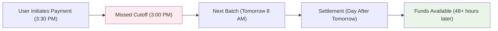

# ACH: The Good, The Bad, and The Ugly
*Still powering trillions. Still moving like it’s stuck in fax machine mode. ACH is the OG (“Original Gangster,” the long-standing foundational system) of payments — both the foundation and frustration of U.S. finance.*




**Audience:** Backend engineers, fintech developers, platform architects  
**Reading Time:** 12 minutes  
**Prerequisites:** Basic knowledge of payment rails, NACHA file formats, Ruby/Python familiarity  
**Why now:** Even with RTP and FedNow emerging, ACH still processes over **$72 trillion annually**, and fintech engineers must continue to design around its quirks.

> **TL;DR:**
> - ACH moves trillions cheaply — but with 1970s batch DNA.
> - Engineers must design for **delays, returns, and cutoff windows**.
> - Same-Day ACH is useful, but riddled with limits and hidden deadlines.
> - Fintech apps fake “instant” UX by fronting funds on ledgers.
> - To succeed: **engineer reconciliation, retries, and fraud mitigation upfront**.

⚠️ **Disclaimer**: All scenarios, accounts, names, and data used in examples are not real. They are realistic scenarios provided only for educational and illustrative purposes.

---

## Problem Definition

**The challenge:** ACH is cheap and universal, but slow, opaque, and operationally messy. Engineers designing fintech apps must reconcile its 1970s batch processing architecture with modern “real-time” UX expectations.

**Who faces this:** Fintech developers, payments engineers, B2B payout platforms, payroll providers, and compliance-heavy systems.

**Cost of inaction:**
- **User churn** when payouts appear delayed or fail silently.
- **Ops overhead** in reconciling NACHA return codes, Notifications of Change (NOCs), and cutoff mismatches.
- **Financial risk** when apps front funds and ACH later fails.

**Why current approaches fail:** Simply wrapping ACH in a UI doesn’t eliminate settlement delays, fraud risks, or reconciliation chaos. Engineers must **design systems that assume ACH failure** and handle operational edge cases explicitly.

---

## Solution Implementation

### Step 1: Understand ACH Mechanics

ACH is a **batch clearing system** — not real-time.

Key characteristics:
- **Settlement delay:** 1–2 business days standard, Same-Day ACH if cutoff met.
- **Files, not APIs:** ACH relies on NACHA-formatted files, not JSON/webhooks.
- **Returns + NOCs:** Failures and account updates arrive days later, via files.
- **Consumer vs. Business protections:** Regulation E (60-day reversal for consumers) vs. UCC 4A (tighter for businesses).

---

### Step 2: Model Costs

```ruby
# Compare $10,000 transfer costs across rails
payment_costs = {
ach: { fee: 1.00, finality: "1-3 days" },
wire: { fee: 25.00, finality: "Same day" },
card: { fee: 300.00, finality: "Immediate authorization (settlement + chargeback risk)" }
}

puts "ACH wins for transfers > $50 on flat-fee pricing"
```

💡 **Tip:** Always verify your processor’s ACH pricing. Some charge “percentage + flat fee,” which makes large transfers costly.

---

### Step 3: Handle Timing and Cutoffs



*Fallback image identical to Mermaid diagram with full labels is required for publishing.*

❗ **Warning:** Cutoff times vary by ODFI. Missing one can delay payroll or payouts by a full day.

---

### Step 4: Build Return Handling Logic

```ruby
def handle_ach_return(return_entry)
case return_entry.return_reason_code
when 'R01' then puts "❌ Insufficient funds"
when 'R03' then puts "❌ Invalid account"
when 'R29' then puts "❌ Customer disputes authorization"
else puts "⚠️ Generic return: #{return_entry.return_reason_code}"
end
end
```

ℹ️ **Note:** ACH has **50+ return codes**. Build robust mapping logic, not hardcoded conditionals.

---

### Step 5: Implement Same-Day ACH (Carefully)

```ruby
def validate_same_day(payment)
raise "Exceeds $1M limit" if payment.amount_cents > 100_000_000
raise "Weekend not allowed" unless Date.today.on_weekday?
raise "Missed cutoff" if Time.now.hour >= 14
end
```

💡 **Tip:** Operator deadlines differ from your bank’s. Always confirm ODFI cutoff times.

---

## Validation & Monitoring

- **Testing:** Submit a batch with mixed valid + invalid accounts. Ensure return codes reconcile correctly.
- **Metrics:** Track **return rate (%)**, **average settlement delay**, **cutoff misses per month**.
- **Failure Modes:**
    - Orphaned returns (trace mismatch) → build manual review queues.
    - NOCs ignored → future payments will keep failing.
    - Float mismanagement → real balance drift vs. ledger balance.

```ruby
# Example: detecting late returns
if Time.now > expected_settlement_date + 2.days
alert("ACH return delay exceeds SLA")
end
```
---

## Key Takeaways

1. **ACH is cheap and universal** but built for batch settlement, not real-time.
2. **Reconciliation logic is non-negotiable** — design for failures from day one.
3. **Same-Day ACH helps** but requires cutoff awareness and eligibility checks.
4. **Consumer vs. business protections differ** — know your fraud exposure.
5. **Don’t fake instant transfers without safeguards** — float management = real credit risk.

---

## Next Steps

- Implement a **return code handler** and integrate with customer notifications.
- Set up monitoring for **cutoff compliance** and **return delays**.
- Map out **migration paths**: when to use ACH vs. RTP/FedNow for specific use cases.

---

## Acronyms

- **OG** – Original Gangster
- **ACH** – Automated Clearing House
- **ODFI** – Originating Depository Financial Institution
- **RDFI** – Receiving Depository Financial Institution
- **NOC** – Notification of Change
- **RTP** – Real-Time Payments
- **UCC 4A** – Uniform Commercial Code, Article 4A (business account rules)

---

## References

1. NACHA ACH Volume Stats - [NACHA ACH Volume Statistics, 2024](https://www.nacha.org/rules/ach-operations-bulletins-and-advisories)
2. Fed ACH Guide - [ACH Same Day Processing, 2024](https://www.frbservices.org/financial-services/ach)
3. NACHA Rules - [2024 NACHA Operating Rules](https://www.nacha.org/rules)
4. Ruby NACHA Gem - [ACH File Processing for Ruby, 2024](https://github.com/jm81/nacha)
5. Federal Reserve Data - [ACH Return Codes and Processing, 2024](https://fred.stlouisfed.org/series/ACHRETURN)
6. TCH ACH Guide - [Same Day ACH Implementation Guide, 2024](https://www.theclearinghouse.org/payment-systems/ach)  

---
