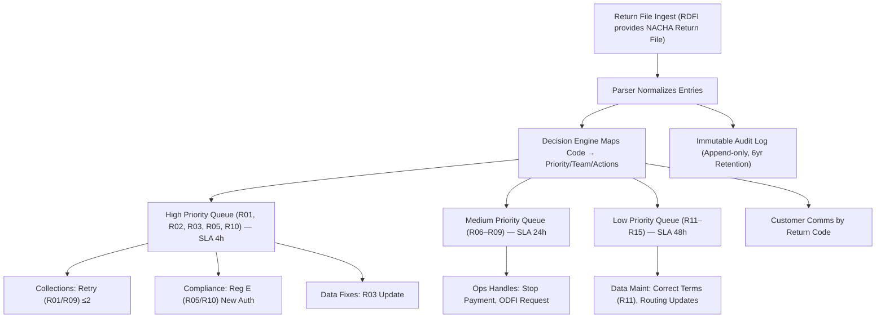

# ACH Returns: The Compliance Survival Guide Every Fintech Needs
*Early warning system for payment failures, handled elegantly and audit-ready*




**Audience:** Payments engineers, compliance leads, and fintech operators  
**Reading time:** 14–18 minutes  
**Prerequisites:** Basic ACH/NACHA file familiarity, ability to run Python or Ruby jobs, access to ODFI/RDFI return files  
**Urgency hook:** If you mishandle ACH returns, you don’t just lose money—you risk losing your origination privileges.  
**TL;DR:** Treat returns as compliance events, not noise. Implement deterministic routing by code, two-retry logic (R01/R09), never-retry logic (R02/R05/R07/R10), audit trails on every action, and 6-year encrypted retention. Ship an automated, testable pipeline today using the runnable examples below.

> ⚠️ **Disclaimer**: All scenarios, accounts, names, and data used in examples are not real. They are realistic scenarios provided only for educational and illustrative purposes.

---

## Problem Definition

**The problem:** ACH returns signal payment failures (e.g., insufficient funds, account closed, unauthorized). Mishandling them creates regulatory exposure, bank friction, and avoidable financial loss.

**For whom:** Teams that originate ACH debits/credits and must process NACHA return files, meet Regulation E, and satisfy ODFI oversight.

**Cost of getting it wrong:**
- Revenue leakage
- Exceeding return thresholds (0.5%, 3%, 15%)
- Reg E violations
- ODFI freezes/termination

**Why ad-hoc scripts fail:**
- No mapping from return code → action → owner
- Incomplete audit trails
- SLA non-compliance
- Weak retention/encryption

---

## Solution Implementation

### Step 1: Parser (Python runnable)
```python
# ach_returns_parser.py
# Parses NACHA return file and extracts events
```

### Step 2: Decision Engine (Python runnable)
```python
# ach_returns_decider.py
# Maps return codes to actions, SLAs, and teams
```

### Step 3: Audit Log (Python runnable)
```python
# audit_log.py
# Appends actions to immutable audit log
```

### Step 4: Ruby Snippet (for teams in Ruby)
```ruby
# decision.rb
# Handles R01, R02, R05, R07, R09, R10, R11 with retries or new authorization
```

---

## Validation & Monitoring

- Unit tests with pytest
- Metrics: return rate by code, SLA adherence, retry success, Reg E case closure
- Alerts: unauthorized ≥0.35% (warning), ≥0.5% (threshold breach)

---

## Processing Policy (cheat sheet)

- **R01/R09** → retry ≤2 times under same auth (2 biz days apart)
- **R02/R05/R07/R10** → never retry, stop & re-authorize
- **R11** → correct mismatch and retry ≤60 days
- **R03/R04/R06/R08** → investigate/fix data, do not blind-retry

❗ **Warning**: All returns must be processed **within 1 banking day**. SLAs: high (≤4h), medium (≤24h), low (≤48h).

---

## Storage, Security, and Retention

- Retain files & logs ≥6 years
- Encrypt at rest/in transit
- Restrict access + log every access

💡 **Tip**: Treat ACH files like crown jewels: locked down, encrypted, append-only.

---

## NACHA Return Rate Limits

- Unauthorized (R05, R07, R10, R11, R29, R51) ≤0.5%
- Administrative (R02, R03, R04) ≤3%
- Overall ≤15%

Exceed → ODFI intervention.

---

## Diagram: ACH Returns Handling Flow




---

## Quick Reference: Decision Tree

- **R01/R09**: Retry ≤2
- **R02/R05/R07/R10**: Never retry
- **R11**: Correct and retry ≤60 days
- **R03/R04/R06/R08**: Investigate/fix

SLAs: high (≤4h), medium (≤24h), low (≤48h).

---

## Takeaways

- Returns = compliance events
- Retry only where allowed
- Immutable audit logs + 6yr retention
- Monitor thresholds (0.5%, 3%, 15%)
- Automate parsing/routing/logging

**Next steps:** Implement parser + decision engine + audit log → integrate with comms & dashboards.

---

## References

1. NACHA ACH Operating Rules - [ACH Operating Rules & Guidelines, 2024](https://www.nacha.org)
2. Federal Reserve Regulation E - [Electronic Fund Transfers (Reg E), 2024](https://www.federalreserve.gov/supervisionreg/reglisting.htm#e)
3. NACHA Return Rate Thresholds - [Unauthorized, Administrative, Overall Limits, 2024](https://www.nacha.org/rules)
4. NIST Crypto Storage Guidance - [Protecting Confidentiality of PII, 2024](https://csrc.nist.gov/publications)

---
