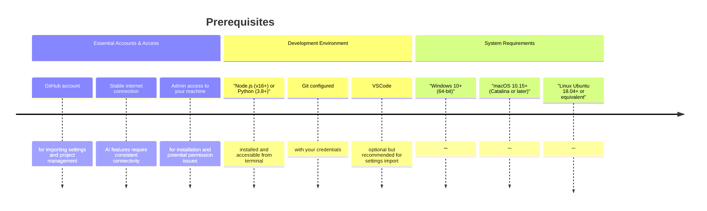
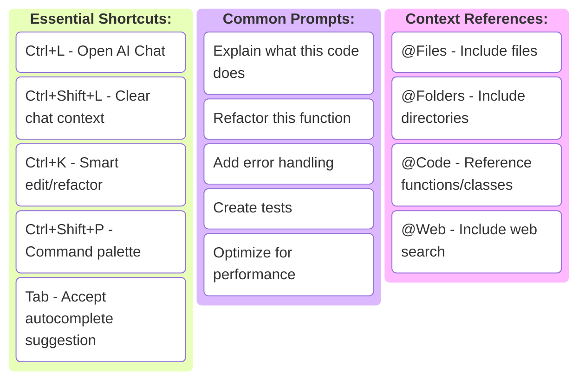

# Cursor Pro: Zero to Expert — The Complete Developer’s Journey

**One-line metric:** Go from first install to a production PR with AI pair-programming in **7 days**, and a measurable **3–5× feature throughput** by **week 6**.  
**Audience:** Individual developers, tech leads, and platform engineers adopting Cursor Pro.  
**Reading time:** ~20 minutes.  
**Prerequisites:** Git, Node.js 18+ or Python 3.10+, a GitHub account, and a sample repo you can freely modify.  
**Urgency hook:** Teams that standardize AI workflows early capture compounding velocity gains—late adopters spend months unlearning ad-hoc habits.  
**TL;DR:** Install Cursor → wire a tiny app and tests → codify standards in `.cursorrules` → scale to refactors, code review, and CI checks. This guide gives you runnable examples, validation steps, and production guardrails.

> ⚠️ **Disclaimer**: All scenarios, accounts, names, and data used in examples are not real. They are realistic scenarios provided only for educational and illustrative purposes.

---

## Problem Definition

**The challenge:** Most developers plateau with Cursor after testing autocomplete once. They get novelty value, but no production gains.  
**Who faces this:** Individual contributors, tech leads, and teams piloting AI workflows.  
**Cost of inaction:** Expensive licenses wasted, inconsistent coding styles across repos, rework from hallucinated APIs, and slower onboarding.  
**Why current solutions fail:** Existing tutorials stop at “Hello World” and don’t cover tests, `.cursorrules`, or CI/CD integration.

---

## Quick Start (Skip to Phase 1 if you prefer the full journey)

**Want to jump in immediately? Here's your 15-minute setup:**

1. **Download & Install** (2 min): [cursor.com](https://cursor.com/)
2. **Enable Pro** (1 min): Start 14-day trial
3. **First AI Chat** (5 min): Press `Ctrl+L`, ask "Create a simple React counter component"
4. **Test Autocomplete** (5 min): Start typing a function, let AI complete it
5. **Verify Setup** (2 min): You should see AI suggestions and chat working

💡 **Tip:** Most devs see value within 15 minutes.

---

## Day Zero Prep: What You Need Before Starting




❗ **Warning:** On corporate devices, admin approval may be required to install Cursor.

---

## Troubleshooting Common Issues

| Symptom | Likely Cause | Solution |
|---------|--------------|----------|
| Cursor won’t start | OS version too old | Verify Windows 10+, macOS 10.15+, Ubuntu 18.04+ |
| Import settings failed | Wrong file path | Copy VSCode settings manually from system folder |
| AI features not working | Not connected or trial expired | Enable Pro, check firewall and network |
| Cursor suggests wrong APIs | Model hallucination | Use `@Web` with official docs, enforce `.cursorrules` |
| Style inconsistent | No shared rules | Create `.cursorrules` at repo root and commit it |

---

## Quick Reference Card




---

## Runnable Example: React Counter with Tests

**`Counter.tsx`**
```tsx
import { useState } from "react";

export default function Counter() {
  const [count, setCount] = useState(0);
  return (
    <div>
      <p>Count: {count}</p>
      <button onClick={() => setCount(count + 1)}>Increment</button>
      <button onClick={() => setCount(0)}>Reset</button>
    </div>
  );
}
```

**`Counter.test.tsx`**
```tsx
import { render, screen, fireEvent } from "@testing-library/react";
import "@testing-library/jest-dom";
import Counter from "./Counter";

test("increments and resets", () => {
  render(<Counter />);
  expect(screen.getByText(/Count: 0/)).toBeInTheDocument();
  fireEvent.click(screen.getByText("Increment"));
  expect(screen.getByText(/Count: 1/)).toBeInTheDocument();
  fireEvent.click(screen.getByText("Reset"));
  expect(screen.getByText(/Count: 0/)).toBeInTheDocument();
});
```

✅ Run with `npm test`.

---

## Runnable Example: Express API with Zod

**`index.ts`**
```ts
import express from "express";
import { z } from "zod";

const app = express();
app.use(express.json());

const PaymentIntent = z.object({
  id: z.string().min(8),
  amount_cents: z.number().int().positive(),
  routing_number: z.string().regex(/^\d{9}$/), // Example: 061000052
  account_number: z.string().regex(/^\d{6,17}$/), // Example: 123456789
  requested_on: z.string().regex(/^\d{8}$/) // YYYYMMDD e.g., 20240817
});

type PaymentIntent = z.infer<typeof PaymentIntent>;
const store = new Map<string, PaymentIntent>();

app.post("/api/payment-intents", (req, res) => {
  const parse = PaymentIntent.safeParse(req.body);
  if (!parse.success) return res.status(400).json({ error: "ValidationFailed" });
  const intent = parse.data;
  if (store.has(intent.id)) return res.status(409).json({ error: "Duplicate" });
  store.set(intent.id, intent);
  return res.status(201).json({ status: "accepted", intent });
});

app.get("/api/payment-intents/:id", (req, res) => {
  const found = store.get(req.params.id);
  if (!found) return res.status(404).json({ error: "NotFound" });
  return res.json(found);
});

app.listen(3001, () => console.log("API running on http://localhost:3001"));
```

✅ Run with `npm run dev`, test using:
```bash
curl -s http://localhost:3001/api/payment-intents/pi_demo_001
```

---

## The Five W’s Framework

Quality of prompts = quality of results. Always specify **Who, What, When, Where, Why**.

**Example Prompt:**  
*"I’m a senior dev (Who) reviewing a React auth component (What). It goes live next week during Black Friday (When) under 10× traffic (Where). Any security or perf issues could cost $100k lost sales (Why). Can you review this for vulnerabilities?"*

---

## Phased Learning Journey

- **Phase 1: Getting Started (Days 1–7)** → Install Cursor, generate simple code, practice Chat vs Autocomplete.
- **Phase 2: Building Confidence (Weeks 2–4)** → Debug unfamiliar repos, build JWT auth, create `.cursorrules`.
- **Phase 3: Advanced Workflows (Months 2–3)** → Refactor large repos (1000+ LOC), adopt shared rules, measure productivity.
- **Phase 4: Expert Level (Month 4+)** → Integrate Cursor into CI/CD, build production apps, mentor new users.

---

## Validation & Monitoring

### How to Test
- Run React tests with `npm test` → expect green.
- Run API with `npm run dev` → cURL returns `201` for valid, `400` for invalid, `409` for duplicate.

### Success Metrics
- PR cycle time reduced by 40–60% in 6 weeks.
- AI-generated code test pass rate >95%.
- Reduced review rounds (target ≤2).

### Common Failure Modes
| Symptom | Likely Cause | Resolution |
|---------|--------------|------------|
| AI generates unused APIs | Hallucination | Require `@Web` doc link, add tests |
| Code style drift | Missing rules | Centralize `.cursorrules` |
| Slow adoption | Lack of examples | Share working snippets + progress reports |

❗ **Warning:** Never merge AI-generated code without tests.

---

## Glossary of AI Development Terms

| Term | Definition |
|------|------------|
| **Autocomplete** | AI-powered code suggestions that appear as you type. |
| **Chat Mode** | Conversational interface for planning, debugging, and explaining code. |
| **Cursor Rules (.cursorrules)** | Config files that define AI behavior, coding standards, and project context. |
| **Hallucination** | When AI generates code that references non-existent APIs or libraries. |
| **Prompt Engineering** | Writing clear, specific instructions for AI to produce useful results. |
| **Human-in-the-Loop (HITL)** | Ensuring all AI-generated code is reviewed and tested by a human. |

---

## Community Exercises

- Share `.cursorrules` files across your team and compare impact.
- Run weekly retros: what worked well with AI? Where did it fail?
- Track adoption metrics (test pass rate, PR cycle time) and discuss in sprint reviews.

💡 **Tip:** Encourage developers to commit **prompts and rules** alongside code for team learning.

---

## Takeaways

- Cursor + tests + `.cursorrules` = production-ready AI coding.
- Prompts must encode Who/What/When/Where/Why.
- CI ensures AI output stays aligned.
- Success comes from **committing prompts, rules, and tests** alongside your code.

---

## References

1. Cursor Docs - [Cursor Documentation, 2025](https://docs.cursor.sh/)
2. Cursor Pro - [Cursor Pro Feature Overview, 2025](https://cursor.com/)
3. Zod Validation - [Zod Documentation, 2025](https://zod.dev/)
4. Vitest Test Runner - [Vitest Documentation, 2025](https://vitest.dev/)
5. Express Framework - [Express API Documentation, 2025](https://expressjs.com/)

---
