# Optimizing Cursor Prompts: How to Stay Under API Limits While Maximizing AI Assistance

*Reduce API costs significantly with targeted context management*



  

**Audience** Software engineers and AI-assisted developers\
**Reading Time:** 12 minutes\
**Prerequisites:** Basic Cursor usage, familiarity with prompt engineering\
**Why Now:** Rising API costs and token overages in Cursor Pro make optimization urgent for developers scaling daily use

> **TL;DR:**
>
> - Replace `@Codebase` with specific `@File.js` references (8x cheaper).
> - Clear context every \~10 exchanges or when warning signs appear.
> - Keep requests <2,000 tokens (\~\$0.03) for efficiency.
> - Use progressive disclosure: start with minimal context, expand only as needed.

⚠️ **Disclaimer**: All scenarios, accounts, names, and data used in examples are not real. They are realistic scenarios provided only for educational and illustrative purposes.

---

## Problem Definition

**The challenge:** Developers using Cursor Pro frequently hit the **500 fast request limit** or exceed token budgets, leading to unexpected costs and degraded AI responses.

**Who faces this:** Solo developers and teams working on medium-to-large codebases, especially those leaning on AI for debugging, refactoring, or feature development.

**Cost of inaction:**

- Overages: \$30–\$75/month in unplanned charges
- Slowdowns: Token-heavy requests result in latency and truncated answers
- Poor ROI: Wasting 8,000 tokens on vague prompts instead of 800 on targeted ones

**Why current approaches fail:**

- Developers overuse `@Codebase` and entire-folder references
- Long-running conversations accumulate hidden context
- Prompts are often too vague (“fix my app”) instead of surgical (“fix bug in AuthService.js line 45”).

---

## Solution Implementation

### Step 1: Understand Cursor’s Token Economics

Each request consumes **input tokens** (your prompt, files, conversation history) and **output tokens** (AI response). Cost is tied directly to **total tokens used**.

💡 **Note:** Token math varies by content type. Code is denser than prose, JSON/YAML lighter than JS/Python. Always treat estimates as **rough ballpark figures**.

---

### Step 2: Use the Context Pyramid

```mermaid
flowchart TD
  A["Level 1: Direct Question (200 tokens)"] --> B["Level 2: +Single File (800 tokens)"]
  B --> C["Level 3: +Related Files (1,500 tokens)"]
  C --> D["Level 4: +Folder Context (3,000+ tokens)"]
  D --> E["Level 5: +Codebase + Web Search (5,000–8,000 tokens)"]
```




💡 **Tip:** Stay in Levels 1–2 for 80% of daily dev work. Only descend if you hit blockers.

---

### Step 3: Replace @Codebase with File-Scoped Prompts

**Before:**

```cursor
@Codebase "How do I add error handling?"
```

~~8,000 tokens (~~\$0.12)

**After:**

```cursor
@UserForm.js "Add error handling to the submit function"
```

~~800 tokens (~~\$0.01)

✅ 10x cheaper, sharper answers

---

### Step 4: Implement an Enhanced Token Calculator

```javascript
// Enhanced token estimator
function estimateTokens(prompt, files = [], lang = "js", hasContext = false) {
  const ratios = { js: 10, py: 9, json: 6, yaml: 5, txt: 4 }; // tokens per line
  const promptTokens = Math.ceil(prompt.length / 4);
  const fileTokens = files.reduce((sum, f) => {
    const multiplier = ratios[lang] || 8;
    return sum + (f.lines * multiplier);
  }, 0);
  const contextBuffer = hasContext ? 800 : 0; // reserve for conversation history/system
  return promptTokens + fileTokens + contextBuffer;
}

// Example: 150-line AuthService.js file with context
console.log(
  estimateTokens("Fix bug in AuthService login", [{ name: "AuthService.js", lines: 150 }], "js", true)
); // ≈ 2,300 tokens
```

💡 **Note:** These values are **approximations**. For precise measurement, use [OpenAI’s tokenizer](https://platform.openai.com/tokenizer).

---

### Step 5: Apply SMART Prompt Framework

- **Specific:** “Fix TypeError in AuthService.js line 34”
- **Measurable:** “Return refactored function using async/await”
- **Achievable:** Break tasks into smaller steps
- **Relevant:** Include only needed files
- **Time-bound:** “Review login flow, not entire app”

---

## Validation & Monitoring

### Success Metrics

- Average tokens/request: **<2,000**
- Context clears: **≥1 per 10 exchanges**
- “Token per completed task” ratio: **<3,000**

### Failure Modes

- **High Latency:** Context too large → clear immediately
- **Truncated Answers:** Output capped due to token budget → split into smaller tasks
- **Overages:** Usage >500 requests → evaluate custom API keys

### Context Clearing Checklist

Clear context when:

- Context size >5,000 tokens (⚠️ high-cost zone)
- Requests slow down noticeably
- Responses degrade (“I can’t keep track…” errors)
- Switching between **unrelated tasks** (auth vs UI)
- After finishing a major feature/debugging task

**Shortcut:** `Ctrl + Shift + L` (Pro) or manually summarize + restart (Enterprise).

💡 **Tip:** Before clearing, ask the AI: *“Summarize our key decisions so far.”* Then restart lean without losing direction.

---

## Cost Context: Baseline vs Overages

| Usage Pattern       | Requests/Month | Monthly Cost |
| ------------------- | -------------- | ------------ |
| Normal Dev (20/day) | \~600          | \$20–\$30    |
| Heavy Dev (35/day)  | \~1,000        | \$45–\$60    |
| Team Lead (50/day)  | \~1,500        | \$70–\$95    |

📊 **Baseline:** Cursor Pro base plan = \$20/month for 500 requests.\
📊 **Overages:** Additional requests at \$0.03–\$0.05 each.

---

## Takeaways

- **Context is currency**: treat tokens like billable hours
- **Precision saves money**: target files, not entire repos
- **Clear often**: reset context to stay lean
- **Batch smartly**: group related fixes in one request

---

## Next Steps

1. Install a **token counter** script or browser extension.
2. Audit last 10 Cursor sessions for wasteful patterns.
3. Update your `.cursorrules` to be concise and token-efficient.
4. Share optimization wins with your team.

---

## Acronyms

- **API** – Application Programming Interface
- **ROI** – Return on Investment
- **ODFI** – Originating Depository Financial Institution

---

## References

1. Cursor Pricing Guide - [Cursor Pricing, 2024](https://cursor.so/pricing)
2. OpenAI Token Calculator - [OpenAI Tokenization, 2024](https://platform.openai.com/tokenizer)
3. Prompt Engineering Patterns - [Anthropic Prompt Optimization, 2024](https://www.anthropic.com/news/prompt-engineering)
---
