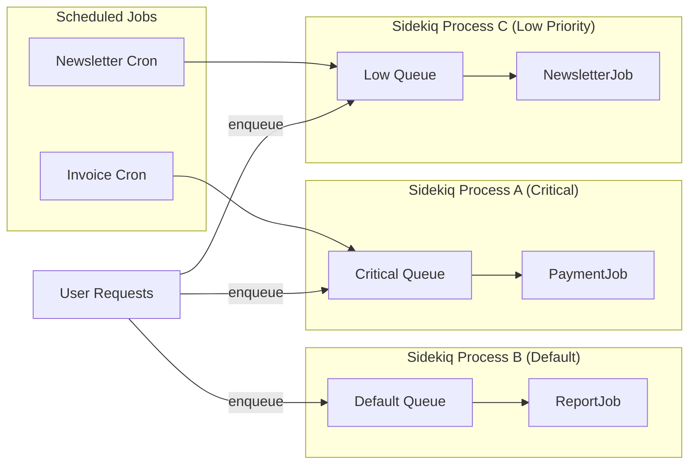
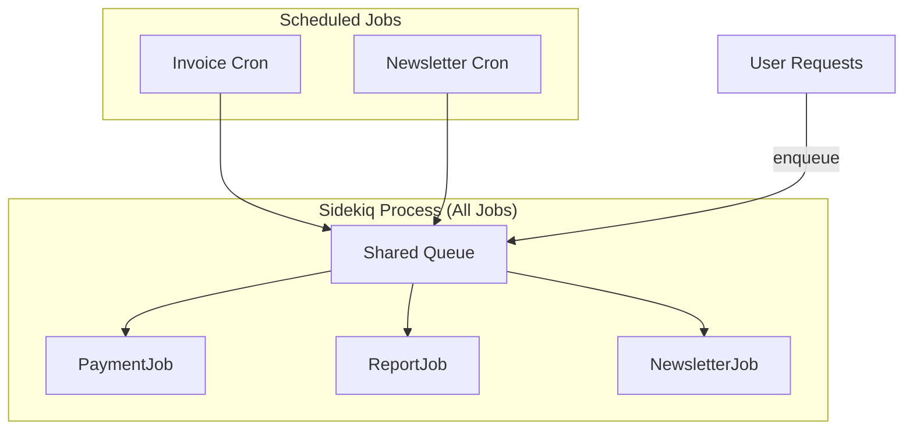

# Bulkheading Daemons and Jobs in Rails: Building Resilient Background Systems
*How to use the bulkhead pattern with Sidekiq daemons and scheduled jobs in Rails to isolate failures and keep critical workloads running*

<div class="personal-branding">
  
  <div class="author-info">
    <div class="author-name">Author: Suma Manjunath</div>
    <div class="publish-date">Published on: {{ page.date | date: "%B %d, %Y" }}</div>
    
    <div class="update-date">Updated on: {{ page.last_modified_at | date: "%B %d, %Y" }}</div>
    
  </div>
</div>


When we think about system design in Ruby on Rails applications, background jobs often get less architectural attention than APIs or databases. But in many systems, they're just as critical: processing payments, provisioning accounts, sending emails, or crunching analytics.  

If we run all of these jobs in the same pool, one bad actor can sink the ship. That's where **bulkheading daemons and jobs** come in—a strategy that combines the **bulkhead pattern** with **background processes and scheduled jobs** in Rails.

---

## The Bulkhead Pattern  

Think about a ship. If one compartment floods, watertight bulkheads keep the rest of the vessel afloat.  

In software, the **bulkhead pattern** serves the same purpose:  
- **Isolation** – partition system components into separate pools.  
- **Resilience** – if one partition fails or is overloaded, it doesn't cascade through the system.  
- **Implementation** – bulkheads are often implemented using thread pools, separate processes, or distinct queues.  

---

## Background Daemons in Rails  

A **daemon** is a background process running continuously. In Rails, they usually handle:  
- Long-running or asynchronous tasks (e.g., image processing, report generation)  
- Scheduled jobs (e.g., sending invoices)  
- Event-driven workloads (e.g., emails, notifications)  

Tools like **Sidekiq, Resque, and Delayed Job** power these daemons.  

---

## Bulkheading Background Daemons  

When we bulkhead daemons, we separate workloads into **dedicated resource pools**. Instead of running every background job in the same process, we partition them:  

- **Critical jobs** – isolated into their own daemon(s), with guaranteed CPU/memory and dedicated queues.  
  *Example: payment transactions, account provisioning.*  

- **Non-critical jobs** – isolated into different daemons, consuming their own queues and thread pools.  
  *Example: sending promotional emails, generating reports.*  

### Why this matters  
If your email-sending service gets backed up, that failure won't starve resources from payment jobs. Critical daemons keep running, even if non-essential daemons are on fire.  

---

## Example: Sidekiq with Bulkheaded Queues  

Sidekiq allows you to assign **weights** to queues in its configuration. The syntax:

```yaml
# config/sidekiq.yml
:queues:
  - [critical, 10]
  - [default, 5]
  - [low, 1]
```

This means:
- Critical jobs are 10x more likely to be picked than low jobs if they're in the same process.
- It does not create separate processes by itself—you still need to run multiple Sidekiq processes to fully isolate workloads.

To truly bulkhead, run separate daemons:

```bash
# Critical jobs only
bundle exec sidekiq -q critical

# Default jobs
bundle exec sidekiq -q default

# Low-priority jobs
bundle exec sidekiq -q low
```

Each Sidekiq process has its own thread pool. Within a process, queues compete for those threads based on weight. By running separate processes, you prevent low-priority jobs from ever touching the same threads as critical jobs.

You can also target queues in job classes explicitly:

```ruby
class PaymentJob < ApplicationJob
  queue_as :critical
end

class NewsletterJob < ApplicationJob
  queue_as :low
end
```

Or dynamically:

```ruby
PaymentJob.set(queue: 'critical').perform_later(payment_id)
```

---

## Bulkheading Cron and Scheduled Jobs

Cron jobs (or scheduled jobs) in Rails are typically managed by gems like `whenever`, `sidekiq-cron`, or by OS-level cron. These jobs often trigger database cleanup, batch reports, or recurring syncs with external systems.

Sidekiq-Cron integrates smoothly by simply enqueueing jobs into the queues you already bulkhead. For example:

```yaml
# config/schedule.yml
invoice_generation:
  cron: "0 0 * * *"
  class: InvoiceJob
  queue: critical

newsletter_sync:
  cron: "0 3 * * *"
  class: NewsletterSyncJob
  queue: maintenance
```

Run separate daemons:

```bash
bundle exec sidekiq -q critical
bundle exec sidekiq -q maintenance
```

This way, your billing cron runs independently of your newsletter cron—an outage in Mailchimp won't delay invoices.

---

## Failure Scenarios

**Without bulkheads:** A flood of low-priority newsletter jobs ties up threads. Payments queue up behind them, and customers can't check out.

**With bulkheads:** Newsletter jobs pile up, but payments keep flowing—customers never see a failure.

In one fintech company I worked with, separating payment jobs into their own Sidekiq pool reduced failed checkouts by 80% during high-load marketing campaigns. Non-critical jobs failed silently, but revenue-critical workflows were unaffected.

---

## Trade-Offs of Bulkheading

Bulkheading makes your system more resilient, but it comes at a cost:

- **Increased operational complexity** – multiple processes to deploy, monitor, and configure.
- **Memory overhead** – each Sidekiq process has its own thread pool and Redis connections.
- **Monitoring needs** – you'll need to track queue health per daemon, not just globally.

**When NOT to use** – if your app is small, with low job volume and no critical/non-critical distinction, bulkheading may be overkill.

---

## Monitoring Bulkheaded Systems

When running multiple daemons, monitoring becomes crucial:

- Use Sidekiq Web UI to monitor queues individually.
- Add metrics via Prometheus + Grafana or services like Datadog.
- Set alerts for queue latency per daemon so you can tell when one bulkhead is failing.

---

## Asking Better Questions: The Five W's Framework

When working with AI tools to design systems like bulkheading, the quality of your questions directly impacts the quality of your solutions. Use this framework to structure your prompts:

### **Who** - Define the Stakeholders
- **Before:** "How do I bulkhead my jobs?"
- **Better:** "As a Rails developer managing a payment processing system, how do I bulkhead my Sidekiq jobs to ensure critical payment workflows never fail?"

### **What** - Specify the Exact Problem
- **Before:** "Fix my Sidekiq configuration"
- **Better:** "What Sidekiq configuration changes do I need to separate payment processing jobs from email jobs to prevent email failures from blocking payments?"

### **When** - Consider Timing and Context
- **Before:** "How do I handle job failures?"
- **Better:** "During peak holiday shopping periods when our email volume spikes 10x, how do I ensure payment processing jobs maintain their SLA while email jobs can fail gracefully?"

### **Where** - Identify the System Context
- **Before:** "How do I scale my background jobs?"
- **Better:** "In a Rails monolith running on Heroku with Redis add-ons, how do I implement bulkheading for background jobs without adding significant infrastructure complexity?"

### **Why** - Understand the Business Impact
- **Before:** "How do I make my jobs faster?"
- **Better:** "Our payment processing jobs are failing during marketing campaign spikes, causing 15% checkout abandonment. How do I bulkhead these critical workflows to maintain 99.9% uptime?"

### **Example: Applying the Five W's to Bulkheading**

**Poor Prompt:** "Help me with Sidekiq queues"

**Better Prompt:** "I'm a senior Rails developer at a fintech company (Who) building a payment processing system that handles 100k transactions daily (What). During Black Friday, our marketing emails flood the system and block payment jobs (When), causing customer checkout failures (Where). This costs us $50k in lost revenue per hour (Why). How do I implement bulkheading to isolate payment processing from email jobs?"

**Result:** You'll get specific, actionable guidance tailored to your exact situation rather than generic advice.

---

## Visualizing Bulkheaded Daemons and Jobs

Here's a simplified diagram using Mermaid:



This shows three Sidekiq processes (bulkheaded), each handling its own queue, plus cron jobs that feed into the appropriate queue.

---

## The Risk of Not Bulkheading

For comparison, here's what happens without bulkheading:



This makes the risk obvious:
- One daemon, one queue, one thread pool → if low-priority jobs flood the queue, they can block critical jobs like payments.
- Paired with the first diagram, readers will visually understand why bulkheading is valuable.

---

## Closing Thoughts

Resilient system design isn't just about APIs and databases. Your background job architecture deserves the same rigor. Bulkheading daemons and jobs in Rails ensures that essential workflows always succeed—even when the less important ones stumble.

Think of it as building watertight compartments in your background processing system. When one floods, the ship still sails.

---

## References

- Nygard, Michael T. [Release It! Design and Deploy Production-Ready Software](https://www.oreilly.com/library/view/release-it/9781680500264/) (original source of bulkhead pattern)
- [Microsoft Docs – Bulkhead pattern](https://learn.microsoft.com/en-us/azure/architecture/patterns/bulkhead)
- [Sidekiq Pro/Enterprise Docs] (https://github.com/sidekiq/sidekiq)
- [Sidekiq-Cron gem](https://github.com/sidekiq-cron/sidekiq-cron)
- [Whenever gem – Cron in Rails](https://github.com/javan/whenever)
- [Resilience Patterns – Martin Fowler](https://martinfowler.com/articles/bottlenecks-of-scaleups/05-resilience-and-observability.html)
