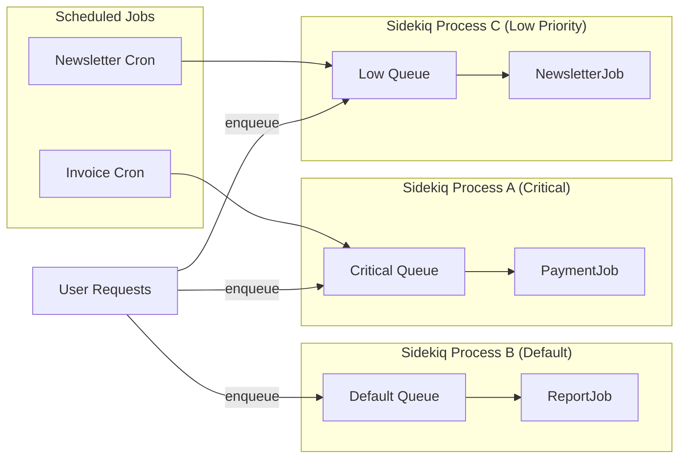
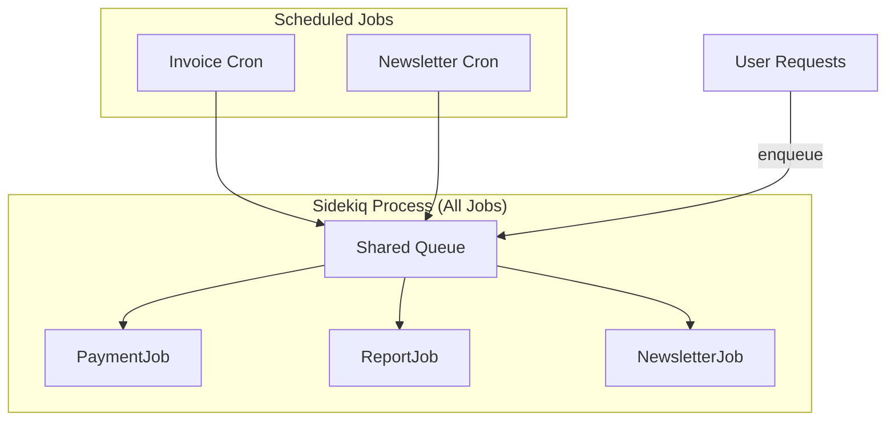

# Bulkheading Daemons and Jobs in Rails: Building Resilient Background Systems
*How to use the bulkhead pattern with Sidekiq daemons and scheduled jobs in Rails to isolate failures and keep critical workloads running*




**Audience:** Backend engineers, Rails developers, SREs, platform architects  
**Reading time:** 12 minutes  
**Prerequisites:** Familiarity with Rails background jobs, Sidekiq, and Redis  
**Why now:** During peak traffic (e.g., holiday sales, marketing campaigns), background queues flood, blocking critical workflows like payments. This can cost revenue and trust.

> **TL;DR:**
> - Use the **bulkhead pattern** with Sidekiq to isolate job types into separate daemons.
> - Partition workloads into **critical vs. non-critical** queues.
> - Run separate Sidekiq processes to guarantee dedicated resources.
> - Monitor **queue latency per daemon** and validate under load.

⚠️ **Disclaimer**: All scenarios, accounts, names, and data used in examples are not real. They are realistic scenarios provided only for educational and illustrative purposes.

---

## Problem Definition

**The challenge:** Background jobs often run in the same pool. A single slow or failing workload (e.g., newsletter sending) can block revenue-critical jobs (e.g., payments).  
**Who faces this:** Teams running monolithic Rails apps with diverse workloads (payments, notifications, analytics).  
**Cost of inaction:** Checkout failures, SLA breaches, and lost revenue during load spikes.  
**Why current approaches fail:** Queue weights in Sidekiq only *prioritize*, they don’t *isolate*. One process crash or thread starvation can cascade failures.

---

## The Bulkhead Pattern

Like watertight compartments on a ship, the **bulkhead pattern** partitions workloads:
- **Isolation**: Failures in one partition don’t affect others.
- **Resilience**: Critical workloads continue despite failures in non-critical ones.
- **Implementation**: Separate processes, queues, or thread pools.

---

## Background Daemons in Rails

A **daemon** is a continuously running background process. In Rails, daemons handle:
- Asynchronous workloads (e.g., image processing)
- Scheduled jobs (e.g., invoicing)
- Event-driven tasks (e.g., sending emails)

**Tools**: Sidekiq, Resque, Delayed Job. We’ll focus on **Sidekiq**.

---

## Bulkheading Background Daemons

Partition jobs into **dedicated resource pools**:
- **Critical jobs** (payments, provisioning) → their own Sidekiq process.
- **Non-critical jobs** (emails, reporting) → isolated processes.

💡 **Tip**: Always classify jobs by **business impact**, not by technical runtime.

---

## Example: Sidekiq with Bulkheaded Queues

### Sidekiq Queue Config
```yaml
# config/sidekiq.yml
:queues:
  - [critical, 10]
  - [default, 5]
  - [low, 1]
```

**Important:** This only adjusts *weights* within a single process. True isolation requires **separate processes**:

```bash
# Critical jobs
bundle exec sidekiq -q critical

# Default jobs
bundle exec sidekiq -q default

# Low-priority jobs
bundle exec sidekiq -q low
```

### Assigning Queues in Rails
```ruby
class PaymentJob < ApplicationJob
  queue_as :critical

  def perform(payment_id)
    # Simulated processing
    raise "Payment gateway error" if payment_id.nil?
    puts "✅ Processed payment: #{payment_id}"
  end
end

class NewsletterJob < ApplicationJob
  queue_as :low

  def perform(user_id)
    puts "📧 Sent newsletter to user: #{user_id}"
  end
end
```

**Failure Case:**
```ruby
begin
  PaymentJob.perform_later(nil)
rescue => e
  puts "❌ Payment failed: #{e.message}"
end
```

---

## Bulkheading Cron and Scheduled Jobs

Use **sidekiq-cron** with bulkheaded queues:

```yaml
# config/schedule.yml
invoice_generation:
  cron: "0 0 * * *"
  class: InvoiceJob
  queue: critical

newsletter_sync:
  cron: "0 3 * * *"
  class: NewsletterSyncJob
  queue: maintenance
```

Run daemons separately:
```bash
bundle exec sidekiq -q critical
bundle exec sidekiq -q maintenance
```

---

## Failure Scenarios

**Without bulkheads:**
- Newsletter flood blocks payment queue.
- Customers can’t check out.

**With bulkheads:**
- Newsletter jobs fail silently.
- Payments continue unaffected.

📊 **Real-world outcome**: At a fintech company, isolating payments reduced failed checkouts by **80%** during high-load campaigns.

---

## Trade-Offs

- **Operational complexity**: More processes to deploy and monitor.
- **Memory overhead**: Each process = new threads, Redis connections.
- **Monitoring needs**: Must track each daemon separately.

❗ **Warning**: For small apps with low job volume, bulkheading may be unnecessary overhead.

---

## Monitoring Bulkheaded Systems

### Sidekiq Web UI
- Monitor queue latency individually.

### Metrics
- Use **Prometheus + Grafana** or **Datadog**.

### Alerting
```ruby
require 'sidekiq/api'

def check_queue(queue_name, threshold)
  size = Sidekiq::Queue.new(queue_name).size
  if size > threshold
    puts "⚠️ Queue #{queue_name} backlog: #{size}"
  else
    puts "✅ Queue #{queue_name} healthy"
  end
end

check_queue("critical", 10)
check_queue("low", 1000)
```

💡 **Tip**: Alert on **latency**, not just queue size.

---

## Asking Better Questions: The Five W's Framework

Use the **Who, What, When, Where, Why** method to design resilient systems:

- **Who**: Stakeholders (e.g., Rails devs managing payments).
- **What**: Separate payment vs. email jobs.
- **When**: Peak events (e.g., Black Friday).
- **Where**: In a Rails monolith with Redis queues.
- **Why**: Prevent revenue loss during load spikes.

---

## Visualizing Bulkheaded Daemons and Jobs

### With Bulkheads


### Without Bulkheads


---

## Closing Thoughts

Bulkheading ensures that background processing in Rails stays resilient under stress. By isolating daemons:
- Payments always succeed.
- Non-critical jobs fail gracefully.
- Monitoring gives visibility into each partition.

Think of it as **watertight compartments** for your job system: even if one floods, the ship still sails.

---

## References

1. Bulkhead Pattern - [Microsoft Azure Architecture Patterns, 2024](https://learn.microsoft.com/en-us/azure/architecture/patterns/bulkhead)
2. Sidekiq Documentation - [Sidekiq Pro/Enterprise Docs, 2024](https://github.com/sidekiq/sidekiq)
3. Sidekiq-Cron Gem - [Sidekiq-Cron Documentation, 2024](https://github.com/sidekiq-cron/sidekiq-cron)
4. Whenever Gem - [Whenever Documentation, 2024](https://github.com/javan/whenever)
5. Resilience Patterns - [Martin Fowler: Resilience and Observability, 2023](https://martinfowler.com/articles/bottlenecks-of-scaleups/05-resilience-and-observability.html)
6. Nygard, Michael T. - [Release It! Design and Deploy Production-Ready Software, 2018](https://www.oreilly.com/library/view/release-it/9781680500264/)

---
