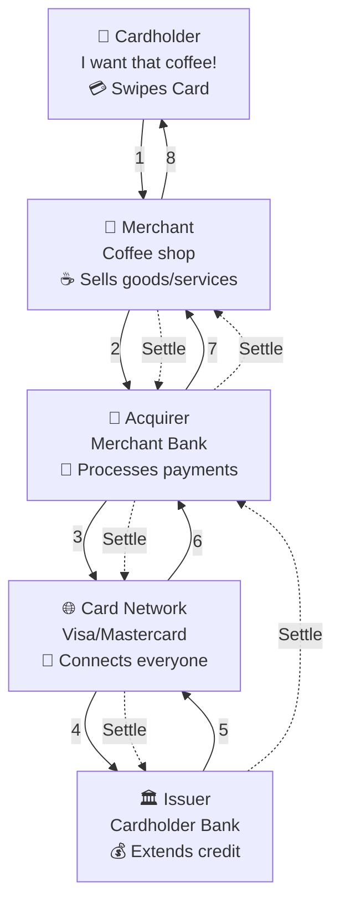

# Credit Cards: Swipe, Smile, Settle Later
*The rail that powers commerce — with a hidden settlement machine behind the scenes.*



**Audience:** Payment engineers, fintech architects, developers integrating card rails  
**Reading Time:** 9 minutes  
**Prerequisites:** Familiarity with basic payment processing (ACH, RTP, APIs)  
**Why now:** With RTP and FedNow rising, teams need clarity on how cards differ and why they remain dominant.

> **TL;DR:**
> - Credit cards feel instant but actually use delayed settlement (T+1 to T+3).
> - Merchants face fees, delays, and chargeback risks despite consumer convenience.
> - Developers must build reconciliation and dispute handling into systems.
> - Cards will coexist with instant rails, not disappear.

⚠️ **Disclaimer**: All scenarios, accounts, names, and data used in examples are not real. They are realistic scenarios provided only for educational and illustrative purposes.

---

## Problem Definition

**The challenge:** Credit cards dominate consumer payments, but their delayed settlement, high interchange fees, and reconciliation complexity create operational and financial headaches for merchants and developers.

**Who faces this:** Merchants with thin margins, fintech developers integrating APIs, payment ops teams managing chargebacks.

**Cost of inaction:** Without robust reconciliation and risk systems, businesses face revenue leakage, fraud losses, and operational drag.

**Why standard advice fails:** Most developer guides focus on the swipe experience, not the settlement machine behind it — leaving teams unprepared for disputes and delays.

---

## The Good: Instant Credit, Global Acceptance

- **Seamless User Experience** – Consumers swipe/tap and walk away.
- **Global Reach** – Visa, Mastercard, AmEx, Discover = universal acceptance.
- **Consumer Protections** – Fraud coverage, chargebacks, dispute rights.
- **Credit Float** – Consumers pay later, get rewards.
- **Risk Offloading** – Issuers handle underwriting and fraud detection.

---

## The Bad: Cost and Complexity

- **Interchange Fees** – Merchants lose ~2–3% per swipe.
- **Settlement Delays** – Funds take 1–3 days (longer cross-border).
- **Chargebacks** – Exposure for months.
- **Authorization vs. Capture Gap** – Approval ≠ cash in bank.

---

## The Ugly: Integration & Reconciliation

- **Integration Sprawl** – Merchants rely on gateways and processors, not networks directly.
- **Reconciliation Nightmares** – Async batch files, mismatched IDs.
- **Hidden Costs** – Fraud disputes, failed settlements, late chargebacks.
- **Cross-Border Pain** – Currency conversions, scheme rules, country-specific fees.

---

## How Credit Cards Actually Work

### The Four-Party Model

Credit card payments involve four key players:

1. **Cardholder** – Consumer making the purchase
2. **Merchant** – Business accepting the card
3. **Acquirer** – Merchant’s bank, processes payment
4. **Issuer** – Cardholder’s bank, extends credit

**Card Networks** (Visa, Mastercard, AmEx, Discover) connect everyone.

---

### Authorization vs. Settlement

**Phase 1: Authorization (seconds)**
- Issuer checks balance/credit + fraud risk.
- Approval code flows back.
- ❗ No money moves yet.

**Phase 2: Settlement (days later)**
- Merchant batches transactions.
- Acquirer → Network → Issuer → back.
- Actual funds move T+1 to T+3.

💡 **Tip:** Always build systems that separate "authorization success" from "funds received."

---

## Adoption Metrics (2024–2025)

| Metric | Value |
|--------|-------|
| Global card volume | $50T+ |
| U.S. spend | $5T+ |
| Average interchange | ~2% domestic |
| Chargeback rate | 0.4–1% |
| Settlement time | T+1–T+3 days |
| Leading networks | Visa, Mastercard, AmEx, Discover |

---

## Developer Integration Reality

**Stack Layers:**
1. **Processors** (Stripe, Adyen, Square) – routing, APIs, settlement
2. **Gateways** (Braintree, Authorize.net) – routing, PCI compliance
3. **Networks** – rules, interchange, settlement infra

**Integration challenges:**
- Different webhook formats
- Settlement files vary
- ID mismatches between auth and settlement
- Disputes arrive months later

---

## Validation & Monitoring

### Success Criteria
- ✅ Settlements received within T+2 days
- ✅ Chargeback rate <1%
- ✅ Reconciliation automation >90% match rate

### Failure Modes
- ❗ Auth success but settlement failure
- ❗ Duplicate charges due to retries
- ❗ Fraud disputes months after sale

### Monitoring
- Track **auth-to-settlement ratios**
- Track **dispute rates** by issuer
- Alert on **settlement delays >T+3**

---

## Final Take

Credit cards are paradoxical: **instant approval, delayed settlement.**

For consumers: Magic.  
For merchants: Cost and risk.  
For developers: A reconciliation puzzle.

💡 **Tip:** Treat reconciliation and dispute handling as core engineering systems, not back-office afterthoughts.

Cards won’t vanish, but real-time rails (RTP, FedNow) will force teams to design for **multi-rail futures**.

---

## Acronyms

- **ACH** — Automated Clearing House
- **DDA** — Demand Deposit Account
- **ISO 20022** — International payments messaging standard
- **Interchange** — Fees paid to issuers
- **RTP** — Real-Time Payments
- **FedNow** — Federal Reserve’s instant payments rail

---

## References

1. Visa Inc. - [Annual Report 2024](https://investor.visa.com/financial-information/annual-reports)
2. The Nilson Report - ["Global Card Fraud Losses Reach $32.34 Billion", 2024]
3. Federal Reserve Bank of Kansas City - [Federal Reserve Payments Study, 2023](https://www.kansascityfed.org/research)
4. Mastercard - [Interchange Rates and Criteria, 2024](https://www.mastercard.com/us/en/merchants/support/rates-and-interchange.html)
5. American Express - [Merchant Pricing and Interchange, 2024](https://network.americanexpress.com/globalnetwork/merchants/)
6. Discover Financial Services - [Interchange Rates and Fees, 2024](https://www.discoverglobalnetwork.com/en-us/business-resources/merchant-resources/interchange-rates.html)
7. Stripe - [Understanding Credit Card Processing, 2024](https://stripe.com/guides/credit-card-processing)
8. Square - [Credit Card Processing Guide, 2024](https://squareup.com/help/us/en/article/5068-credit-card-processing)
9. Adyen - [Payment Processing Explained, 2024](https://www.adyen.com/knowledge-hub/payment-processing)
10. Chargeback Gurus - [2024 Chargeback Statistics and Trends, 2025](https://www.chargebackgurus.com/blog/2024-statistics)

---
