# Credit Cards: Swipe, Smile, Settle Later

*The rail that powers commerce — with a hidden settlement machine behind the scenes.*

## What Are Credit Card Payments?

Credit cards are the default payment rail in the U.S. — accepted everywhere from gas pumps to e-commerce checkouts. At a glance, they feel instantaneous: swipe, dip, or tap, and you're done. Behind that "smile and go" user experience lies a four-party model (issuer, acquirer, network, merchant) and a complex chain of authorizations, clears, and settlements that take days.

Credit cards are not real-time money movement. They are real-time credit approvals coupled with delayed settlement. This tradeoff is why the rail works so well for consumers — and creates both opportunities and headaches for businesses.

## The Good: Instant Credit, Global Acceptance

### Seamless User Experience
Customers swipe/tap and walk away with goods. The illusion of "instant payment" is what drives adoption.

### Global Reach
Card networks (Visa, Mastercard, AmEx, Discover) create universal acceptance across merchants and geographies.

### Consumer Protections
Disputes, chargebacks, and fraud coverage make cards safer for consumers compared to ACH or RTP.

### Credit Float
Consumers don't settle right away. They get weeks of float, rewards, and cash-back incentives.

### Built-In Risk Models
Issuers provide underwriting, fraud detection, and credit limits — offloading burdens merchants would otherwise carry.

## The Bad: Cost and Complexity

### Interchange Fees
Merchants pay ~2–3% on each transaction. Great for card issuers, but painful for thin-margin businesses.

### Settlement Delays
Funds don't arrive instantly. Merchants often wait 1–3 business days for settlement, longer if cross-border.

### Chargebacks
Consumers can dispute charges for months after purchase. Merchants must prove validity, creating overhead and risk.

### Authorization vs. Capture
An approval at the terminal isn't money in the bank. Transactions can fail during clearing or settlement, leaving merchants exposed.

## The Ugly: Integration & Reconciliation

### Integration Sprawl
Merchants rarely integrate directly with networks. They rely on processors, gateways, or aggregators, each with its own APIs, pricing, and quirks.

### Reconciliation Nightmares
Batch files, settlement reports, and disputes arrive asynchronously. Matching authorization IDs with deposits is notoriously messy.

### Hidden Risk Costs
Every failed authorization, fraud dispute, or late chargeback creates operational drag. Large merchants run entire teams just for chargeback management.

### Cross-Border Complexity
Currency conversions, scheme rules, and country-specific interchange caps make international acceptance a minefield.

## How Credit Cards Actually Work

### The Four-Party Model

Credit card payments involve four key players, each with different incentives and responsibilities:

1. **Cardholder** - The consumer making the purchase
2. **Merchant** - The business accepting the card
3. **Acquirer** - The merchant's bank that processes the transaction
4. **Issuer** - The cardholder's bank that extends credit

**Card Networks** (Visa, Mastercard, AmEx, Discover) act as the infrastructure layer, connecting all parties and setting the rules.

```mermaid
flowchart TD
    %% Cardholder - The Happy Shopper
    CH["🛒 Cardholder
    I want that coffee!
    💳 Swipes Card"]
    
    %% Merchant - The Business
    M["🏪 Merchant
    Coffee shop
    ☕ Sells goods/services"]
    
    %% Acquirer - Merchant's Bank
    A["🏦 Acquirer
    Merchant Bank
    💼 Processes payments"]
    
    %% Issuer - Cardholder's Bank
    I["🏛️ Issuer
    Cardholder Bank
    💰 Extends credit"]
    
    %% Card Network (infrastructure)
    CN["🌐 Card Network
    Visa/Mastercard
    🔗 Connects everyone"]
    
    %% Flow arrows with labels
    CH -->|1| M
    M -->|2| A
    A -->|3| CN
    CN -->|4| I
    I -->|5| CN
    CN -->|6| A
    A -->|7| M
    M -->|8| CH
    
    %% Settlement flow (dashed lines)
    M -.->|Settle| A
    A -.->|Settle| CN
    CN -.->|Settle| I
    I -.->|Settle| A
    A -.->|Settle| M
    
    %% Styling
    classDef cardholder fill:#e1f5fe,stroke:#01579b,stroke-width:2px
    classDef merchant fill:#f3e5f5,stroke:#4a148c,stroke-width:2px
    classDef acquirer fill:#e8f5e8,stroke:#1b5e20,stroke-width:2px
    classDef issuer fill:#fff3e0,stroke:#e65100,stroke-width:2px
    classDef network fill:#fce4ec,stroke:#880e4f,stroke-width:2px
    
    class CH cardholder
    class M merchant
    class A acquirer
    class I issuer
    class CN network
```

### Authorization vs. Settlement: The Two-Phase Process

#### Phase 1: Authorization (Instant)
- Cardholder swipes/taps card
- Merchant's terminal sends authorization request to acquirer
- Acquirer routes request through card network to issuer
- Issuer checks credit limit, fraud risk, and approves/declines
- Approval code sent back through the chain in seconds

**What Happens**: No money moves yet. The issuer is just saying "yes, this person can spend this amount."

#### Phase 2: Settlement (Delayed)
- Merchant batches transactions throughout the day
- Batch sent to acquirer after business hours
- Acquirer processes batch and sends to card network
- Network routes to each issuer for final processing
- Issuer transfers funds to network, network to acquirer, acquirer to merchant

**What Happens**: Actual money movement occurs 1-3 business days later.

### Why "Instant" Approval Isn't Really Instant

The approval you see at checkout is just a credit promise. Here's what's really happening:

- **Authorization** = "I promise to pay this later"
- **Settlement** = "I'm actually paying this now"
- **The Gap** = Time for disputes, fraud detection, and batch processing

This gap creates several operational challenges:
- Merchants show "approved" but don't have funds
- Reconciliation becomes complex (authorization IDs vs. settlement IDs)
- Failed settlements can occur after successful authorizations
- Chargebacks can happen months later

## Adoption Metrics (2024–2025)

| Metric | Value |
|--------|-------|
| Global card volume (2024) | $50T+ across networks |
| U.S. credit card spend | $5T+ annually |
| Average interchange | ~2% domestic, higher cross-border |
| Chargeback rate | 0.4–1% of transactions |
| Settlement time | T+1 to T+3 days (domestic), longer cross-border |
| Leading networks | Visa, Mastercard, AmEx, Discover |

*Sources: Visa Annual Report 2024, Nilson Report, Federal Reserve Payments Study.*

## The Real-World Bottlenecks

### Illusion of Instant
At checkout, approval feels instant — but merchants don't actually have funds until settlement.

### Dispute Window
RTP is final; cards are anything but. Merchants face months of chargeback exposure.

### Fee Burden
Interchange fees and assessments make cards one of the most expensive rails.

### Systemic Dependence
Merchants can't easily opt out — consumers expect to "just swipe."

## Developer Integration Reality

### The Integration Stack

Most merchants don't integrate directly with card networks. Instead, they use:

1. **Payment Processors** (Stripe, Square, Adyen)
   - Handle network routing and compliance
   - Provide unified APIs across multiple networks
   - Manage settlement and reporting

2. **Payment Gateways** (Authorize.net, Braintree)
   - Handle transaction routing and security
   - Often integrated with specific processors

3. **Card Networks** (Visa, Mastercard, AmEx, Discover)
   - Set interchange rates and rules
   - Provide settlement infrastructure
   - Handle cross-border routing

### Reconciliation Challenges

The authorization vs. settlement gap creates several technical challenges:

- **ID Mapping**: Authorization IDs don't always match settlement IDs
- **Batch Processing**: Settlements arrive in batches, not real-time
- **Partial Settlements**: Some transactions in a batch may fail
- **Chargeback Timing**: Disputes can arrive months after settlement

### API Complexity

Each layer has its own API quirks:
- Processors have different webhook formats
- Networks have different settlement file formats
- Acquirers have different reporting schedules
- Cross-border transactions add currency and compliance layers

## Final Take

Credit cards are the paradox of payments: a rail that powers trillions in commerce by making spending feel instant — while hiding a lagging, fee-laden back office.

For consumers, it's magic: swipe, smile, settle later.
For merchants, it's cost and operational overhead.
For developers and operators, it's a constant balancing act of integrations, reconciliation, and risk.

If RTP is about real-time settlement, credit cards are about real-time approval with deferred money movement. Both have their place, but the lesson for engineering leaders is clear:

- **Build reconciliation as a first-class system**
- **Expect disputes and chargebacks as part of the workflow**
- **Price interchange into your business model**

Cards aren't going away. They're too embedded in consumer behavior. But the next decade may see them increasingly share the stage with real-time rails like RTP and FedNow — where "settle later" becomes "settle now."

---

## Acronyms and Terms

- **ACH** — Automated Clearing House (batch settlement system in the U.S.)
- **DDA** — Demand Deposit Account (checking account)
- **ISO 20022** — International messaging standard (used in RTP and FedNow)
- **Interchange** — Fees paid by merchants' banks to card issuers per transaction
- **RTP** — Real-Time Payments, U.S. instant settlement rail by The Clearing House
- **FedNow** — Federal Reserve's instant settlement rail (2023)

## References

1. **Visa Inc.** Annual Report 2024. [https://investor.visa.com/financial-information/annual-reports](https://investor.visa.com/financial-information/annual-reports)

2. **The Nilson Report**. "Global Card Fraud Losses Reach $32.34 Billion." Industry Analysis, 2024.

3. **Federal Reserve Bank of Kansas City**. "Federal Reserve Payments Study 2023." Economic Research, December 2023.

4. **Mastercard**. "Interchange Rates and Criteria." [https://www.mastercard.com/us/en/merchants/support/rates-and-interchange.html](https://www.mastercard.com/us/en/merchants/support/rates-and-interchange.html)

5. **American Express**. "Merchant Pricing and Interchange." [https://network.americanexpress.com/globalnetwork/merchants/](https://network.americanexpress.com/globalnetwork/merchants/)

6. **Discover Financial Services**. "Interchange Rates and Fees." [https://www.discoverglobalnetwork.com/en-us/business-resources/merchant-resources/interchange-rates.html](https://www.discoverglobalnetwork.com/en-us/business-resources/merchant-resources/interchange-rates.html)

7. **Stripe**. "Understanding Credit Card Processing." [https://stripe.com/guides/credit-card-processing](https://stripe.com/guides/credit-card-processing)

8. **Square**. "Credit Card Processing Guide." [https://squareup.com/help/us/en/article/5068-credit-card-processing](https://squareup.com/help/us/en/article/5068-credit-card-processing)

9. **Adyen**. "Payment Processing Explained." [https://www.adyen.com/knowledge-hub/payment-processing](https://www.adyen.com/knowledge-hub/payment-processing)

10. **Chargeback Gurus**. "2024 Chargeback Statistics and Trends." Industry Report, January 2025.

---

