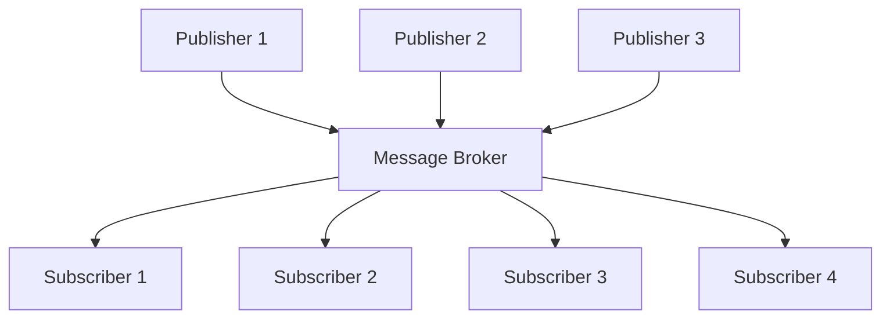

# Guide to Publish-Subscribe Pattern in Software Architecture

*Master the publish-subscribe pattern for building scalable, loosely-coupled systems*


The publish-subscribe (pub-sub) pattern is one of the most powerful messaging patterns in distributed systems and software architecture. It enables loose coupling between components by introducing an intermediary that handles message distribution, allowing systems to scale and evolve independently.

---

## What is the Publish-Subscribe Pattern?

The publish-subscribe pattern is an architectural messaging pattern where senders of messages (publishers) don't program the messages to be sent directly to specific receivers (subscribers). Instead, published messages are characterized into classes without knowledge of which subscribers, if any, there may be.

### Core Components

**Publisher**: The component that generates and sends messages/events without knowing who will receive them.

**Subscriber**: The component that registers interest in specific types of messages and processes them when received.

**Message Broker/Event Bus**: The intermediary that receives published messages and delivers them to interested subscribers.

**Topic/Channel**: A named communication channel that categorizes messages by type or purpose.



---

## How Pub-Sub Works

1. **Subscription Phase**: Subscribers register with the message broker, specifying which types of messages they're interested in receiving.

2. **Publishing Phase**: Publishers send messages to the broker without specifying recipients.

3. **Distribution Phase**: The broker matches published messages with subscriber interests and delivers messages accordingly.

4. **Processing Phase**: Subscribers receive and process messages independently.

---

## Types of Pub-Sub Systems

### 1. Topic-Based Systems
Messages are published to named topics, and subscribers register for specific topics.

```ruby
# Topic-based example
EventBus.publish('user.registered', user_data)
EventBus.publish('payment.processed', payment_data)

EventBus.subscribe('user.registered') { |data| send_welcome_email(data) }
EventBus.subscribe('payment.processed') { |data| update_inventory(data) }
```

### 2. Content-Based Systems
Subscribers register interest based on message content or properties rather than predefined topics.

```ruby
# Content-based filtering
EventBus.subscribe do |message|
  message[:amount] > 1000 && message[:type] == 'payment'
end
```

### 3. Type-Based Systems
Messages are categorized by their data type or class.

```ruby
class UserRegisteredEvent; end
class PaymentProcessedEvent; end

EventBus.subscribe(UserRegisteredEvent) { |event| handle_user_registration(event) }
```

---

## When to Use Pub-Sub

### Ideal Use Cases

**1. Event-Driven Architectures**
```ruby
class OrderService
  def complete_order(order)
    order.update!(status: 'completed')
    
    # Publish event - multiple services can react
    EventBus.publish('order.completed', {
      order_id: order.id,
      customer_id: order.customer_id,
      total: order.total,
      items: order.items.map(&:to_h)
    })
  end
end

# Multiple independent subscribers
class InventoryService
  EventBus.subscribe('order.completed') do |data|
    data[:items].each { |item| reduce_stock(item) }
  end
end

class ShippingService
  EventBus.subscribe('order.completed') do |data|
    create_shipping_label(data[:order_id])
  end
end

class AnalyticsService
  EventBus.subscribe('order.completed') do |data|
    track_sale(data)
  end
end
```

**2. Microservices Communication**
When services need to communicate without tight coupling.

**3. Real-Time Notifications**
```ruby
class ChatService
  def send_message(room_id, message)
    save_message(message)
    
    EventBus.publish("chat.message.#{room_id}", {
      message: message.content,
      sender: message.sender,
      timestamp: message.created_at
    })
  end
end
```

**4. Data Pipeline Processing**
```ruby
class DataIngestionService
  def process_raw_data(data)
    cleaned_data = clean_data(data)
    
    EventBus.publish('data.cleaned', cleaned_data)
  end
end

class ValidationService
  EventBus.subscribe('data.cleaned') do |data|
    if valid?(data)
      EventBus.publish('data.validated', data)
    else
      EventBus.publish('data.validation_failed', data)
    end
  end
end
```

**5. Audit and Logging Systems**
```ruby
class AuditSubscriber
  # Subscribe to all events for audit trail
  EventBus.subscribe(/.*/) do |event_type, data|
    AuditLog.create!(
      event_type: event_type,
      data: data,
      timestamp: Time.current
    )
  end
end
```

---

## When NOT to Use Pub-Sub

### Avoid Pub-Sub When:

**1. Simple Request-Response Interactions**
```ruby
# Don't use pub-sub for direct queries
# BAD
EventBus.publish('user.get', user_id: 123)
EventBus.subscribe('user.get') { |data| return User.find(data[:user_id]) }

# GOOD - Direct method call
user = UserService.find(123)
```

**2. Synchronous Processing Requirements**
When you need immediate confirmation or results.

**3. Strong Consistency Requirements**
Pub-sub is inherently asynchronous and eventual consistency focused.

**4. Simple, Single-Purpose Applications**
The overhead may not be justified for simple applications.

**5. When Message Ordering is Critical**
Standard pub-sub doesn't guarantee message ordering across topics.

---

## Pros and Cons

### Advantages

**Loose Coupling**
Publishers and subscribers are independent, making systems more modular and maintainable.

```ruby
# Publisher doesn't need to know about subscribers
class PaymentProcessor
  def process(payment)
    result = charge_card(payment)
    
    # Just publish - don't care who listens
    EventBus.publish('payment.processed', payment.to_h)
  end
end
```

**Scalability**
Easy to add new subscribers without modifying existing code.

```ruby
# Adding a new feature is simple
class FraudDetectionService
  # New subscriber - no changes needed elsewhere
  EventBus.subscribe('payment.processed') do |data|
    check_for_fraud(data)
  end
end
```

**Flexibility**
Supports dynamic subscription and unsubscription.

**Reliability**
System can continue operating even if some subscribers fail.

**Asynchronous Processing**
Non-blocking operations improve performance.

### Disadvantages

**Complexity**
Adds architectural complexity and potential points of failure.

```ruby
# Debugging becomes harder with multiple async subscribers
EventBus.publish('user.updated', user_data)
# Where did the error occur? Which subscriber failed?
```

**Message Delivery Guarantees**
Depending on implementation, messages might be lost or duplicated.

**Testing Challenges**
Integration testing becomes more complex with asynchronous message flows.

```ruby
# Testing pub-sub requires special handling
RSpec.describe "User registration" do
  it "sends welcome email" do
    expect(EventBus).to receive(:publish).with('user.registered', anything)
    
    UserService.register(user_params)
    
    # How do we test the subscriber was called?
    # Need to either stub or use test-specific synchronous processing
  end
end
```

**Potential Performance Overhead**
Message broker can become a bottleneck.

**Debugging Difficulties**
Tracing message flows across multiple subscribers can be challenging.

---

## Implementation Patterns and Best Practices

### 1. Event Naming Conventions
```ruby
# Use hierarchical naming
EventBus.publish('ecommerce.order.created', data)
EventBus.publish('ecommerce.order.cancelled', data)
EventBus.publish('ecommerce.payment.processed', data)

# Include context in event names
EventBus.publish('user.profile.updated', data)
EventBus.publish('user.password.changed', data)
```

### 2. Error Handling
```ruby
class RobustEventBus
  def self.publish(event_type, data)
    subscribers = find_subscribers(event_type)
    
    subscribers.each do |subscriber|
      begin
        subscriber.call(data)
      rescue => e
        # Log error but don't fail other subscribers
        Rails.logger.error "Subscriber failed for #{event_type}: #{e.message}"
        
        # Optionally retry or send to dead letter queue
        DeadLetterQueue.add(event_type, data, e)
      end
    end
  end
end
```

### 3. Message Schema Versioning
```ruby
class EventSchema
  def self.publish(event_type, data, version: 1)
    versioned_data = {
      version: version,
      timestamp: Time.current.iso8601,
      data: data
    }
    
    EventBus.publish(event_type, versioned_data)
  end
end
```

### 4. Circuit Breaker Pattern
```ruby
class CircuitBreakerSubscriber
  def initialize
    @failure_count = 0
    @last_failure = nil
  end
  
  def call(data)
    if circuit_open?
      Rails.logger.warn "Circuit breaker open, skipping subscriber"
      return
    end
    
    begin
      process(data)
      reset_circuit
    rescue => e
      handle_failure
      raise
    end
  end
  
  private
  
  def circuit_open?
    @failure_count >= 5 && Time.current - @last_failure < 60.seconds
  end
  
  def handle_failure
    @failure_count += 1
    @last_failure = Time.current
  end
  
  def reset_circuit
    @failure_count = 0
    @last_failure = nil
  end
end
```

---

## External Message Brokers (For Microservices)

For distributed systems, use external message brokers:

**With Sidekiq and Redis:**
```ruby
# Publisher
class AchPaymentService
  def process_payment(payment)
    result = submit_to_ach_network(payment)
    
    if result.success?
      # Publish to Redis stream
      Sidekiq.redis do |conn|
        conn.xadd('payment-events', {
          event: 'payment.succeeded',
          payment_id: payment.id,
          amount: payment.amount,
          timestamp: Time.current.to_i
        })
      end
    end
  end
end

# Consumer service
class PaymentEventConsumer
  include Sidekiq::Worker
  
  def perform
    Sidekiq.redis do |conn|
      # Process Redis streams
      conn.xread('payment-events', '0', block: 1000) do |stream, entries|
        entries.each do |entry_id, fields|
          handle_event(fields['event'], fields)
        end
      end
    end
  end
  
  private
  
  def handle_event(event_type, data)
    case event_type
    when 'payment.succeeded'
      PaymentSuccessJob.perform_async(data['payment_id'])
    when 'payment.failed'
      PaymentFailureJob.perform_async(data['payment_id'])
    end
  end
end
```

**With RabbitMQ (using Bunny gem):**
```ruby
# Publisher
class AchPaymentService
  def process_payment(payment)
    result = submit_to_ach_network(payment)
    
    if result.success?
      publish_event('payment.succeeded', {
        payment_id: payment.id,
        amount: payment.amount
      })
    end
  end
  
  private
  
  def publish_event(event_type, data)
    connection = Bunny.new
    connection.start
    
    channel = connection.create_channel
    exchange = channel.topic('payment_events')
    
    exchange.publish(
      data.to_json,
      routing_key: event_type,
      content_type: 'application/json'
    )
    
    connection.close
  end
end

# Consumer
class PaymentEventConsumer
  def start
    connection = Bunny.new
    connection.start
    
    channel = connection.create_channel
    exchange = channel.topic('payment_events')
    queue = channel.queue('', exclusive: true)
    
    queue.bind(exchange, routing_key: 'payment.*')
    
    queue.subscribe(block: true) do |delivery_info, properties, body|
      data = JSON.parse(body)
      handle_event(delivery_info.routing_key, data)
    end
  end
  
  private
  
  def handle_event(event_type, data)
    case event_type
    when 'payment.succeeded'
      PaymentSuccessJob.perform_async(data['payment_id'])
    end
  end
end
```

---

## Testing Strategies

### 1. Testing ActiveSupport::Notifications
```ruby
RSpec.describe AchPaymentService do
  let(:service) { described_class.new }
  let(:payment) { create(:payment) }
  
  it "publishes payment success event" do
    expect do
      service.process_payment(payment)
    end.to publish_notification('ach.payment.succeeded')
      .with(hash_including(payment_id: payment.id))
  end
end

# Custom RSpec matcher
RSpec::Matchers.define :publish_notification do |event_name|
  match do |block|
    @events = []
    
    ActiveSupport::Notifications.subscribe(event_name) do |name, start, finish, id, payload|
      @events << payload
    end
    
    block.call
    
    if @expected_payload
      @events.any? { |event| @expected_payload.all? { |k, v| event[k] == v } }
    else
      @events.any?
    end
  end
  
  chain :with do |expected_payload|
    @expected_payload = expected_payload
  end
end
```

### 2. Testing Background Jobs Pattern
```ruby
RSpec.describe AchPaymentService do
  it "enqueues payment processed job on success" do
    expect(PaymentProcessedJob).to receive(:perform_later)
      .with(payment.id, 'success')
    
    service.process_payment(payment)
  end
end

RSpec.describe PaymentProcessedJob do
  it "fans out to notification and accounting jobs" do
    expect(PaymentNotificationJob).to receive(:perform_later).with(payment.id)
    expect(AccountingJob).to receive(:perform_later).with(payment.id)
    
    described_class.new.perform(payment.id, 'success')
  end
end
```

---

## Monitoring and Observability

### 1. ActiveSupport::Notifications Monitoring
```ruby
# Monitor event publishing
ActiveSupport::Notifications.subscribe('ach.payment.succeeded') do |name, start, finish, id, payload|
  # Log the event
  Rails.logger.info "Payment succeeded: #{payload[:payment_id]}"
  
  # Send metrics
  StatsD.increment('payments.succeeded')
  StatsD.gauge('payment.amount', payload[:amount])
end

# Monitor processing time
class MonitoredAchPaymentService < AchPaymentService
  def process_payment(payment)
    StatsD.time('payment.processing_time') do
      super(payment)
    end
  end
end
```

### 2. Background Job Monitoring
```ruby
class PaymentProcessedJob < ApplicationJob
  def perform(payment_id, status, error = nil)
    StatsD.increment("payment_jobs.processed.#{status}")
    
    StatsD.time("payment_jobs.processing_time") do
      super
    end
  rescue => e
    StatsD.increment('payment_jobs.failed')
    Rails.logger.error "Payment job failed: #{e.message}"
    raise
  end
end
```

---

## Critical Production Considerations

### 1. Idempotency

Events may be delivered multiple times, so subscribers must be idempotent:

```ruby
# BAD - Not idempotent, could create duplicate records
class PaymentSubscriber
  def payment_succeeded(payment_id:, amount:)
    # This creates a new record every time
    AccountingEntry.create!(
      payment_id: payment_id,
      amount: amount,
      type: 'debit'
    )
  end
end

# GOOD - Idempotent using unique constraints
class PaymentSubscriber
  def payment_succeeded(payment_id:, amount:)
    AccountingEntry.find_or_create_by(payment_id: payment_id) do |entry|
      entry.amount = amount
      entry.type = 'debit'
    end
  rescue ActiveRecord::RecordNotUnique
    # Race condition - entry already exists, which is fine
    Rails.logger.info "Accounting entry already exists for payment #{payment_id}"
  end
end

# BETTER - Using idempotency keys
class PaymentSubscriber
  def payment_succeeded(payment_id:, amount:, idempotency_key:)
    return if IdempotencyTracker.processed?(idempotency_key)
    
    AccountingEntry.create!(
      payment_id: payment_id,
      amount: amount,
      type: 'debit'
    )
    
    IdempotencyTracker.mark_processed(idempotency_key)
  end
end

# Idempotency tracking service
class IdempotencyTracker
  def self.processed?(key)
    Rails.cache.exist?("idempotency:#{key}")
  end
  
  def self.mark_processed(key, ttl: 24.hours)
    Rails.cache.write("idempotency:#{key}", true, expires_in: ttl)
  end
end
```

### 2. Event Ordering and Sequence

Events may arrive out of order, especially in distributed systems:

```ruby
# Problem: Events arrive out of order
# 1. user.created (timestamp: 10:00)
# 2. user.updated (timestamp: 10:05)
# But they arrive in reverse order!

class UserEventSubscriber
  def user_created(user_id:, sequence_number:, **data)
    process_if_in_sequence(user_id, sequence_number) do
      User.create!(id: user_id, **data)
    end
  end
  
  def user_updated(user_id:, sequence_number:, **data)
    process_if_in_sequence(user_id, sequence_number) do
      User.find(user_id).update!(**data)
    end
  end
  
  private
  
  def process_if_in_sequence(user_id, sequence_number)
    last_sequence = Rails.cache.read("user_sequence:#{user_id}") || 0
    
    if sequence_number == last_sequence + 1
      yield
      Rails.cache.write("user_sequence:#{user_id}", sequence_number)
    elsif sequence_number > last_sequence + 1
      # Out of order - queue for later processing
      OutOfOrderEventJob.perform_later(user_id, sequence_number, event_data)
    end
    # If sequence_number <= last_sequence, it's a duplicate - ignore
  end
end
```

### 3. Dead Letter Queue and Error Handling

Handle failures gracefully with retry mechanisms:

```ruby
class RobustEventProcessor < ApplicationJob
  retry_on StandardError, wait: :exponentially_longer, attempts: 3
  
  discard_on ActiveRecord::RecordNotFound do |job, error|
    # Log permanently discarded jobs
    Rails.logger.error "Discarding job due to missing record: #{error.message}"
    DeadLetterQueue.add(job.arguments, error)
  end
  
  def perform(event_type, payload)
    case event_type
    when 'payment.succeeded'
      PaymentSubscriber.new.payment_succeeded(**payload.symbolize_keys)
    when 'user.updated'
      UserSubscriber.new.user_updated(**payload.symbolize_keys)
    end
  end
end

class DeadLetterQueue
  def self.add(job_data, error)
    DeadLetterRecord.create!(
      job_class: job_data[:job_class],
      arguments: job_data[:arguments],
      error_message: error.message,
      error_backtrace: error.backtrace.join("\n"),
      failed_at: Time.current
    )
  end
  
  def self.retry_failed_jobs
    DeadLetterRecord.where(retried_at: nil).find_each do |record|
      # Attempt to reprocess
      job_class = record.job_class.constantize
      job_class.perform_later(*record.arguments)
      
      record.update!(retried_at: Time.current)
    end
  end
end
```

---

## Performance Optimization

### Message Size
Keep messages small and include references rather than full objects:

```ruby
# Instead of publishing full object
ActiveSupport::Notifications.instrument('user.updated', user.attributes)

# Publish reference and changed fields
ActiveSupport::Notifications.instrument('user.updated', {
  user_id: user.id,
  changed_fields: user.changed,
  timestamp: Time.current
})
```

### Subscriber Performance
Use background jobs for heavy processing:

```ruby
# Don't block the event system with heavy work
ActiveSupport::Notifications.subscribe('data.imported') do |name, start, finish, id, payload|
  # Lightweight - just queue the heavy work
  ProcessDataJob.perform_later(payload[:data_id])
end

# Heavy processing happens in background job
class ProcessDataJob < ApplicationJob
  def perform(data_id)
    data = ImportedData.find(data_id)
    # Heavy processing here
    perform_complex_analysis(data)
  end
end
```

---

## Common Anti-Patterns to Avoid

### 1. Request-Response via Events
```ruby
# BAD - Using events for synchronous queries
ActiveSupport::Notifications.instrument('user.get', user_id: 123)
# You can't get a return value from notifications!

# GOOD - Direct service call
result = UserService.find(123)
```

### 2. Event Chains Too Long
```ruby
# BAD - Complex event chains are hard to follow
ActiveSupport::Notifications.subscribe('step_a_complete') do |name, start, finish, id, payload|
  ActiveSupport::Notifications.instrument('step_b_start', payload)
end

ActiveSupport::Notifications.subscribe('step_b_complete') do |name, start, finish, id, payload|
  ActiveSupport::Notifications.instrument('step_c_start', payload)
end

# GOOD - Direct orchestration when steps must be sequential
class WorkflowOrchestrator
  def execute(data)
    result_a = StepA.new.execute(data)
    result_b = StepB.new.execute(result_a)
    result_c = StepC.new.execute(result_b)
    result_c
  end
end
```

### 3. Missing Error Boundaries
```ruby
# BAD - One failing subscriber can crash others (in some implementations)
ActiveSupport::Notifications.subscribe('risky_event') do |name, start, finish, id, payload|
  risky_operation(payload) # This could raise an exception
end

# GOOD - Handle errors gracefully
ActiveSupport::Notifications.subscribe('risky_event') do |name, start, finish, id, payload|
  begin
    risky_operation(payload)
  rescue => e
    Rails.logger.error "Event handler failed: #{e.message}"
    ExceptionNotifier.notify_exception(e, data: payload)
    # Don't re-raise - let other subscribers continue
  end
end
```

---

## Conclusion

The publish-subscribe pattern is a powerful tool for building scalable, maintainable systems. It excels in event-driven architectures, microservices communication, and scenarios requiring loose coupling between components. However, it's not a silver bullet and should be used judiciously.

Consider pub-sub when you need:
- Loose coupling between components
- Event-driven architecture
- Scalable message distribution
- Asynchronous processing capabilities

Avoid pub-sub when dealing with:
- Simple request-response interactions
- Strong consistency requirements
- Synchronous processing needs
- Overly simple applications

When implementing pub-sub, focus on proper error handling, monitoring, testing strategies, and performance optimization. With careful design and implementation, the publish-subscribe pattern can significantly improve your system's modularity, scalability, and maintainability.

---

## References

1. Hohpe, G., & Woolf, B. (2003). *Enterprise Integration Patterns: Designing, Building, and Deploying Messaging Solutions*. Addison-Wesley Professional.

2. Vernon, V. (2013). *Implementing Domain-Driven Design*. Addison-Wesley Professional.

3. Newman, S. (2015). *Building Microservices: Designing Fine-Grained Systems*. O'Reilly Media.

4. Fowler, M. (2005). "Event Sourcing." Martin Fowler's Blog. https://martinfowler.com/eaaDev/EventSourcing.html

5. Richardson, C. (2018). *Microservices Patterns: With Examples in Java*. Manning Publications.

6. Stopford, B. (2018). *Designing Event-Driven Systems*. O'Reilly Media.

7. Redis Documentation. "Pub/Sub." https://redis.io/topics/pubsub

8. AWS Documentation. "Amazon SNS." https://docs.aws.amazon.com/sns/

9. Apache Kafka Documentation. "Introduction." https://kafka.apache.org/intro

10. RabbitMQ Documentation. "Publish/Subscribe." https://www.rabbitmq.com/tutorials/tutorial-three-ruby.html
