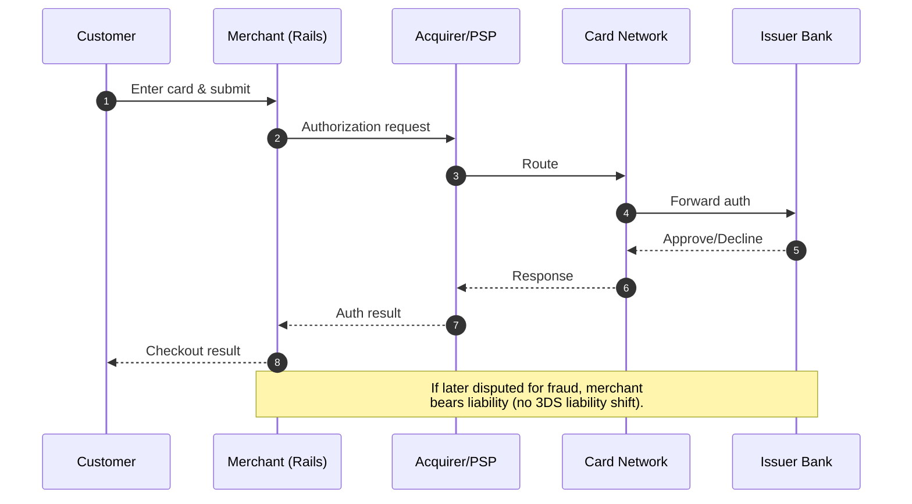
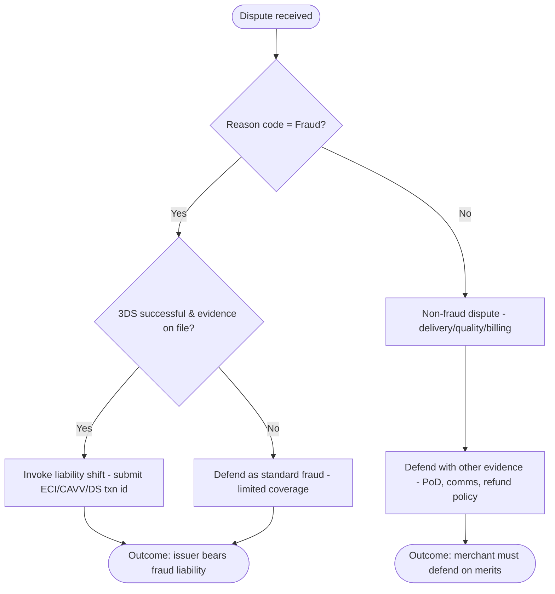

# Money Flows, Chargebacks, and Rails: A Leader's Guide to 3-D Secure
*The rail that powers commerce — with a hidden settlement machine behind the scenes.*




**Audience:** Engineering leaders, fintech architects, payment operations managers  
**Reading Time:** 8 minutes  
**Prerequisites:** Familiarity with card payment flows, Rails applications, and dispute management  
**Why now:** As fraud grows and issuers demand stronger authentication, 3-D Secure is moving from compliance checkbox to profitability lever.

> **TL;DR:**
> - 3DS shifts liability for fraud-coded chargebacks from merchant to issuer when successful.
> - Chargebacks for non-fraud reasons (delivery, billing, quality) still apply.
> - Rails integration is straightforward, but storing 3DS evidence is critical.
> - Key metrics: challenge rate, conversion lift, fraud chargeback ratio, dispute win rate.

⚠️ **Disclaimer**: All scenarios, accounts, names, and data used in examples are not real. They are realistic scenarios provided only for educational and illustrative purposes.

---

## The Baseline: Card Money Flow (No 3DS)



**Why it matters**: a successful 3DS authentication generally shifts liability for fraud-related chargebacks from merchant to issuer (with some scheme-specific exceptions).

---

## Rails: Integration Posture (Code is Easy; Ownership is Hard)

Here's the orchestration shape you'll own in Rails, regardless of PSP:

```ruby
# app/controllers/payments_controller.rb
class PaymentsController < ApplicationController
  def create
    payment = Payment.new(payment_params)

    # 1) Initiate 3DS
    three_ds = ThreeDSService.initiate(payment)

    if three_ds.challenge_required?
      # 2) Redirect/present issuer challenge (3DS2)
      redirect_to three_ds.challenge_url and return
    end

    # 3) Authorize with 3DS proof attached
    auth = PaymentGateway.authorize(
      payment,
      three_ds: {
        eci: three_ds.eci,
        cavv: three_ds.cavv,
        ds_transaction_id: three_ds.ds_transaction_id,
        version: three_ds.version
      }
    )

    render json: { status: auth.status }
  end
end
```

What actually protects you isn't the controller—it's the evidence you persist:

- `eci`, `cavv/aav`, `ds_transaction_id`, `three_ds_version`
- Timestamps + correlation IDs between 3DS auth and payment auth
- Device and IP risk signals for observability

---

## Yes, Chargebacks Can Still Happen After Successful 3DS

**Key reality**: 3DS authenticates the cardholder. It shifts liability for fraud-coded disputes when successful. It does not fix disputes like delivery, quality, billing errors, or misrepresentation.

### Why 3DS Doesn't Prevent All Chargebacks

1. **Fraudulent authentication still happens**: fraudsters may occasionally bypass 3DS.
2. **Non-fraud reasons remain**: delivery issues, product dissatisfaction, billing errors, or misrepresentation are still valid disputes.

**Examples**:
- Customer claims product not delivered.
- Customer dissatisfied with quality.
- Duplicate or incorrect billing.
- Misrepresented item.

### What to Do If You Receive a Chargeback on a 3DS Transaction



**Key takeaway**: 3DS is a powerful fraud liability shield, but not a complete solution. You must still manage non-fraud disputes with operational processes and provide 3DS proof for fraud-related ones.

As engineering leaders, our role is to ensure payments systems are not only functional but also financially defensive. 3DS is more than compliance—it's a lever to protect margin, shift liability, and earn issuer trust.

Done well, it doesn't just prevent fraud losses—it reshapes money flows in your favor.

---

## Metrics That Matter

- **Challenge rate / frictionless rate**: how often 3DS is triggered.
- **Conversion post-3DS**: does friction hurt revenue?
- **Authorization lift**: issuers approve authenticated traffic more readily.
- **Chargeback ratio**: fraud vs. non-fraud, before and after 3DS.
- **Win rate**: % of disputes successfully defended with 3DS evidence.

---

## Acronyms & Terms

- **3DS / 3-D Secure**: Authentication protocol to verify cardholder identity.
- **PSP (Payment Service Provider)**: Processor that routes transactions (e.g., Stripe, Adyen).
- **ACS (Access Control Server)**: Issuer's 3DS server that challenges the customer.
- **DS (Directory Server)**: Card scheme's directory service that routes 3DS requests.
- **ECI (Electronic Commerce Indicator)**: Code showing how transaction was authenticated.
- **CAVV / AAV (Cardholder Authentication Verification Value)**: Cryptographic proof of successful 3DS authentication.
- **DS Transaction ID**: Unique identifier for the 3DS transaction.
- **Chargeback**: Dispute raised by cardholder through their issuer.
- **Frictionless flow**: 3DS approves without customer challenge (risk-based).
- **Challenge flow**: Customer must enter OTP, biometric, or app approval.

---

## References

- Adyen – [Why did I receive a chargeback on a 3DS transaction?](https://www.adyen.com/help/risk-management/chargebacks/why-did-i-receive-a-chargeback-on-a-3ds-transaction)
- Stripe Docs – [Authenticate with 3D Secure](https://stripe.com/docs/payments/3d-secure)
- Stripe Guide – [3DS2 and Liability Shift](https://stripe.com/docs/payments/3d-secure#liability-shift)
- ChargebackStop – [Can You Chargeback-Proof with 3DS?](https://chargebackstop.com/blog/can-you-chargeback-proof-with-3ds/)
- Visa Developer – [Approval rates and low friction 3DS programs](https://developer.visa.com/docs/visa-3d-secure-2-0)
- Chargebacks911 – [Chargebacks in the 3DS era](https://chargebacks911.com/3d-secure/)

---
