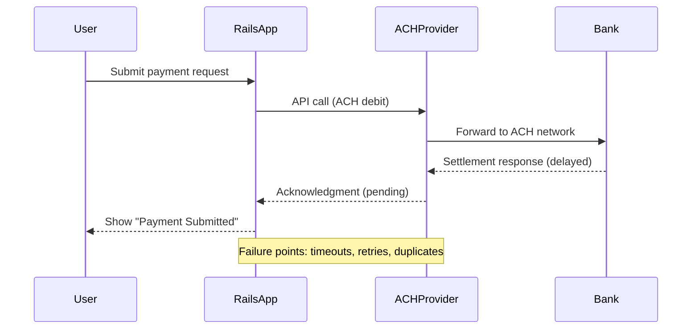

# Why Rails Apps Fail in Production (and What ACH Teaches Us)


When I first read *Release It!* by Michael Nygard, one phrase stuck:  

> **Most systems fail in production, not because of bugs, but because of unpredictable real-world conditions.**

That's especially true in fintech. You can build the cleanest Rails codebase, pass every test, and still hit walls in production once **ACH payments** start flowing.  

---

## Reliability Fundamentals (Quick Primer)

Before diving in, let's define a few system design terms that matter for financial systems:  

- **Availability** – the percentage of time your system is up and functioning.  
- **Consistency** – whether all users see the same state at the same time.  
- **Partition Tolerance** – how your system behaves when parts of it cannot communicate.  

Together, these form the **CAP theorem**. In payment systems like ACH, we often trade **immediate consistency** for **eventual consistency** (e.g., showing "Payment Submitted" while settlement completes later).  

Reliability is usually framed in **SLAs** (Service Level Agreements) and **error budgets**. For example:  
- SLA: "ACH submission API is available 99.9% of the time."  
- Error budget: "We can afford up to 43 minutes of downtime per month."  

These concepts are not just theory — they directly impact customer trust and regulatory compliance.  

---

## Common Failure Modes in Rails ACH Apps

Here are the ways Rails apps typically fail in ACH contexts, and how to design against them:

1. **Network Instability**  
   - Problem: ACH API calls time out or return 5xx errors.  
   - Mitigation: Use retries with **exponential backoff** and upper bounds.  

   ```ruby
   # ❌ Bad: naive retry
   response = Net::HTTP.post(uri, payload)
   response = Net::HTTP.post(uri, payload) if response.code != "200"

   # ✅ Better: exponential backoff
   attempts = 0
   begin
     response = Net::HTTP.post(uri, payload)
   rescue Timeout::Error
     attempts += 1
     sleep(2**attempts) # 2s, 4s, 8s...
     retry if attempts < 3
   end
   ```

2. **Duplicate Submissions**  
   - Problem: retries or race conditions resubmit the same ACH file.  
   - Mitigation: Idempotency keys and database uniqueness constraints.  

3. **Slow Dependencies**  
   - Problem: one slow bank call ties up Puma threads.  
   - Mitigation: Connection pooling, timeouts, and circuit breakers.  

4. **Poor Error Messaging**  
   - Problem: vague "Something went wrong."  
   - Mitigation: map ACH return codes to user-facing messages.  

5. **Operational Blind Spots**  
   - Problem: no visibility into retry counts or settlement delays.  
   - Mitigation: monitor queue length, error rates, and SLA adherence.  

## Example: Rails ACH Payment Flow

Let's model a simple ACH payment flow with potential failure points:



Notice the eventual consistency: the user sees "Payment Submitted," but the real truth (settlement) arrives hours or days later. This is a distributed system challenge: availability vs. consistency under network partitions.

## Lessons From Release It! Applied to ACH

- **Expect Failure**: Design your ACH integration assuming timeouts and retries.
- **Isolate Dependencies**: Don't let a slow bank bring down your app (use circuit breakers).
- **Communicate Clearly**: Be honest about settlement delays — that's eventual consistency in action.
- **Measure Against SLAs**: Track whether your retry logic and provider uptime respect error budgets.

## Coming Up Next

In the next post, we'll dive into stability patterns from Release It! and show how to apply them to Rails ACH systems — starting with circuit breakers.

## Key Takeaways

- ACH is the perfect playground for studying system reliability.
- Rails apps fail in production not just due to bugs, but due to distributed system realities like partitions, latency, and eventual consistency.
- By applying Release It! patterns (timeouts, retries, idempotency), we can build resilient, trustworthy payment systems.

---

---

## 📖 Acronyms & Terms

- **ACH** – Automated Clearing House, a U.S. network for electronic bank-to-bank transactions.  
- **CAP Theorem** – Consistency, Availability, Partition Tolerance; a principle describing trade-offs in distributed systems.  
- **SLA** – Service Level Agreement; the promised level of availability or performance from a system or provider.  
- **Error Budget** – The maximum allowable downtime or failure percentage within an SLA.  
- **Idempotency** – A property of operations where repeating the same action produces the same result (critical in payments).  

---

## 📚 References

- Nygard, Michael T. *Release It!: Design and Deploy Production-Ready Software*. Pragmatic Bookshelf.  
- NACHA Operating Rules & Guidelines (official ACH compliance rules).  
- Google SRE Book – Chapter on SLAs, SLOs, and Error Budgets.  
- Martin Kleppmann. *Designing Data-Intensive Applications* (eventual consistency, distributed systems).  

---

*This is the first article in a series exploring how to apply Michael Nygard's Release It! principles to Rails applications processing ACH payments. We'll cover circuit breakers, bulkheads, timeouts, and other resilience patterns that keep your payment systems running when external dependencies fail.*
