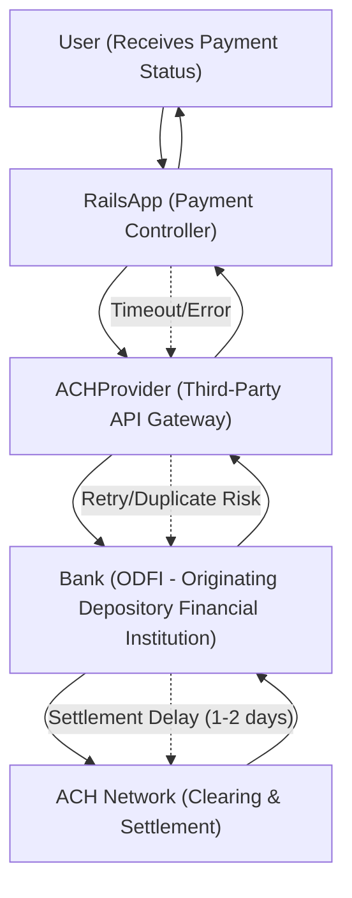

# Why Apps Fail in Production (and What ACH Teaches Us)

Whether you're using Rails, Django, or Spring Boot, production failures rarely come from syntax errors—they come from timeouts, retries, duplicates, and slow dependencies that integration tests miss.




**Audience** Backend engineers, Rails developers, fintech architects  
**Reading Time:** 14 minutes  
**Prerequisites:** Rails app in production, basic ACH/payment knowledge  
**Why now:** ACH volumes keep growing (29.1B payments in 2023). Rails teams building financial systems face outages not from syntax errors, but from distributed system realities.

**TL;DR:**
- Rails apps fail in production due to retries, duplicates, blind spots, and slow dependencies.
- ACH teaches resilience patterns: idempotency, retries with backoff, circuit breakers, clear error mapping.
- Design for eventual consistency — settlement takes hours/days, not seconds.
- Reliability design must also cover recovery procedures (batch failures, corruption, duplicates) and compliance obligations (audit, retention, reporting).

⚠️ **Disclaimer:** All scenarios, accounts, names, and data used in examples are not real. They are realistic scenarios provided only for educational and illustrative purposes.

## Problem Definition

**The challenge:** Rails fintech apps pass tests, but fail in production when ACH payments introduce timeouts, duplicates, and slow dependencies.

**Who faces this:** Rails teams integrating payment flows at banks, lenders, payroll providers, and utilities.

**Cost of inaction:** Customer trust erosion, regulatory exposure, financial loss. Example: a payroll system resubmits duplicate debit files — employees get double-paid, compliance auditors get involved.

**Why current solutions fail:** Testing focuses on correctness of code, not resilience against network partitions, retries, and eventual consistency.

## Reliability Fundamentals (Quick Primer)
- **Consistency** – whether users see the same state at the same time.
- **Availability** – % of time system is up.
- **Partition Tolerance** – how the system behaves when nodes cannot communicate.

These define the **CAP theorem**. ACH systems favor availability + partition tolerance over strict consistency. Example: users see "Payment Submitted" while actual settlement occurs hours later.

- **SLA Example:** "ACH submission API is available 99.9% of the time."
- **Error budget:** 43 minutes downtime per month.

ℹ️ **Note:** These aren't just theory — they are written into contracts, regulations, and customer trust.

## Common Failure Modes in Rails ACH Apps

### 1. Network Instability

❗ **Warning:** A single timeout on ACH API calls can block payroll for thousands of employees.

```ruby
require 'net/http'
require 'uri'

uri = URI("https://ach-provider.example.com/debits")
payload = { routing_number: "061000052", account_number: "123456789", amount_cents: 12500 }.to_json

attempts = 0
begin
  response = Net::HTTP.post(uri, payload, "Content-Type" => "application/json")
  raise "Non-200 response: #{response.code}" unless response.code == "200"
  puts "✅ Success: #{response.body}"
rescue => e
  attempts += 1
  sleep(2**attempts) # exponential backoff: 2s, 4s, 8s
  retry if attempts < 3
  puts "❌ Failure after retries: #{e.message}"
end
```

### 2. Duplicate Submissions

💡 **Tip:** Always use idempotency keys or database uniqueness constraints.

```ruby
payment = Payment.create!(
  idempotency_key: SecureRandom.uuid,
  routing_number: "061000052",
  account_number: "123456789",
  amount_cents: 12500,
  status: "submitted"
)
```

### 3. Slow Dependencies

One slow bank ties up Puma threads.

✅ **Solution:** Circuit breakers + connection pool limits.

```ruby
require 'circuitbox'

circuit = Circuitbox.circuit(:ach_api, exceptions: [Timeout::Error], sleep_window: 60)

response = circuit.run do
  Net::HTTP.post(uri, payload, "Content-Type" => "application/json")
end

if response.nil?
  puts "❌ ACH service unavailable — circuit open"
end
```

### 4. Poor Error Messaging

ACH return codes are specific. Don't show "Something went wrong."

Map codes → actionable messages.

```ruby
RETURN_CODES = {
  "R01" => "Insufficient funds",
  "R02" => "Bank account closed",
  "R03" => "No account / unable to locate",
  "R29" => "Corporate customer refused"
}

def user_message(code)
  RETURN_CODES[code] || "Unexpected error — please contact support."
end
```

### 5. Operational Blind Spots

ℹ️ **Note:** If you don't track retries, queue length, and settlement times, you are flying blind.

Use Prometheus/Grafana:
- Queue depth > 500 → backlog alert
- ACH retries > 5% → instability alert
- Settlement > 72h → compliance alert

Example: Rails ACH Payment Flow



## Recovery Procedures (When Things Go Wrong)

### 1. ACH File Corruption

❗ **Warning:** Corrupted ACH files are rejected at the ODFI level.

✅ **Recovery:** Validate checksums before submission; regenerate only if mismatch.

```ruby
require 'digest'

file_path = "/tmp/ach_batch.ach"
checksum = Digest::SHA256.file(file_path).hexdigest

if checksum != expected_checksum
  puts "❌ File corruption detected, regenerating batch..."
  regenerate_ach_file(file_path)
else
  puts "✅ ACH file validated, safe to submit."
end
```

### 2. Partial Batch Failures

ℹ️ **Note:** A 1,000-entry file can partially fail (950 succeed, 50 rejected).

✅ **Recovery:** Parse return codes, retry failed subset only, maintain per-entry queue.

### 3. Duplicate Submissions

💡 **Tip:** Never rollback completed ACH entries. Instead:

- Record duplicates as compensating transactions.
- Retain trace numbers for reconciliation.
- Notify compliance immediately.

## Compliance Considerations (Reliability in a Regulated Context)

### 1. Audit Trails
Every ACH submission must have a complete log (trace, retries, user ID).

```ruby
AuditLog.create!(
  event: "ACH_SUBMISSION",
  trace_number: payment.trace_number,
  user_id: payment.user_id,
  retry_count: payment.retries,
  timestamp: Time.now.utc
)
```

### 2. Data Retention
ACH records must be stored 2+ years, often in immutable storage.

### 3. Error Reporting
Material incidents (delays, duplicates) may require reporting to ODFI/NACHA within 24 hours.

❗ **Warning:** Noncompliance risks fines, audits, and loss of ACH privileges.

## Lessons From Release It! Applied to ACH

- **Expect Failure** – Assume ACH calls timeout, retry, and duplicate.
- **Isolate Dependencies** – Circuit breakers prevent cascading failure.
- **Communicate Clearly** – Show "Payment submitted, settlement pending."
- **Measure Against SLAs** – Track retries, latency, and error budgets.
- **Prepare for Recovery** – Batch failures, corruption, duplicates happen.

## Validation & Monitoring

✅ **Test cases:**
- Retry works up to 3 attempts, then logs failure.
- Duplicate requests rejected by idempotency key.
- Circuit opens after 3 failures, resets after 60s.
- User sees ACH-specific error messages.
- Audit logs written per transaction.

📊 **Success metrics:**
- < 0.1% duplicate submissions
- < 1% ACH retry rate
- P95 API latency < 2s
- SLA uptime ≥ 99.9%
- Error budget ≤ 43 minutes downtime/month

❗ **Failure modes:**
- Circuit breaker left closed → app stalls
- Idempotency not persisted → double charges
- Monitoring gaps → SLA violation without alert
- Audit logging missing → compliance failure

## Key Takeaways

- ACH is the perfect resilience case study.
- Rails failures in production = distributed system realities, not bad code.
- Apply Release It! patterns (timeouts, retries, idempotency, circuit breakers).
- Reliability requires recovery procedures and compliance discipline.
- SLAs and error budgets measure whether your design works.

## Next Steps

1. Implement circuit breakers in your Rails payment flows.
2. Add recovery handling for corrupted/partial batches.
3. Build immutable audit logs and compliance runbooks.
4. Review SLA + error budgets with your compliance officer.

## 📖 Acronyms & Terms

- **ACH** – Automated Clearing House
- **CAP Theorem** – Consistency, Availability, Partition Tolerance
- **SLA** – Service Level Agreement
- **Error Budget** – Allowable downtime/failures within SLA
- **Idempotency** – Same request produces same result
- **ODFI** – Originating Depository Financial Institution

## 📚 References

- [NACHA ACH Volume Stats](https://www.nacha.org/news/ach-volume-statistics) - NACHA ACH Volume Statistics, 2024
- [Michael Nygard](https://pragprog.com/titles/mnee2/release-it-second-edition/) - Release It!: Design and Deploy Production-Ready Software, 2018
- [Google SRE](https://sre.google/sre-book/error-budgets/) - Site Reliability Engineering: Error Budgets, 2020
- [Martin Kleppmann](https://dataintensive.net/) - Designing Data-Intensive Applications, 2017
  
---
