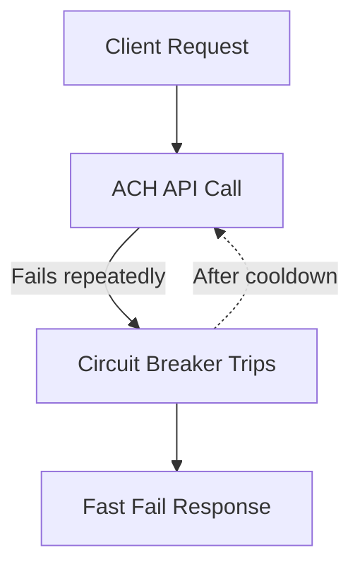
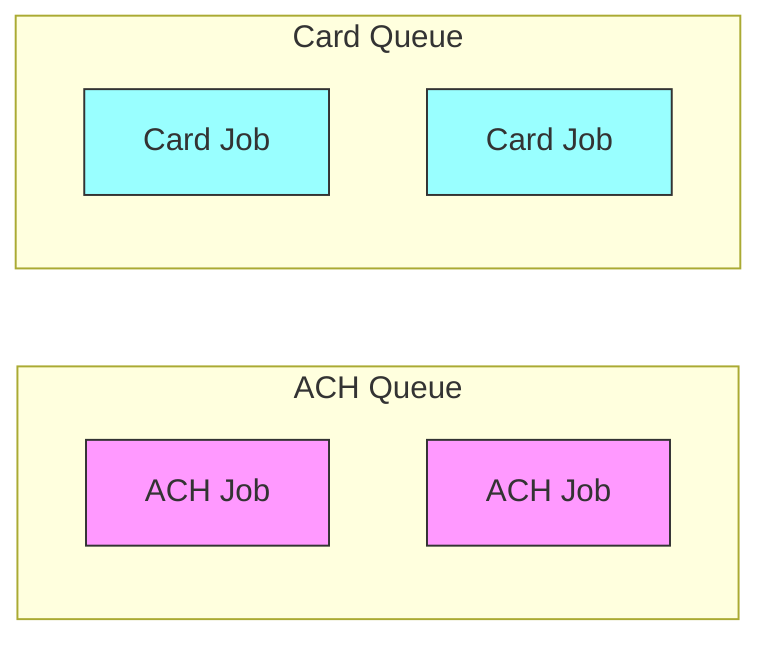

# Stability Patterns Every Rails Fintech Engineer Should Know
*Design techniques that keep Rails fintech apps alive when real-world failures strike.*

<div class="personal-branding">
  
  <div class="author-info">
    <div class="author-name">Author: Suma Manjunath</div>
    <div class="publish-date">Published on: {{ page.date | date: "%B %d, %Y" }}</div>
    
    <div class="update-date">Updated on: {{ page.last_modified_at | date: "%B %d, %Y" }}</div>
    
  </div>
</div>


In *Release It!*, Michael Nygard introduces **stability patterns** — design techniques that keep systems alive when real-world failures strike.  

For fintech engineers working with **ACH payments**, these aren't optional. An ACH outage can mean **duplicate withdrawals, delayed settlements, or even compliance violations**.  

This post covers four essential stability patterns for Rails fintech apps: **Circuit Breakers, Timeouts, Retries, and Bulkheads**.

---

## The Problem: Fragile ACH Dependencies

Rails apps that handle ACH rely on **external services** — payment gateways, bank APIs, and NACHA file processors.  

When those services misbehave, your app risks:  
- **Thread lockups** in Puma or Sidekiq.  
- **Endless retries**, leading to duplicate ACH submissions.  
- **Cascading failures**, where one outage spreads system-wide.  

---

## Stability Patterns in Action

### 1. Circuit Breaker

A **circuit breaker** prevents cascading failures. After repeated errors, it "trips" and stops making requests for a cooldown period. Instead of tying up resources, your app fails fast.  

```ruby
require "semian"

begin
  Semian::NetHTTP.new("ach_provider", success_threshold: 1, error_threshold: 3, timeout: 10) do
    Net::HTTP.start("ach.example.com") do |http|
      http.post("/debit", payload)
    end
  end
rescue Semian::OpenCircuitError
  # Fast-fail: don't block the app
  Rails.logger.error "ACH service unavailable - circuit open"
  raise ACHSubmissionError, "ACH provider temporarily unavailable"
end
```

**Diagram**:


### 2. Timeouts

Never let slow ACH APIs hog your app. Configure reasonable timeouts based on SLAs.

**Typical defaults**:
- Open timeout: 2s
- Read timeout: 5–10s

```ruby
conn = Faraday.new(url: "https://ach.example.com") do |f|
  f.options.open_timeout = 2 # connect
  f.options.timeout = 10     # read
end
```

### 3. Retries with Backoff + Jitter

Retries are essential — but naive retries cause retry storms that make outages worse. Always use exponential backoff with jitter and a max cap.

```ruby
class ACHService
  MAX_RETRIES = 3
  MAX_BACKOFF = 32

  def submit_payment(payload)
    retries = 0
    begin
      response = connection.post("/debit", payload)
      handle_response(response)
    rescue Faraday::TimeoutError, Faraday::ConnectionFailed => e
      retries += 1
      if retries <= MAX_RETRIES
        backoff = [2**retries + rand(0..1), MAX_BACKOFF].min
        sleep(backoff)
        retry
      else
        raise ACHSubmissionError, "ACH submission failed after #{MAX_RETRIES} attempts"
      end
    end
  end
end
```

**ACH-specific tie-in**: NACHA rules prohibit duplicate file submissions → idempotency keys are mandatory. Retries should never generate duplicate batches.

### 4. Bulkheads

Like watertight compartments in a ship, bulkheads isolate workloads so one failure doesn't sink everything.

In Rails, this often means separate Sidekiq queues:

```yaml
# sidekiq.yml
:queues:
  - [ach_processing, 5]
  - [card_payments, 5]
  - [default, 2]
```

**Diagram**:


**ACH-specific tie-in**: ACH jobs often run on daily cutoff windows — if they back up, you don't want them blocking real-time card payments.

---

## Acronyms & Terms

- **ACH** – Automated Clearing House, U.S. electronic payments network.
- **Circuit Breaker** – Pattern that halts failing calls temporarily to prevent cascading failure.
- **Bulkhead** – Partitioning strategy that isolates workloads to contain failures.
- **Jitter** – Randomized delay added to backoff to avoid retry storms.
- **DLQ (Dead Letter Queue)** – Queue for jobs that permanently fail.

---

## References

- Nygard, Michael T. *Release It!: Design and Deploy Production-Ready Software*. Pragmatic Bookshelf.
- NACHA Operating Rules & Guidelines.
- AWS Architecture Blog: "Exponential Backoff and Jitter."
- Netflix Tech Blog: "Circuit Breaker Pattern at Scale."
- Google SRE Book – Handling overload and graceful degradation.
- Shopify Engineering: "Circuit Breakers at Scale."

---

## Roadmap

This article is part of the **Release It! with Rails + ACH** series:

- **Previous**: [Why Rails Apps Fail in Production](/2025/08/30/why-rails-apps-fail-production-ach-teaches-us.html)
- **Next**: The Four Core Production Concerns in Fintech Systems

**Related upcoming deep dives**:
- Circuit Breakers (Post #4)
- Retries & Backoff (Post #5)
- Bulkhead isolation (Post #7)

---

## Key Takeaways

- ACH APIs are fragile dependencies — plan for failure.
- Circuit breakers, timeouts, retries, and bulkheads are the core survival patterns.
- In Rails, these can be implemented with gems (Semian, Faraday) and queueing strategies (Sidekiq).
- ACH-specific rules (like NACHA's duplicate file restrictions) require careful retry + idempotency design.

---


*This post introduces the toolkit. Each of the four patterns will get its own deep dive article later — here we're setting the stage.*
