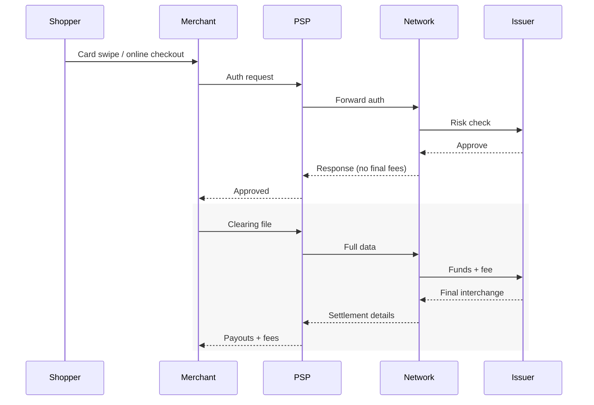
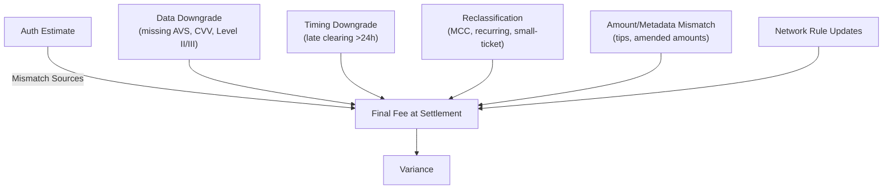
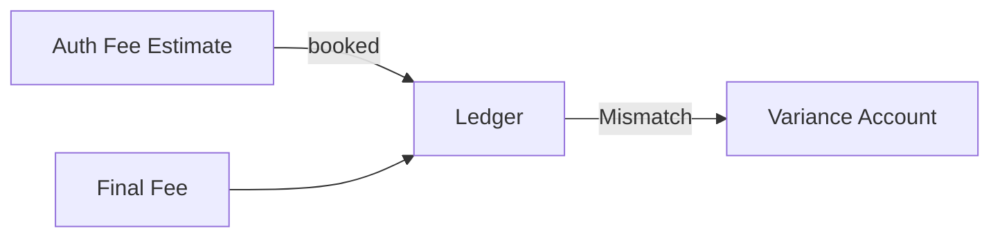
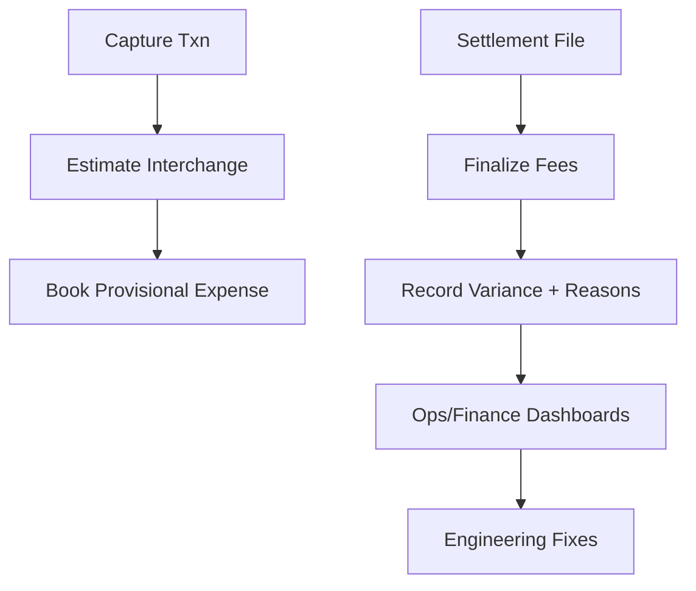
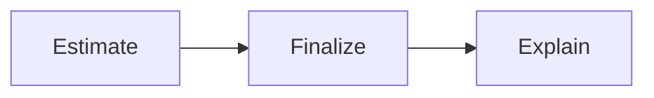

# Why Credit Card Interchange Fees Differ at Authorization vs Settlement (and How to Reconcile Them)
*Understanding why credit card interchange fees change between authorization and settlement is crucial for payment system design. This article explores the reconciliation challenges and provides practical solutions for tracking fee variances.*

<div class="personal-branding">
  
  <div class="author-info">
    <div class="author-name">Author: Suma Manjunath</div>
    <div class="publish-date">Published on: {{ page.date | date: "%B %d, %Y" }}</div>
    
    <div class="update-date">Updated on: {{ page.last_modified_at | date: "%B %d, %Y" }}</div>
    
  </div>
</div>  


Interchange at auth is just an estimate. Final fees are set at settlement, where missing data, timing, and classification issues can "downgrade" a transaction. If you treat auth as final, you'll end up with reconciliation noise, misstated margins, and ops pain.

> **Note:** This post focuses on U.S. credit card interchange (Visa, Mastercard, AmEx). Other regions/methods differ.

## The Misconception

Many systems assume authorization = final economics. In reality:

- **Auth (T0):** Approval + provisional fee category.
- **Settlement (T+1…T+3):** Networks calculate final fee with all data.



## Why Auth ≠ Settlement

Common reasons the final interchange differs from your auth-time estimate:

* **Data Downgrades**: Missing or incorrect fields (AVS, CVV match, postal code, tax indicators, Level II/III data) force a higher fee bracket.
* **Timing Downgrades**: Late clearing (e.g., >24 hours after auth) or partial captures.
* **Reclassification**: MCC, recurring flag, small-ticket vs. standard, card-not-present vs. present, cross-border.
* **Amount/Metadata Mismatch**: Tipping, amended amounts, currency conversions.

* **Rule Changes**: Scheme updates or regional programs applied at clearing.




## Failure Mode in Reconciliation



**Impact:**
- Finance books don't tie.
- Ops spends hours chasing deltas.
- Margins misreported by product/region.

## Real-World Impact

On a $100 txn:
- Estimated = $1.75
- Final = $2.00 (due to MISSING_AVS)
- Variance = +$0.25 (Unfavorable)

Across 100,000 transactions/month, this becomes $25,000 in unexpected cost. For thin-margin businesses, that's material.

## Rails Implementation

**Code context:** These examples assume a Rails monolith handling payments through a PSP (Payment Service Provider). Interchange estimation/finalization lives in a domain service layer, while settlement ingestion runs in background jobs (e.g., Sidekiq). Variance data is persisted to support both finance reporting and engineering feedback loops.

### Data Model (simplified)

```ruby
create_table :payments do |t|
  t.string  :psp_txn_id, null: false
  t.string  :card_brand, :mcc, :entry_mode, :recurring_flag, :currency
  t.bigint  :amount_minor, null: false
  t.datetime :authorized_at, :captured_at, :settled_at
end

create_table :interchange_estimates do |t|
  t.references :payment
  t.decimal :rate_bps
  t.decimal :per_txn_fee_minor
end

create_table :interchange_finalizations do |t|
  t.references :payment
  t.decimal :final_rate_bps, :final_per_txn_fee_minor, :final_amount_minor
  t.jsonb :downgrade_reasons, default: []
end

create_table :interchange_variances do |t|
  t.references :payment
  t.decimal :estimated_fee_minor, :final_fee_minor, :variance_minor
end
```

### Estimate at Auth

```ruby
module Interchange
  class Estimator
    def estimate(payment:)
      bucket = [payment.card_brand, payment.entry_mode, payment.recurring_flag, payment.mcc].join(":")
      rule   = @rate_table.fetch(bucket)
      pct    = ((payment.amount_minor * rule[:bps]) / 10_000.0).round
      total  = pct + rule[:per_txn_fee_minor]

      InterchangeEstimate.create!(payment:, rate_bps: rule[:bps], per_txn_fee_minor: rule[:per_txn_fee_minor])
      total
    end
  end
end
```

### Finalize at Settlement

```ruby
module Interchange
  class Finalizer
    def apply!(payment:, row:)
      final_fee = ((row.settlement_amount_minor * row.final_rate_bps) / 10_000.0).round + row.final_per_txn_fee_minor
      estimated = payment.interchange_estimates.last

      InterchangeFinalization.create!(payment:, final_rate_bps: row.final_rate_bps, downgrade_reasons: row.downgrade_reasons)
      InterchangeVariance.create!(payment:, estimated_fee_minor: estimated_total(estimated), final_fee_minor: final_fee, variance_minor: final_fee - estimated_total(estimated))
    end

    def estimated_total(est) = ((est.payment.amount_minor * est.rate_bps) / 10_000.0).round + est.per_txn_fee_minor
  end
end
```

## Ops Playbook



- At capture: Book provisional accrual.
- At settlement: Adjust with final fee.
- Track reasons: AVS missing, late clearing, etc.
- Alert: Spikes in unfavorable variance.
- Feedback loop: Downgrades → engineering fixes.

Common downgrade reasons map to specific engineering solutions:

## Engineering Fixes for Downgrades

- **MISSING_AVS** → enforce ZIP/address collection at checkout.
- **LATE_CLEARING** → ensure capture jobs run within 24h; add monitoring for delays.
- **MISSING_CVV** → require CVV field; reject requests missing it.
- **RECURRING MISFLAGGED** → fix subscription billing flags in PSP integration.

## Example

On $100 txn:
- Estimated at auth: 1.65% + $0.10 = $1.75
- Final at settlement (downgraded): 1.90% + $0.10 = $2.00
- Variance: +$0.25 (Unfavorable)

## Takeaway

Interchange at auth is only a hint. Build systems to:



That loop is what turns messy variance into actionable cost reduction.

## Glossary

- **AVS:** Address Verification Service.
- **CNP/CP:** Card Not Present / Card Present.
- **MCC:** Merchant Category Code (e.g., 5732 = electronics stores).
- **PSP:** Payment Service Provider (processor/gateway).
- **Issuer:** Bank that issued the card.
- **Acquirer:** Bank that processes payments for the merchant.
- **Downgrade:** When a transaction falls into a higher-cost interchange bucket.
- **BPS:** Basis points. 100 bps = 1.00%.

## References

- [Visa USA Interchange Reimbursement Fees (PDF)](https://usa.visa.com/support/small-business/merchant-resources/rates.html)
- [Mastercard US Interchange Rates (PDF)](https://www.mastercard.us/en-us/business/issuers/rates.html)
- [AmEx Merchant Pricing Overview](https://network.americanexpress.com/globalnetwork/business/en_US/merchant-pricing)
- [Nacha Rules (ACH comparison)](https://www.nacha.org/rules)


