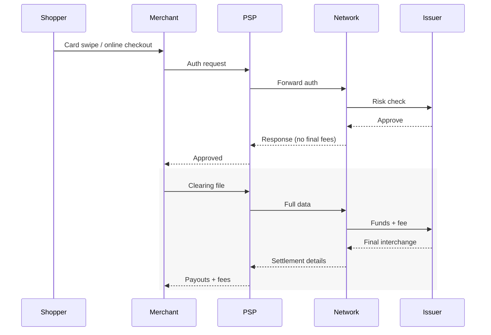
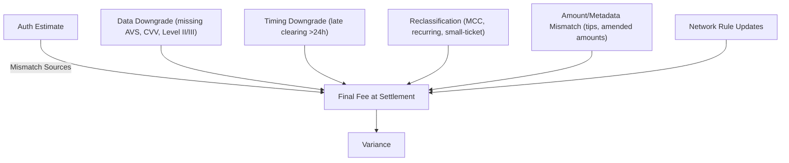
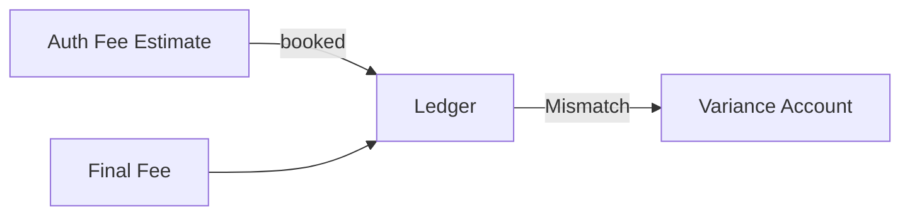
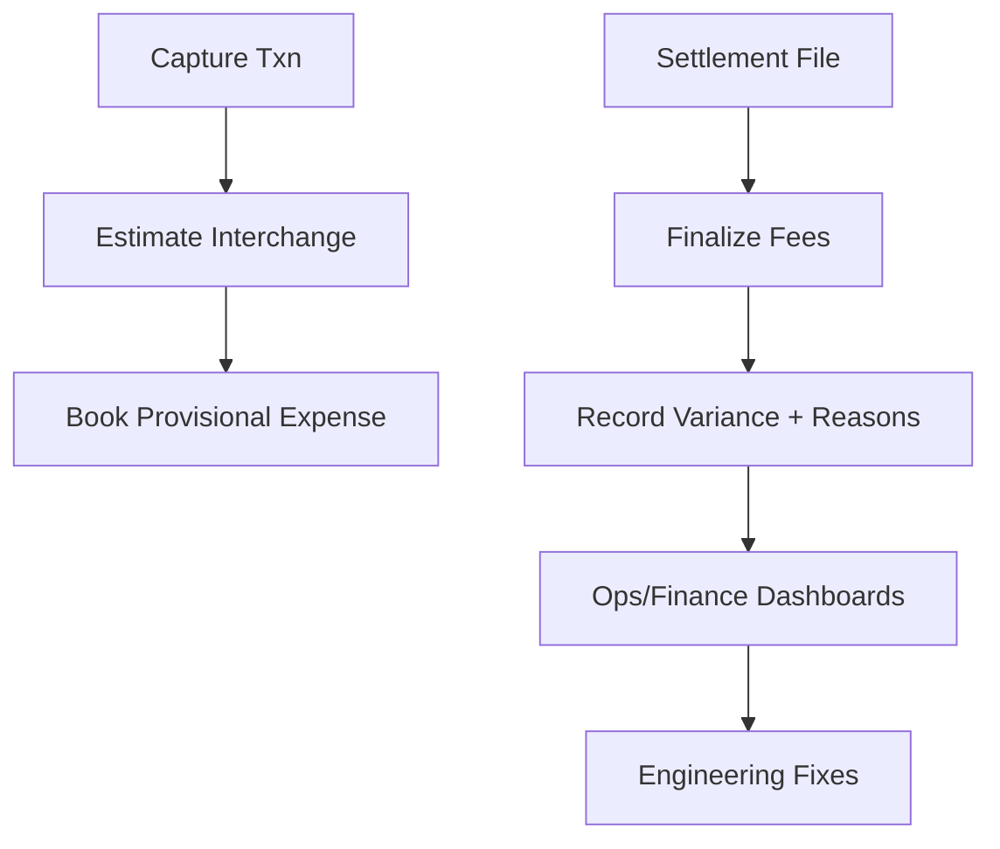

# Why Credit Card Interchange Fees Differ at Authorization vs Settlement (and How to Reconcile Them)

*Understanding why credit card interchange fees change between authorization and settlement is crucial for payment system design. This article explores the reconciliation challenges and provides practical solutions for tracking fee variances.*




**For:** Payment engineers, finance systems architects  
**Reading Time:** 12 minutes  
**Prerequisites:** Familiarity with card processing flows, Rails background job frameworks  
**Why now:** Interchange downgrades are rising with new scheme rules—misreporting margins creates material financial risk.  

> **TL;DR:**  
> - Authorization interchange is **only a provisional estimate**, not final economics.  
> - Settlement introduces **data, timing, and reclassification adjustments** that change fees.  
> - Treating auth as final creates reconciliation noise and margin misreporting.  
> - Build variance tracking pipelines to **close the loop between auth and settlement**.  

⚠️ **Disclaimer**: All scenarios, accounts, names, and data used in examples are not real. They are realistic scenarios provided only for educational and illustrative purposes.

---

## Problem Definition

**The challenge:** Many payment systems treat authorization fees as final, leading to reconciliation mismatches when settlement occurs.  

**Who faces this:** Merchants, PSPs, and finance teams handling high transaction volumes.  

**Cost of inaction:** Reconciliation breaks, finance reporting errors, margin leakage of tens of thousands monthly.  

**Why current approaches fail:** Most ledger systems don’t model fee variances explicitly, hiding downgrade causes from engineering.  

---

## The Misconception

Many assume **authorization = final economics**. In reality:  

- **Auth (T0):** Approval + provisional fee category.  
- **Settlement (T+1…T+3):** Networks compute **final fee** with complete data.  




---

## Why Auth ≠ Settlement

Final interchange differs due to:  

- **Data Downgrades** – missing AVS, CVV, postal code, Level II/III data.  
- **Timing Downgrades** – late clearing (>24h), partial captures.  
- **Reclassification** – MCC changes, recurring flag mis-set, cross-border detection.  
- **Amount Mismatch** – tips, amended amounts, FX conversions.  
- **Network Rule Updates** – scheme changes applied at clearing.  




---

## Failure Mode in Reconciliation




**Impact:**  
- Finance books don’t tie.  
- Ops spends hours chasing deltas.  
- Margins misreported.  

---

## Real-World Impact

On a $100 txn:  
- Estimated = $1.75  
- Final = $2.00 (due to MISSING_AVS)  
- Variance = +$0.25 (unfavorable)  

Across **100,000 transactions/month**, this becomes **$25,000 in hidden costs**.  

---

## Solution Implementation (Rails Example)

We’ll build a pipeline to:  
1. Estimate fees at auth.  
2. Ingest settlement files.  
3. Record variances + downgrade reasons.  

### Data Model

```ruby
create_table :payments do |t|
  t.string  :psp_txn_id, null: false
  t.string  :card_brand, :mcc, :entry_mode, :recurring_flag, :currency
  t.bigint  :amount_minor, null: false
  t.datetime :authorized_at, :captured_at, :settled_at
end

create_table :interchange_estimates do |t|
  t.references :payment
  t.decimal :rate_bps
  t.decimal :per_txn_fee_minor
end

create_table :interchange_finalizations do |t|
  t.references :payment
  t.decimal :final_rate_bps, :final_per_txn_fee_minor, :final_amount_minor
  t.jsonb :downgrade_reasons, default: []
end

create_table :interchange_variances do |t|
  t.references :payment
  t.decimal :estimated_fee_minor, :final_fee_minor, :variance_minor
end
```

### Estimate at Auth

```ruby
module Interchange
  class Estimator
    def estimate(payment:)
      bucket = [payment.card_brand, payment.entry_mode, payment.recurring_flag, payment.mcc].join(":")
      rule   = @rate_table.fetch(bucket)
      pct    = ((payment.amount_minor * rule[:bps]) / 10_000.0).round
      total  = pct + rule[:per_txn_fee_minor]

      InterchangeEstimate.create!(payment:, rate_bps: rule[:bps], per_txn_fee_minor: rule[:per_txn_fee_minor])
      total
    end
  end
end
```

### Finalize at Settlement

```ruby
module Interchange
  class Finalizer
    def apply!(payment:, row:)
      final_fee = ((row.settlement_amount_minor * row.final_rate_bps) / 10_000.0).round + row.final_per_txn_fee_minor
      estimated = payment.interchange_estimates.last

      InterchangeFinalization.create!(payment:, final_rate_bps: row.final_rate_bps, downgrade_reasons: row.downgrade_reasons)
      InterchangeVariance.create!(payment:, estimated_fee_minor: estimated_total(estimated), final_fee_minor: final_fee, variance_minor: final_fee - estimated_total(estimated))
    end

    def estimated_total(est) = ((est.payment.amount_minor * est.rate_bps) / 10_000.0).round + est.per_txn_fee_minor
  end
end
```

---

## Ops Playbook




💡 **Tip:** Map downgrade reasons to specific engineering fixes:  
- MISSING_AVS → enforce ZIP at checkout.  
- LATE_CLEARING → run capture jobs within 24h.  
- MISSING_CVV → reject requests missing CVV.  
- RECURRING MISFLAGGED → fix subscription flags.  

---

## Validation & Monitoring

- **Validation:** Compare provisional accrual vs. final fee in variance table.  
- **Monitoring:** Alert on unfavorable variance > X bps.  
- **Failure Modes:** Missing downgrade reasons → finance blind spots.  

---

## Takeaways

- Authorization interchange is **only a hint**.  
- Settlement determines **final economics**.  
- Build systems that **estimate → finalize → explain**.  
- Variance tracking converts noise into **actionable engineering fixes**.  

---

## Acronym

- **AVS:** Address Verification Service  
- **CNP/CP:** Card Not Present / Card Present  
- **MCC:** Merchant Category Code  
- **PSP:** Payment Service Provider  
- **Issuer:** Bank issuing the card  
- **Acquirer:** Bank acquiring merchant transactions  
- **Downgrade:** Movement into higher-cost interchange bucket  
- **BPS:** Basis points (100 bps = 1%)  

---

## References

1. Visa Interchange Fees - [Visa USA Interchange Reimbursement Fees, 2024](https://usa.visa.com/dam/VCOM/download/merchants/visa-usa-interchange-reimbursement-fees.pdf)  
2. Mastercard Interchange Rates - [Mastercard US Interchange Rates, 2024](https://www.mastercard.us/content/dam/public/mastercardcom/na/us/en/documents/merchant-rates-2024-2025.pdf)  
3. AmEx Merchant Pricing - [American Express Merchant Pricing Overview, 2024](https://www.americanexpress.com/ca/en/merchant/card-acceptance-pricing.html?linknav=merchant-nsnu-support-cardpricing#:~:text=Merchants%20pay%20a%20single%20Discount,visiting%20international%20Cardmember%2C%20among%20others.)  
4. NACHA ACH Rules - [NACHA ACH Operations Rules & Advisories, 2024](https://www.nacha.org/products/2024-nacha-operating-rules-guidelines)  

---