# Why Card Networks Don't Have NOCs (and How to Build Your Own Downgrade Feedback Loop)
*The hidden cost of credit card transactions — and how to fix it with data-driven engineering.*




Unlike ACH, where Notifications of Change (NOCs) tell you exactly what to fix, credit card networks provide no standardized correction feed. If your transactions downgrade into more expensive interchange categories, you must reverse-engineer the cause from settlement data. And even if you provide all the "right" fields, your processor may not pass them along — meaning the downgrade (and cost) can persist.

## ACH vs. Cards: A Different Philosophy

**ACH:**
- Banks send NOCs when data is wrong (e.g., incorrect routing)
- The format is standardized (NACHA codes)
- Merchants are required to update their records, and future entries are corrected

**Cards:**
- No equivalent of an NOC
- If data is missing or late, the transaction just settles into a more expensive interchange bucket
- You don't get a correction code — only higher fees


## What You Do Get in Cards

**Settlement Bucket**
- The interchange category applied (e.g., CPS Retail, Merit III, EIRF)

**Sometimes a Reason Flag**
- Some PSPs expose downgrade codes (LATE_PRESENTMENT, MISSING_AVS)
- Others only show the bucket name, forcing you to infer why

**Network/PSP Bulletins**
- Visa, Mastercard, AmEx publish interchange rules and data requirements
- These are manual references, not per-transaction corrections

## ACH NOCs vs. Card Downgrades

| Aspect | ACH NOC (Notification of Change) | Card Interchange Downgrade |
|--------|-----------------------------------|----------------------------|
| **Trigger** | Receiving bank finds incorrect data | Missing/incomplete/late fields, or misclassification (MCC, recurring flag, etc.) |
| **Correction Provided?** | ✅ Yes – standardized code + corrected field | ❌ No – only a more expensive interchange category is applied |
| **Cost Impact** | Small NOC fee (~$0.20–$0.50) | Higher interchange rate (basis points + fixed fee) |
| **Action for Merchant** | Must update stored bank data | Must deduce cause & fix inputs |
| **Retroactive Fix?** | ✅ Yes – corrected data applies to future entries | ❌ No – once settled, fees are final |
| **Processor Role** | Banks required by NACHA to forward corrections | PSP/acquirer may or may not pass full data to networks |
| **Persistence of Issue** | Resolved if merchant updates data | May persist if PSP drops fields or account not enabled for certain interchange programs |

## Cost Impact Quantification: Real Numbers

The "basis points + fixed fee" difference isn't abstract—it's real money. Here's what downgrades actually cost:

**Typical Interchange Rates (2025)**
- **CPS Retail (qualified):** 1.51% + $0.10
- **EIRF (unqualified):** 1.80% + $0.10
- **Standard Interchange:** 2.40% + $0.10

**Downgrade Cost Examples**

| Transaction Amount | Qualified Rate | Downgraded Rate | Additional Cost |
|-------------------|----------------|-----------------|-----------------|
| $50.00 | $0.86 | $1.00 | $0.14 |
| $100.00 | $1.61 | $1.90 | $0.29 |
| $500.00 | $7.65 | $9.10 | $1.45 |
| $1,000.00 | $15.20 | $18.10 | $2.90 |

**Monthly Impact Calculation**

If you process $100K/month with 15% downgrade rate:
- **Qualified transactions:** $85K × 1.51% = $1,283.50
- **Downgraded transactions:** $15K × 1.80% = $270.00
- **Total cost:** $1,553.50
- **If all qualified:** $100K × 1.51% = $1,510.00
- **Downgrade penalty:** $43.50/month ($522/year)

**The ROI Case:**
- **AVS implementation cost:** ~$2,000 (one-time)
- **Annual savings:** $522
- **Break-even:** ~4 months
- **3-year ROI:** 78%

## Why Fixes May Not Work Even With Correct Data

Even if you provide all required fields (AVS, CVV, tax amounts, PO numbers, Level II/III data, recurring flags):

**Processor Limitations:** Some PSPs don't support full Level II/III pass-through. Data you send may never reach the network.

**Merchant Configuration:** Interchange programs (e.g., Large Ticket, Utility) often require explicit setup at the acquirer. Without it, you'll never qualify.

**Regional Nuances:** Visa/Mastercard rules vary by region. A U.S. CPS-qualifying transaction may downgrade in EU/APAC despite the same data.

**Immutable Auths:** Some fields (e.g., recurring flag, CVV) must be set at authorization. You can't "fix" them at settlement.

👉 **Bottom line:** Supplying the right data is necessary but not always sufficient. You also need processor support and the right merchant setup to unlock lower interchange.

## Processor Selection: Evaluating Level II/III Support

Not all processors are created equal when it comes to interchange optimization. Here's how to evaluate them:

**Level II/III Data Pass-Through**
- **Full Support:** Stripe, Adyen, Square (Enterprise), Worldpay
- **Partial Support:** PayPal, Square (Standard), most regional processors
- **Limited Support:** Many smaller PSPs, some bank direct integrations

**Key Questions to Ask Your Processor:**
1. "Do you pass Level II/III data to all networks (Visa, Mastercard, AmEx)?"
2. "What percentage of Level II/III fields actually reach the networks?"
3. "Do you support all interchange programs (Large Ticket, Utility, Government)?"

**Red Flags:**
- Processor can't provide network-level settlement data
- No documentation on Level II/III field mapping
- "We handle optimization internally" (code for "we don't pass your data")

**Testing Approach:**
```ruby
# Test Level II/III pass-through
def test_level_ii_iii_pass_through
  test_transaction = create_test_transaction(
    tax_amount: 850,           # $8.50
    invoice_number: "TEST-001",
    po_number: "PO-12345",
    order_description: "Test Level II/III"
  )
  
  # Settle and check if fields appear in settlement data
  settlement = settle_transaction(test_transaction)
  
  assert settlement.tax_amount == 850
  assert settlement.invoice_number == "TEST-001"
  assert settlement.po_number == "PO-12345"
end
```

**Processor Evaluation Checklist**
```ruby
# Run this assessment for each processor you're considering
class ProcessorEvaluator
  def evaluate_level_ii_iii_support
    score = 0
    max_score = 100
    
    # Data pass-through (40 points)
    score += 20 if processor.provides_network_settlement_data?
    score += 10 if processor.passes_level_ii_data?
    score += 10 if processor.passes_level_iii_data?
    
    # Interchange programs (30 points)
    score += 15 if processor.supports_large_ticket?
    score += 10 if processor.supports_utility_programs?
    score += 5 if processor.supports_government_programs?
    
    # Transparency (30 points)
    score += 15 if processor.provides_interchange_breakdown?
    score += 10 if processor.documents_field_mapping?
    score += 5 if processor.provides_downgrade_reasons?
    
    case score
    when 80..100 then "Excellent - Full optimization support"
    when 60..79  then "Good - Most features supported"
    when 40..59  then "Fair - Basic optimization only"
    else "Poor - Limited optimization support"
    end
  end
end
```

## Building Your Own Feedback Loop

Since you don't get an NOC, you need to generate your own signals:

```mermaid
flowchart TD
  Auth[Auth & Estimate Fee] --> Settlement[Settlement File]
  Settlement --> Variance[Compare Fee vs. Estimate]
  Variance --> ReasonMap["Map Bucket/Downgrade → Root Cause"]
  ReasonMap --> Feedback[Ops/Engineering Dashboard]
  Feedback --> Fixes[Concrete Fixes in Checkout / Jobs]
```



**Example Mapping**
- Bucket: EIRF → Missing AVS or late clearing
- Bucket: Merit I instead of Merit III → Missing Level II/III data
- Bucket: Standard Interchange → Wrong MCC or recurring flag not set

**Engineering Fixes (Prioritized by ROI)**

**🔥 High Impact, Low Effort (Implement First)**
1. **AVS collection** - ZIP/address required
   - **ROI:** 15-25% reduction in EIRF downgrades
   - **Effort:** 2-3 days
   - **Cost:** Minimal (UI updates)

2. **Capture job timing** - Ensure <24h from auth
   - **ROI:** 10-20% reduction in late presentment downgrades
   - **Effort:** 1-2 days
   - **Cost:** Infrastructure monitoring

**⚡ Medium Impact, Medium Effort (Implement Second)**
3. **CVV requirement** - Require at checkout
   - **ROI:** 5-15% reduction in standard interchange
   - **Effort:** 3-5 days
   - **Cost:** Potential conversion impact

4. **Level II/III data** - Tax/invoice fields for B2B
   - **ROI:** 20-30% reduction for qualifying transactions
   - **Effort:** 1-2 weeks
   - **Cost:** Data collection infrastructure

**📈 High Impact, High Effort (Plan for Later)**
5. **Processor optimization** - Enable Large Ticket/Utility programs
   - **ROI:** 30-50% reduction for qualifying transactions
   - **Effort:** 2-4 weeks
   - **Cost:** Processor relationship management

**Implementation Timeline:**
- **Week 1-2:** AVS + capture timing (quick wins)
- **Week 3-4:** CVV requirement
- **Month 2:** Level II/III data collection
- **Month 3:** Processor program enablement

## Rails: Downgrade Reason Mapper (Pseudo-NOC)

```ruby
# app/services/interchange/downgrade_reason_mapper.rb
module Interchange
  class DowngradeReasonMapper
    REASON_MAP = {
      "VISA:EIRF"       => ["MISSING_AVS", "LATE_PRESENTMENT"],
      "MC:MERIT_I"      => ["MISSING_LEVEL_II_III"],
      "MC:STANDARD"     => ["MISCLASSIFIED_MCC", "RECURRING_FLAG_MISSING"],
      "AMEX:STANDARD"   => ["DATA_INCOMPLETE"]
    }.freeze

    def initialize(row)
      @row = row
    end

    def infer
      key = "#{@row.card_brand.upcase}:#{@row.bucket_name.upcase}"
      REASON_MAP[key] || fallback_reason
    end

    private

    def fallback_reason
      if @row.settled_at && @row.captured_at && (@row.settled_at - @row.captured_at > 24.hours)
        ["LATE_PRESENTMENT"]
      else
        ["UNKNOWN"]
      end
    end
  end
end
```

## Reporting: Turning Downgrades Into NOC-Like Insights

**Variance by reason (weekly)**
```sql
SELECT
  date_trunc('week', settled_date) AS week,
  reason,
  COUNT(*)                         AS txn_count,
  SUM(variance_minor)/100.0        AS usd_variance
FROM v_interchange_downgrades
WHERE settled_date >= CURRENT_DATE - INTERVAL '56 days'
GROUP BY 1,2
ORDER BY 1, usd_variance DESC;
```

**Heatmap: MCC × downgrade reason**
```sql
SELECT
  mcc,
  reason,
  SUM(CASE WHEN variance_sign='UNFAVORABLE' THEN variance_minor ELSE 0 END)/100.0 AS usd_unfavorable
FROM v_interchange_downgrades
GROUP BY mcc, reason
ORDER BY usd_unfavorable DESC;
```

**Example Dashboard (Vega-Lite spec for unfavorable variance trends)**
```json
{
  "$schema": "https://vega.github.io/schema/vega-lite/v5.json",
  "description": "Weekly unfavorable variance by reason",
  "data": {"name": "table"},
  "mark": "area",
  "encoding": {
    "x": {"field": "week", "type": "temporal", "title": "Week"},
    "y": {"field": "usd_variance", "type": "quantitative", "title": "Unfavorable USD", "stack": "normalize"},
    "color": {"field": "reason", "type": "nominal", "title": "Reason"},
    "tooltip": [
      {"field": "week", "type": "temporal"},
      {"field": "reason", "type": "nominal"},
      {"field": "usd_variance", "type": "quantitative", "format": ".2f"},
      {"field": "txn_count", "type": "quantitative"}
    ]
  }
}
```

## Implementation Roadmap: From Analysis to Action

Based on the cost analysis and prioritization, here's your 90-day plan:

**Month 1: Quick Wins & Assessment**
- **Week 1:** Implement AVS collection (estimated $200-500/month savings)
- **Week 2:** Fix capture job timing (estimated $100-300/month savings)
- **Week 3-4:** Build downgrade monitoring dashboard

**Month 2: Data Collection & CVV**
- **Week 1-2:** Implement CVV requirement (test conversion impact)
- **Week 3-4:** Begin Level II/III data collection for B2B transactions

**Month 3: Optimization & Processor Work**
- **Week 1-2:** Complete Level II/III implementation
- **Week 3-4:** Work with processor to enable optimization programs

**Expected Results:**
- **Month 1:** 15-25% reduction in downgrades
- **Month 2:** Additional 10-20% reduction
- **Month 3:** Additional 20-30% reduction
- **Total potential:** 45-75% reduction in downgrade costs

## Takeaway

- **ACH gives you NOCs out of the box:** a clear correction loop  
- **Cards give you silent penalty pricing:** you only see the downgrade cost  
- **Even with correct data, processor support & merchant setup matter as much as your inputs**

The solution is to build your own pseudo-NOC system:  
1. Ingest settlement buckets  
2. Map them to inferred downgrade reasons  
3. Feed those insights back into engineering and ops  

That's how you close the loop — turning opaque downgrade costs into actionable cost reduction.

**Next Steps:**
1. **Evaluate your processor** using the checklist above  
2. **Implement AVS collection** (highest ROI, lowest effort)  
3. **Build the downgrade monitoring system** to track progress  
4. **Work with your processor** to unlock optimization programs  

The cost of inaction is real: every month of delay costs you the equivalent of a full-time engineer's salary in unnecessary interchange fees.

---

## References  

- [Nacha — Notifications of Change (NOCs)](https://www.nacha.org/news/ach-network-rules-notifications-change)  
- [Visa USA Interchange Reimbursement Fees (PDF)](https://usa.visa.com/content/dam/VCOM/global/support-legal/documents/visa-usa-interchange-reimbursement-fees.pdf)  
- [Mastercard US Interchange Programs (PDF)](https://www.mastercard.us/content/dam/public/mastercardcom/na/us/en/documents/interchange-rates.pdf)  
- [American Express Merchant Pricing Overview](https://www.americanexpress.com/us/merchant/pricing/)  
- [Nacha Operating Rules & Guidelines](https://www.nacha.org/rules)  
- [Federal Reserve — The Role of Interchange Fees in the Payments System](https://www.federalreserve.gov/paymentsystems/interchange-fees.htm)  
- [U.S. GAO Report on Credit Card Interchange Fees](https://www.gao.gov/products/gao-10-45)  

---
