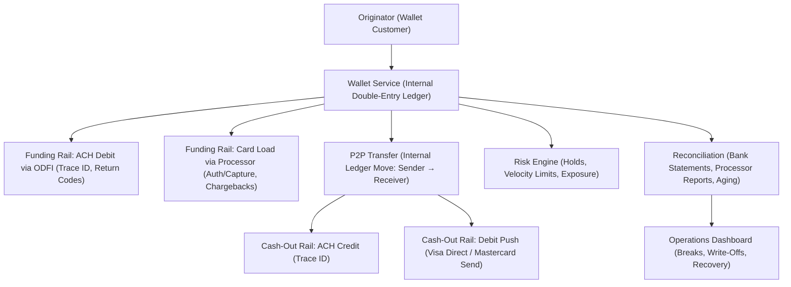
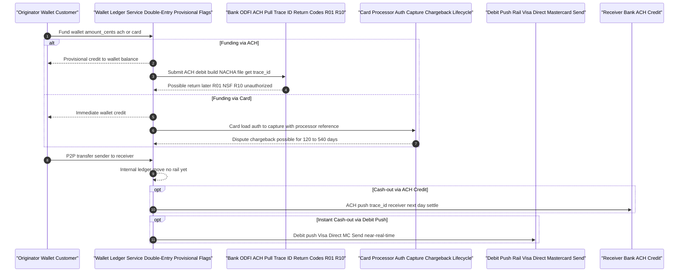
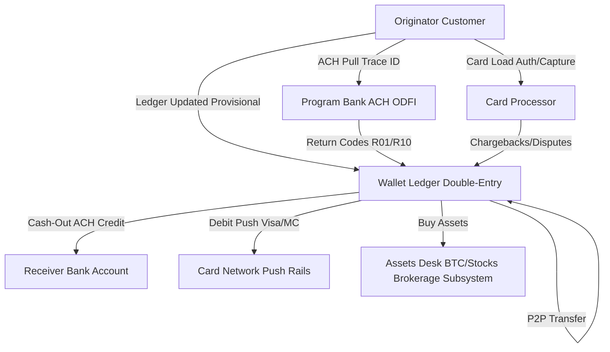
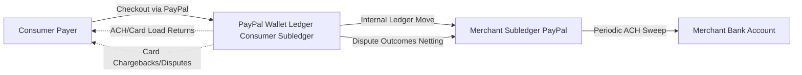
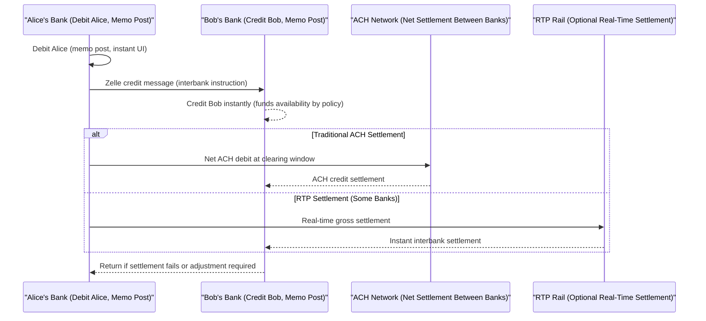

## Wallets & P2P Networks: Venmo, Cash App, PayPal, Zelle — Deliver Instant UX Without Eating Deferred-Settlement Losses
*Cut ACH return losses with proven engineering practices: separate ledger tracking from settlement timing, add provisional holds, and implement automated rail reconciliation.*




**Audience** Backend/payment engineers, risk analysts, operations leaders
**Reading time:** 16 minutes
**Prerequisites:** ACH & card basics, REST webhooks, command line, Ruby 3.x (examples use Ruby)
**Why now:** Wallet adoption keeps rising while ACH/card dispute tails get longer. If you treat "instant balance" as settled cash, you'll ship happy-path UX and wake up to negative balances and write-offs.

## TL;DR

- Wallets are ledger-first abstractions on top of ACH/card rails; balances are provisional until external settlement clears.
- Add rail-aware holds (ACH vs card) + velocity limits to cap exposure; release holds on webhooks.
- Build reconciliation reports keyed by ACH trace IDs and processor capture IDs; auto-match, age, and escalate.
- Ship runnable webhooks for ACH returns (R01/R10) and card disputes; verify end-to-end with provided scripts and sample payloads.

⚠️ **Disclaimer:** All scenarios, accounts, names, and data used in examples are not real. They are realistic scenarios provided only for educational and illustrative purposes.

## Problem Definition

**The problem:** Consumers think "Venmo = cash now." Engineers know it's an internal ledger entry backed by ACH/card rails that settle later. If your system spends a provisional balance like it's settled, you'll create negative balances, reconciliation gaps, and loss.

**Who hits this:** Any team adding P2P/wallet experiences (Venmo-like balance, Cash App-style cash-out, PayPal marketplace flows, bank-embedded Zelle) on top of ACH/card rails.

**Cost of inaction:** 1–3% gross load can get tied up in holds/returns; late R10/R11 unauthorized returns and chargebacks create 60–540 day tails; ops burns hours with unmatched ledgers and bank statements; users see frozen balances and churn.

**Why current approaches fail:** Happy-path prototypes treat "ledger updated" as "money moved." They skip return/dispute webhooks, don't tag entries with external trace IDs, and never distinguish provisional from settled states.

## Solution Implementation

### Architecture Overview (Ledger-First + Rail-Aware)



**Core principles:**

- Double-entry ledger owns truth; ACH/card rails confirm or unwind it.
- Every ledger move carries a rail evidence key (ACH trace, capture ID, dispute case).
- Provisional → settled state machine controlled by webhooks & reports.
- Rail-aware holds and velocity cap exposure at user and program level.

### Wallet Flows With Full Labels

#### Venmo-style (ACH/Card → Internal Ledger → Cash-Out)



#### Cash App-style (Wallet + Stocks/BTC)



#### PayPal-style (Consumer Wallet + Merchant Acceptance)



#### Zelle-style (Bank-Embedded, Not Wallet)



**Key Insight:** Zelle is bank-embedded messaging that gives instant availability to the receiver; interbank settlement is typically deferred net via ACH, but some institutions route Zelle over TCH's RTP rail, which gives real-time interbank (gross) settlement. Implementation differs per bank, so treat funds-availability and settlement as separate concerns in your ops model.

## Step-By-Step: Ship the Minimal Rail-Aware Wallet

We'll implement a standalone, runnable Ruby skeleton you can drop into a Rails app or run as a script to validate flows. It includes:

- Double-entry ledger with provisional vs settled flags
- ACH/card funding with realistic IDs
- P2P transfers
- Cash-out (ACH credit / debit push) placeholders
- Holds & velocity checks
- Webhook handlers for ACH returns and card disputes
- Reconciliation report keyed by trace/capture IDs

ℹ️ **Note:** This is database-backed in production. Here, we use in-memory structures so you can run everything instantly.

### 1) Runnable Wallet Core (copy-paste and run)

```ruby
# wallet_sim.rb
# Run: ruby wallet_sim.rb
require "json"
require "securerandom"
require "time"

ROUTING_NUMBER = "061000052" # Bank of America (publicly known)
ACCOUNT_NUMBER = "123456789"
DATE_EFFECTIVE = "20240817"  # YYYYMMDD for ACH examples

class Ledger
  Entry = Struct.new(:id, :user_id, :amount_cents, :direction, :rail_ref, :provisional, :created_at)
  Balance = Struct.new(:available_cents, :provisional_cents)

  def initialize
    @entries = []
    @balances = Hash.new { |h, k| h[k] = Balance.new(0, 0) }
  end

  def credit(user_id:, amount_cents:, rail_ref:, provisional: true)
    id = SecureRandom.uuid
    @entries << Entry.new(id, user_id, amount_cents, :credit, rail_ref, provisional, Time.now)
    bal = @balances[user_id]
    if provisional
      bal.provisional_cents += amount_cents
    else
      bal.available_cents += amount_cents
    end
    id
  end

  def debit(user_id:, amount_cents:, rail_ref:)
    bal = @balances[user_id]
    raise "Insufficient available balance" if bal.available_cents < amount_cents
    id = SecureRandom.uuid
    @entries << Entry.new(id, user_id, amount_cents, :debit, rail_ref, false, Time.now)
    bal.available_cents -= amount_cents
    id
  end

  def settle(rail_ref:)
    affected = 0
    @entries.each do |e|
      next unless e.rail_ref == rail_ref && e.provisional && e.direction == :credit
      bal = @balances[e.user_id]
      bal.provisional_cents -= e.amount_cents
      bal.available_cents   += e.amount_cents
      e.provisional = false
      affected += 1
    end
    affected
  end

  def reverse(rail_ref:, reason:)
    # Used for ACH returns and card chargebacks
    affected = 0
    @entries.select { |e| e.rail_ref == rail_ref && e.direction == :credit }.each do |e|
      bal = @balances[e.user_id]
      if e.provisional
        bal.provisional_cents -= e.amount_cents
      else
        # If already spent, balance can go negative (exposure)
        bal.available_cents -= e.amount_cents
      end
      affected += 1
    end
    puts "❗ Reversed rail_ref=#{rail_ref} due to #{reason}, entries=#{affected}"
    affected
  end

  def transfer(from_user:, to_user:, amount_cents:, memo:)
    debit(from_user, amount_cents: amount_cents, rail_ref: "P2P:#{memo}")
    credit(user_id: to_user, amount_cents: amount_cents, rail_ref: "P2P:#{memo}", provisional: false)
  end

  def balances(user_id)
    @balances[user_id]
  end

  def entries
    @entries
  end
end

class Risk
  MAX_DAILY_LOAD_CENTS = 100_000 # $1,000
  def initialize
    @loads_by_day = Hash.new(0)
  end

  def check_velocity!(user_id:, amount_cents:)
    key = "#{user_id}:#{Time.now.utc.strftime("%Y-%m-%d")}"
    projected = @loads_by_day[key] + amount_cents
    raise "VelocityLimitExceeded: #{projected} > #{MAX_DAILY_LOAD_CENTS}" if projected > MAX_DAILY_LOAD_CENTS
    @loads_by_day[key] = projected
  end

  def hold_policy(funding_method:, amount_cents:)
    case funding_method
    when :ach
      # Hold full amount for 5 business days; partial risk tail remains until day 60
      { immediate_hold_cents: amount_cents, extended_tail_days: 60 }
    when :card
      # Risk tail via chargebacks up to 120–540 days depending on program
      { immediate_hold_cents: amount_cents, extended_tail_days: 120 }
    else
      { immediate_hold_cents: 0, extended_tail_days: 0 }
    end
  end
end

class Reconciliation
  # Keeps lightweight maps of rail references for reporting
  def initialize
    @ach = {} # trace_id => {status, user_id, amount}
    @card = {} # capture_id => {status, user_id, amount}
  end
  def record_ach(trace_id:, user_id:, amount_cents:, status: "submitted")
    @ach[trace_id] = { status:, user_id:, amount_cents: }
  end
  def record_card(capture_id:, user_id:, amount_cents:, status: "captured")
    @card[capture_id] = { status:, user_id:, amount_cents: }
  end
  def ach_return(trace_id:, code:)
    row = @ach[trace_id]; return unless row
    row[:status] = "returned:#{code}"
  end
  def card_chargeback(capture_id:)
    row = @card[capture_id]; return unless row
    row[:status] = "chargeback"
  end
  def report
    {
      ach: @ach,
      card: @card
    }
  end
end

# --- Demo run ---
ledger = Ledger.new
risk   = Risk.new
recon  = Reconciliation.new

user_alice = "U_ALICE"
user_bob   = "U_BOB"

# 1) Alice funds via ACH: provisional credit + ACH trace_id
fund_amount = 12500 # $125.00
risk.check_velocity!(user_id: user_alice, amount_cents: fund_amount)
trace_id = "ACH#{Time.now.utc.to_i}"
ledger.credit(user_id: user_alice, amount_cents: fund_amount, rail_ref: trace_id, provisional: true)
recon.record_ach(trace_id: trace_id, user_id: user_alice, amount_cents: fund_amount, status: "submitted")
puts "✅ ACH funding submitted trace_id=#{trace_id}"
puts "Alice balances after provisional: #{ledger.balances(user_alice).to_h}"

# 2) ACH settles next day: move provisional → available
ledger.settle(rail_ref: trace_id)
recon.record_ach(trace_id: trace_id, user_id: user_alice, amount_cents: fund_amount, status: "settled")
puts "✅ ACH settled trace_id=#{trace_id}"
puts "Alice balances after settlement: #{ledger.balances(user_alice).to_h}"

# 3) Alice P2P sends $20 to Bob
ledger.transfer(from_user: user_alice, to_user: user_bob, amount_cents: 2000, memo: "DINNER202408")
puts "🍔 P2P transfer completed"
puts "Alice: #{ledger.balances(user_alice).to_h} | Bob: #{ledger.balances(user_bob).to_h}"

# 4) Simulate ACH return (late R10 unauthorized) and observe negative
late_trace = "ACH_LATE_#{Time.now.utc.to_i}"
ledger.credit(user_id: user_alice, amount_cents: 5000, rail_ref: late_trace, provisional: true)
recon.record_ach(trace_id: late_trace, user_id: user_alice, amount_cents: 5000, status: "submitted")
# Alice spends it immediately (before settlement)
ledger.transfer(from_user: user_alice, to_user: user_bob, amount_cents: 3000, memo: "COFFEE202408")
puts "☕ Alice spent provisional funds; now ACH returns R10"
recon.ach_return(trace_id: late_trace, code: "R10")
ledger.reverse(rail_ref: late_trace, reason: "ACH Return R10 unauthorized")
puts "Alice after R10: #{ledger.balances(user_alice).to_h} (may be negative exposure)"
puts JSON.pretty_generate(recon.report)
```

**What you'll see (abridged):**

- ✅ ACH funding submitted … → provisional balance increases
- ✅ ACH settled … → available increases, provisional drops
- 🍔 P2P transfer → internal move, no rail yet
- ☕ Provisional spend → ACH R10 reversal makes Alice's available negative (exposure you must collect)

💡 **Tip:** Keep rail_ref on every entry. For ACH, that's the trace_id; for cards, the capture_id. Your recon job is just a join.

### 2) Webhooks: ACH Returns & Card Chargebacks (ready-to-drop Rack app)

```ruby
# webhooks.rb
# Run: ruby webhooks.rb (requires 'rackup' if you prefer)
require "json"
require "webrick"

# Fake in-memory references to the objects from wallet_sim.rb
$LEDGER = Object.new
def $LEDGER.reverse(rail_ref:, reason:) ; puts "[LEDGER] reverse #{rail_ref} because #{reason}" ; end
$RECON = Object.new
def $RECON.ach_return(trace_id:, code:) ; puts "[RECON] ACH return #{trace_id} #{code}" ; end
def $RECON.card_chargeback(capture_id:) ; puts "[RECON] card chargeback #{capture_id}" ; end

class WebhookServlet < WEBrick::HTTPServlet::AbstractServlet
  def do_POST(req, res)
    begin
      payload = JSON.parse(req.body)
      case req.path
      when "/webhooks/ach_return"
        trace = payload.fetch("trace_id")
        code  = payload.fetch("return_code") # e.g., "R01", "R10"
        $RECON.ach_return(trace_id: trace, code: code)
        $LEDGER.reverse(rail_ref: trace, reason: "ACH Return #{code}")
      when "/webhooks/card_dispute"
        capture = payload.fetch("capture_id")
        $RECON.card_chargeback(capture_id: capture)
        $LEDGER.reverse(rail_ref: capture, reason: "Card Chargeback")
      else
        raise "Unknown webhook path"
      end
      res.status = 200
      res.body = JSON.dump({ ok: true })
    rescue => e
      res.status = 422
      res.body = JSON.dump({ ok: false, error: e.message })
    end
    res["Content-Type"] = "application/json"
  end
end

server = WEBrick::HTTPServer.new(Port: 9292)
server.mount "/", WebhookServlet
trap("INT") { server.shutdown }
server.start
```

**Test locally:**

```bash
# Simulate ACH return R01 NSF
curl -sS -XPOST localhost:9292/webhooks/ach_return \
  -H "Content-Type: application/json" \
  -d '{"trace_id":"ACH1735820000","return_code":"R01"}' | jq

# Simulate card chargeback
curl -sS -XPOST localhost:9292/webhooks/card_dispute \
  -H "Content-Type: application/json" \
  -d '{"capture_id":"CAP_9f2ad3"}' | jq
```

❗ **Warning:** Never trust webhook origin blindly. Validate signatures (e.g., HMAC) and idempotency (dedupe by event_id) before mutating balances.

❗ **Warning:** Prevent replay as well as forgery. Require HMAC-SHA256 signatures, enforce a tight timestamp tolerance (e.g., ±5 minutes), and dedupe by an event_id nonce with TTL. Use constant-time comparison for signatures.

```ruby
# replay_safe_webhook.rb
require "openssl"
require "rack/utils"

SECRET = ENV.fetch("WEBHOOK_SECRET")

def secure_compare(a, b)
  Rack::Utils.secure_compare(a, b)
end

def valid_signature?(raw_body:, sig_header:)
  # Example header: "t=1725302400,v1=hexhmac"
  ts = sig_header[/t=(\d+)/, 1].to_i
  v1 = sig_header[/v1=([0-9a-f]+)/, 1]
  return false if (Time.now.to_i - ts).abs > 300 # 5-min tolerance

  expected = OpenSSL::HMAC.hexdigest("SHA256", SECRET, "#{ts}.#{raw_body}")
  secure_compare(expected, v1)
end

def dedupe!(event_id:)
  key = "wh:#{event_id}"
  inserted = $redis.set(key, 1, nx: true, ex: 600) # 10-min TTL
  raise "ReplayDetected" unless inserted
end
```

**Security Checklist:**

- Verify signature & timestamp before parsing JSON
- Reject old timestamps; drop already-seen event_ids
- Log digest of body for forensics; never log raw secrets

### 3) Rails Adapters (realistic endpoints + error handling)

```ruby
# app/services/wallets/venmo_adapter.rb
class Wallets::VenmoAdapter
  BASE = "https://api.example-venmo.local"

  def fund_via_ach(user_id:, amount_cents:, bank_token:)
    post("/funding/ach", user_id:, amount_cents:, bank_token:)
  rescue => e
    Rails.logger.error("ACH funding failed: #{e.message}")
    raise
  end

  def fund_via_card(user_id:, amount_cents:, card_token:)
    post("/funding/card", user_id:, amount_cents:, card_token:)
  end

  def transfer(from:, to:, amount_cents:, memo:)
    post("/transfers", from:, to:, amount_cents:, memo:)
  end

  def cash_out(user_id:, amount_cents:, instant: false)
    rail = instant ? "debit_push" : "ach_credit"
    post("/payouts", user_id:, amount_cents:, rail:)
  end

  private

  def post(path, payload)
    # Net::HTTP with timeouts, retries, and JSON parsing
    uri  = URI.join(BASE, path)
    http = Net::HTTP.new(uri.host, uri.port)
    http.use_ssl = uri.scheme == "https"
    http.read_timeout = 5
    req = Net::HTTP::Post.new(uri, { "Content-Type" => "application/json" })
    req.body = JSON.dump(payload.merge(effective_date: DATE_EFFECTIVE))
    res = http.request(req)
    raise "HTTP #{res.code}: #{res.body}" unless res.code.to_i.between?(200,299)
    JSON.parse(res.body)
  end
end
```

💡 **Tip:** For Apple Pay / Google Pay, treat payment tokens as card-like: authorize, capture, refund.

**PCI Scope:** A network token/DPAN is a PAN-format, routable account number used for authorization. Storing or processing DPANs keeps you in PCI scope. You can reduce scope by ensuring only your processor/TSP handles PAN/DPAN and by using tokenization/P2PE so your systems hold non-reversible tokens (or truncated values) instead of PAN/DPAN. DPAN + cryptogram reduces fraud risk, but doesn't, by itself, remove PCI obligations.

💡 **Tip:** Keep any DPAN→internal-token mapping inside your CDE and segment aggressively; prefer provider-side tokenization so your app stores only provider tokens.

## Reconciliation & Aging


| Flow      | Reconcile Against                 | Primary Evidence                       | Risk Tail (Typical)                                                                                                                                    |
| --------- | --------------------------------- | -------------------------------------- | ------------------------------------------------------------------------------------------------------------------------------------------------------ |
| ACH load  | ACH ODFI file & bank statement    | trace_id, effective_date, amount       | R01: due by 2 banking days; R10: up to 60 calendar days (consumer)                                                                                     |
| Card load | Processor captures & dispute logs | capture_id, auth_id, ARN               | Chargebacks: windows vary by network & reason code — Visa disputes typically allow up to 120 days; Mastercard allows up to 540 days in some scenarios |
| P2P       | Internal ledger                   | Ledger tx_id, memo                     | Irreversible once spent                                                                                                                                |
| Cash-out  | Bank statement / processor report | trace_id (ACH) / push_ref (debit push) | Return / push failure windows vary                                                                                                                     |

**Aging strategy:**

- 0–5d (ACH): Full hold if high-risk; release gradually by user risk tier.
- 6–60d (ACH): Tail exposure; increase velocity limits based on tenure.
- 0–120d (Card): Keep reserve vs. gross card loads; lower for 3DS-authenticated tokens.

**ACH Return Timelines:**

- **ACH R01 (Insufficient Funds):** RDFI must return within 2 banking days of settlement.
- **ACH R10 (Unauthorized):** Consumer unauthorized returns allowed up to 60 calendar days.

**Card Chargeback Windows:**
Chargebacks: windows vary by network & reason code — Visa disputes typically allow up to 120 days; Mastercard allows up to 540 days in some scenarios.

ℹ️ **Note:** Use your acquirer's program guide for the exact count by reason code, region, and delivery vs. service dates. (Keep evidence IDs like ARN/capture_id in your ledger so you can reconcile per-case.)

ℹ️ **Note:** Don't over-hold. Tie release rules to positive signals: prior settled loads, verified identity, tenure, and device reputation.

## Risk Controls That Actually Move Loss

- Provisional holds by rail
- Velocity checks per user/device/payment method
- Loss reserves (program-level) sized by historical return rates
- Negative balance recovery: offset future inflows, dunning, handoff to collections

### Runnable Risk Helper

```ruby
# risk_helper.rb
def calculate_provisional_hold(amount_cents:, funding_method:)
  case funding_method
  when :ach
    { immediate_hold: amount_cents, tail_days: 60 }
  when :card
    { immediate_hold: amount_cents, tail_days: 120 }
  else
    { immediate_hold: 0, tail_days: 0 }
  end
end

def enforce_velocity!(user_id:, amount_cents:, window_24h_cents:)
  total = window_24h_cents + amount_cents
  limit = 100_000
  raise "VelocityLimitExceeded: #{total} > #{limit}" if total > limit
  true
end
```

❗ **Warning:** If you credit receiver from sender's provisional ACH load, you own the credit risk when the ACH returns. Favor receiver-provisional or delayed spend for new senders.

## Validation & Monitoring

### Local Tests (copy-paste)

**End-to-end happy path**
`ruby wallet_sim.rb` → watch provisional → settled → P2P → cash-out placeholders.

**ACH return unhappy path**
In wallet_sim.rb, the late R10 block shows how provisional spend leads to negative available.

**Verify the webhook** with webhooks.rb + curl example; confirm reversal lines.

**Card dispute path**
Post to /webhooks/card_dispute with a fake capture_id; ensure ledger reversal and recon update.

### Success Metrics (put on dashboards)

- % of loads with holds released on time (SLO: > 98%)
- ACH return rate (R01/R10) by cohort (SLO: < 1.0% for mature users)
- Chargeback rate (card loads) (target by MCC/program)
- Average negative balance days outstanding (aim < 10d)
- Recon breaks > 48h (SLO: 0)

### Monitoring/Alerts (sample Prometheus counters)

```ruby
# metrics.rb (pseudo, expose via /metrics)
$metrics = {
  ach_returns_total: 0,
  card_chargebacks_total: 0,
  recon_breaks_total: 0
}

def inc(metric) ; $metrics[metric] += 1 ; end
# Call inc(:ach_returns_total) in ACH return webhook, etc.
```

**Set alerts:**

- ach_returns_total rate spike > 3x 7-day baseline = page
- recon_breaks_total > 0 for > 24h = page
- Cash-out push failures > 0.5% last 1h = investigate
- Webhook replay rejects > 0 in last 1h ⇒ investigate clock drift

## Troubleshooting

- **Provisional won't settle:** Check trace_id exists in bank return/settlement report; if absent, file not sent or file rejected.
- **Chargebacks spiking:** Check 3DS adoption and DPAN cryptogram validation; raise card load friction for risky devices.
- **Recon mismatch:** Ensure timezone alignment and rounding; replay the exact file/capture report for the broken day.

## Takeaways

- Wallets provide instant UX, not instant settlement.
- Explicit state machine from provisional → settled via webhooks & reports prevents silent loss.
- Rail-aware holds + velocity + reserves move loss curves in 30–60 days.
- Reconciliation by evidence IDs (trace/capture) lets ops find and fix breaks quickly.

## Next Steps (do these today)

1. Tag every ledger entry with rail_ref (trace/capture/push_ref)
2. Deploy ACH return + card dispute webhooks
3. Turn on risk holds for ACH and card loads
4. Ship a daily recon report with aging buckets and owners

## Acronyms & Terms

- **ACH (Automated Clearing House):** U.S. batch electronic funds transfer network.
- **DPAN (Device Primary Account Number):** Tokenized card number used by Apple/Google Pay.
- **Float:** Funds temporarily held by an intermediary that may earn yield before settlement.
- **Ledger-first:** Update internal ledger instantly; settle externally later.
- **RTP (Real-Time Payments):** Instant rail operated by The Clearing House.
- **RTGS (Real-Time Gross Settlement):** Interbank per-payment settlement (e.g., RTP, FedNow), contrasted with ACH deferred net.
- **Regulation E:** U.S. consumer protections for electronic fund transfers (P2P).
- **PSD2:** EU payments directive for strong customer authentication and rights.
- **3DS (3-D Secure):** Card authentication protocol reducing fraud.

## References

1. **Nacha Unauthorized Returns** – Differentiating Unauthorized Return Reasons, 2021. [Nacha](https://www.nacha.org/)
2. **ACH Return Windows (Bank Guide)** – East West Bank: ACH Return Processing Guidelines, 2024. [East West Bank](https://www.eastwestbank.com/)
3. **Visa Dispute Time Limits** – Visa: Chargeback Purchase Disputes, 2024. [Visa](https://usa.visa.com/)
4. **Mastercard Time Limits** – Mastercard Chargeback Guide (Merchant Edition), 2025. [Mastercard](https://www.mastercard.com/)
5. **Zelle Settlement via RTP** – TCH: Zelle/RTP Integration Milestone, 2020. [The Clearing House](https://www.theclearinghouse.org/)
6. **Zelle ACH vs RTP Summary** – American Bankers Association: Real-Time Payments, 2025. [American Bankers Association](https://www.aba.com/)
7. **PCI Tokenization Guidance** – PCI SSC: Tokenization Guidelines (Info Supplement), 2011. [PCI Security Standards Council](https://www.pcisecuritystandards.org/)
8. **Network Tokens / DPAN Context** – PCI Proxy: Network Tokenization (DPAN), 2025. [docs.pci-proxy.com](https://docs.pci-proxy.com/)
9. **Webhook Replay Prevention** – webhooks.fyi: Replay Prevention, 2024. [webhooks.fyi](https://webhooks.fyi/)

---
