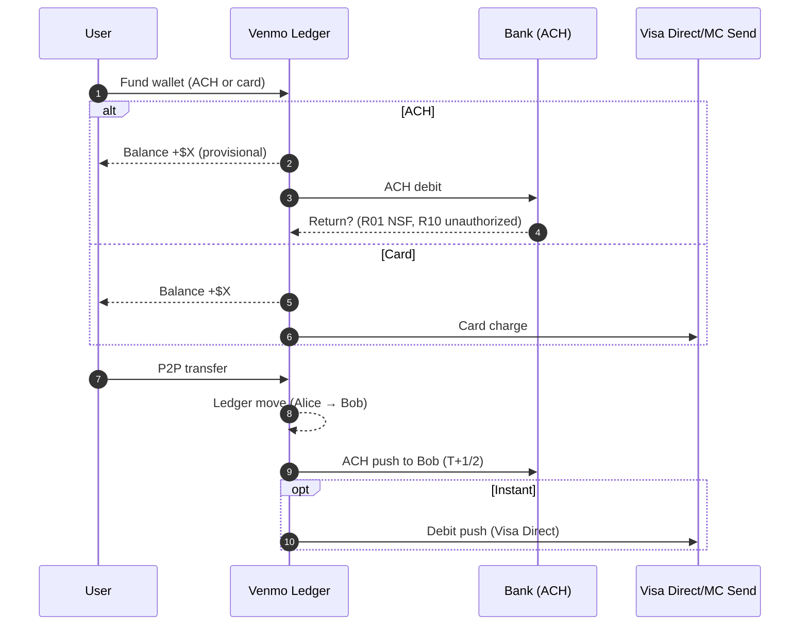
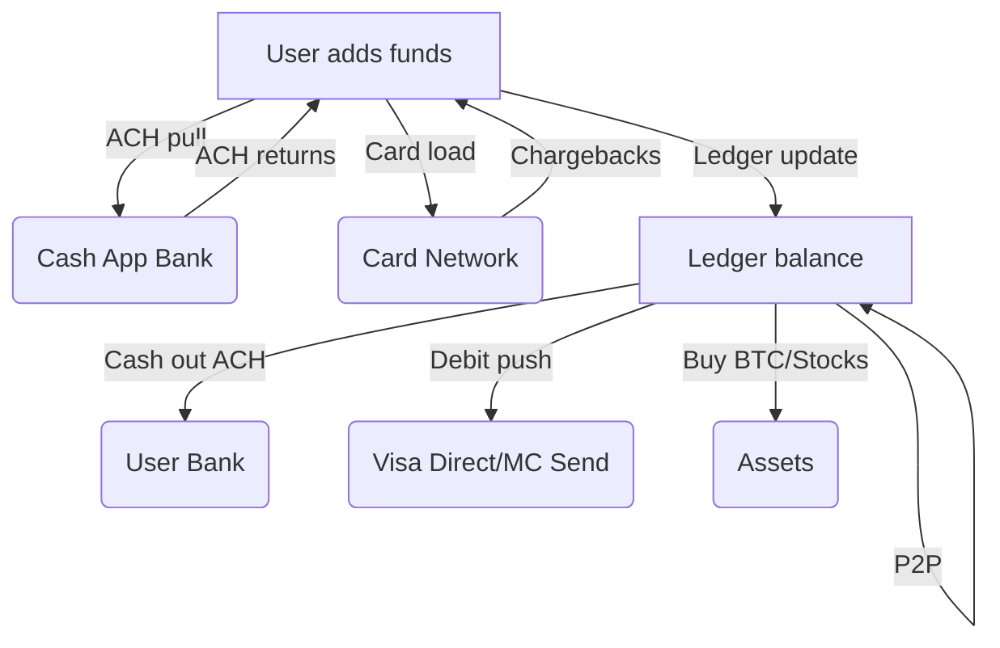
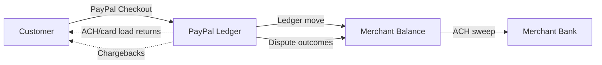
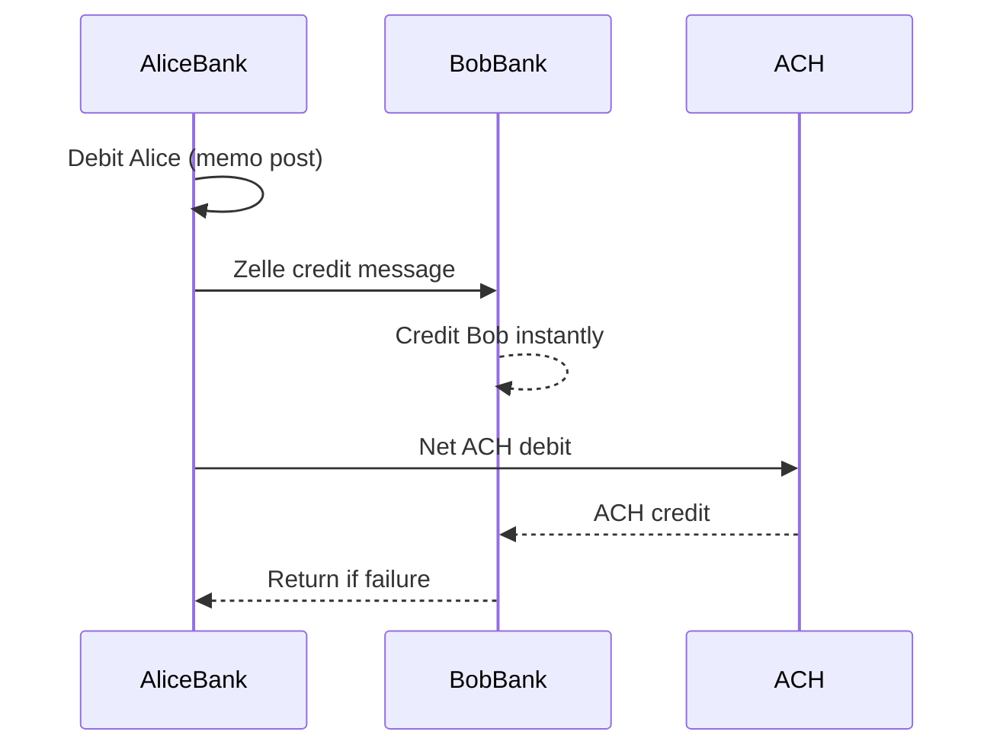
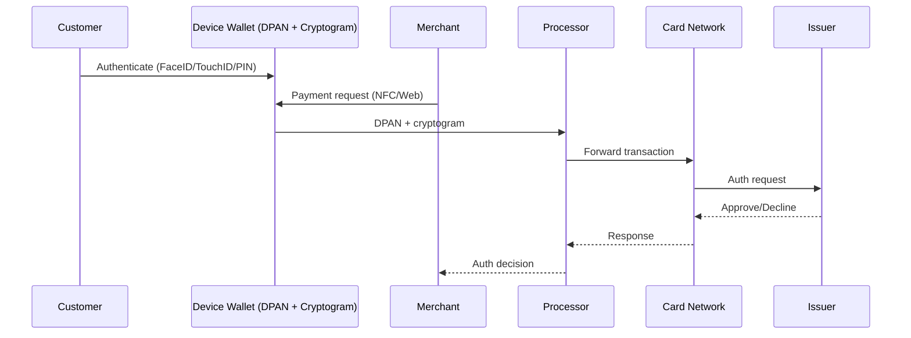

# Wallets & P2P Networks: Venmo, Cash App, PayPal, Zelle

*Published on: September 3, 2025*


### Why This Matters

Consumers think Venmo = cash. Engineers know better: wallets are **ledger-first abstractions** that sit on top of ACH and card rails. If you mistake "instant ledger" for "settled funds," your ops team will bleed.

---

## 1. What Wallets Really Are

- **User mental model:** "Balance in Venmo is mine, now."
- **Reality:** Just a ledger entry inside Venmo's system. Settlement happens later, over ACH or card rails.
- **Revenue:** Wallets monetize via **float, interchange, and fees**.
  - **Float explained:** Funds sitting in wallet provider accounts before being moved to banks. Providers may earn interest or invest them short-term.

---

## 2. Core Flows

### Venmo (ACH/Card → Ledger → Cash-Out)



**Key Insight**: Venmo shows users their balance immediately, but that balance is provisional until ACH settlement completes. If the ACH returns (R01 NSF, R10 unauthorized), Venmo must claw back the provisional balance.

### Cash App (Ledger + Extras: Stocks, BTC)



**Key Insight**: Cash App's multi-asset approach means they're managing not just fiat ledger risk, but also crypto and securities settlement risk. Each asset class has different settlement timelines and failure modes.

### PayPal (Consumer + Merchant Acceptance)



**Key Insight**: PayPal's dual role as both consumer wallet and merchant processor creates complex reconciliation challenges. They must track provisional balances across both sides of the marketplace.

### Zelle (Bank-Embedded)



**Key Insight**: Zelle operates at the bank level, not the wallet level. This means settlement risk is distributed across participating banks rather than concentrated in a single wallet provider.

---

## 3. Rails-Style Integration Sketch

Here's how you might integrate with wallet APIs in a Rails application:

```ruby
class Wallets::VenmoAdapter
  def fund_via_ach(user_id:, amount_cents:, bank_token:)
    post("/funding/ach", { user_id:, amount_cents:, bank_token: })
  rescue => e
    Rails.logger.error("ACH funding failed: #{e.message}")
    raise
  end

  def transfer(from:, to:, amount_cents:)
    post("/transfers", { from:, to:, amount_cents: })
  rescue => e
    Rails.logger.error("P2P transfer error: #{e.message}")
    raise
  end

  def cash_out(user_id:, amount_cents:, instant: false)
    post("/payouts", { user_id:, amount_cents:, rail: instant ? "debit_push" : "ach_push" })
  rescue => e
    Rails.logger.error("Cash-out failed: #{e.message}")
    raise
  end
end
```

**Implementation Notes**:
- Always handle provisional vs. settled states
- Implement proper error handling for ACH returns and card chargebacks
- Track transaction IDs for reconciliation
- Consider implementing webhook handlers for status updates

---

## 4. Apple Pay & Google Pay: Tokenized Cards, Real Money Movement

**Why This Matters**: Apple Pay & Google Pay aren't new rails. They are tokenized UX layers on top of card networks. For engineers, the risk and reconciliation story is exactly card-like — but the tokenization changes how fraud and identity work.

### Flow of a Tokenized Payment



**Key Insight**: The device wallet generates a Device Primary Account Number (DPAN) and cryptogram for each transaction. The DPAN maps back to the user's actual card, but the merchant never sees the real PAN.

### Rails-Style Integration

```ruby
class Payments::ApplePayAdapter
  def authorize(payment_token:, amount_cents:)
    post("/auth", { payment_token:, amount_cents: })
  rescue => e
    Rails.logger.error("Apple Pay auth failed: #{e.message}")
    raise
  end

  def capture(auth_id:)
    post("/capture", { auth_id: })
  rescue => e
    Rails.logger.error("Apple Pay capture failed: #{e.message}")
    raise
  end

  def refund(capture_id:, amount_cents:)
    post("/refund", { capture_id:, amount_cents: })
  rescue => e
    Rails.logger.error("Apple Pay refund failed: #{e.message}")
    raise
  end
end
```

**Implementation Notes**:
- Treat tokenized payments exactly like card payments
- Store DPAN mapping for fraud monitoring
- Validate cryptograms to reduce fraud risk
- Implement standard card dispute handling

---

## 5. Reconciliation vs ACH & Cards

| Flow         | Reconcile Agains t | Risk Tail                                             |
|--------------|--------------------|-------------------------------------------------------|
| ACH load     | ACH trace ID       | Most return 2–5 days (60-day window for unauthorized) |
| Card load    | Processor capture  | Chargebacks (120–540d)                                |
| P2P transfer | Internal ledger    | Irreversible once spent                               |
| Cash-out     | Bank statement     | ACH return / debit push failure                       |

**Key Insight**: Each funding method has different reconciliation requirements and risk profiles. ACH returns can arrive days later, while card chargebacks can take months. P2P transfers are irreversible once spent, creating unique operational challenges.

---

## 6. Risk Management Strategies

1. **Hold provisional balances** for ACH-funded loads until return risk decays
2. **Use velocity checks and limits** on newly funded accounts
3. **Maintain loss reserves** for chargebacks and late returns
4. **Build negative balance recovery flows** (collections or offset against future inflows)

**Implementation Example**:

```ruby
class WalletRiskManager
  def calculate_provisional_hold(amount_cents:, funding_method:)
    case funding_method
    when 'ach'
      # Hold 100% for 5 business days, then 50% for additional 55 days
      { immediate_hold: amount_cents, 
        extended_hold: amount_cents * 0.5,
        hold_duration_days: 60 }
    when 'card'
      # Hold 100% for 120 days (chargeback window)
      { immediate_hold: amount_cents,
        extended_hold: amount_cents,
        hold_duration_days: 120 }
    else
      { immediate_hold: 0, extended_hold: 0, hold_duration_days: 0 }
    end
  end

  def check_velocity_limits(user_id:, amount_cents:)
    recent_transactions = WalletTransaction
      .where(user_id: user_id)
      .where('created_at > ?', 24.hours.ago)
      .sum(:amount_cents)
    
    if recent_transactions + amount_cents > MAX_DAILY_LIMIT
      raise VelocityLimitExceeded.new("Daily limit exceeded")
    end
  end
end
```

---

## 7. Takeaways

 Wallets make payments feel instant, but they don't eliminate the underlying complexity of money movement. Your engineering team must understand both the user experience and the settlement reality to build robust systems.


### For Engineering Leaders

1. **Wallets = UX + ledger wrappers** on existing rails
2. **Engineers must track provisional vs settled funds**
3. **Ops must reconcile wallet reports → bank** while defending against rail-specific disputes
4. Regulatory regimes like **Regulation E** (U.S. P2P) and **PSD2** (EU) frame consumer protections — design your systems to respect them.

### For Product Leaders

1. **User experience is instant, but settlement is not**
2. **Risk management directly impacts user experience**
3. **Compliance requirements vary by funding method**

### For Operations Leaders

1. **Build monitoring for provisional vs settled states**
2. **Implement rail-specific reconciliation processes**
3. **Plan for negative balance recovery scenarios**

---

## 8. Implementation Checklist

- [ ] Implement provisional balance tracking
- [ ] Build ACH return handling
- [ ] Implement card chargeback monitoring
- [ ] Create velocity limit enforcement
- [ ] Build negative balance recovery flows
- [ ] Implement proper transaction ID tracking
- [ ] Create reconciliation reports
- [ ] Build fraud monitoring for tokenized payments

---

### 📖 Acronyms & Terms

- **ACH (Automated Clearing House)**: U\.S\. electronic funds transfer network for batch settlement.
- **DPAN (Device Primary Account Number)**: Tokenized card number used by Apple/Google Pay.
- **Float**: Funds temporarily held by an intermediary \(wallet provider\) before settlement; may earn interest or yield.
- **Ledger\-first**: Updating an internal ledger instantly before external settlement completes.
- **RTP (Real\-Time Payments)**: Instant payment rail operated by The Clearing House.
- **Regulation E**: U\.S\. rule covering electronic fund transfers and consumer protections.
- **PSD2**: EU directive governing payments, authentication, and consumer rights.
- **3DS (3\-D Secure)**: Card authentication protocol for fraud reduction.

---

### 📚 References

1. **FDIC: Prepaid Accounts & Wallets** – [FDIC Consumer Protection on Prepaid/Wallets](https://www.fdic.gov/resources/consumers/banking/prepaid-accounts.html)
2. **Nacha ACH Rules** – [Nacha Operating Rules & Guidelines](https://www.nacha.org/rules)
3. **Visa Direct Overview** – [Visa Direct: Push Payments](https://usa.visa.com/solutions/visa-direct.html)
4. **Mastercard Send** – [Mastercard Send Instant Payment Service](https://www.mastercard.us/en-us/business/overview/send.html)
5. **Consumer Financial Protection Bureau (CFPB): Prepaid & P2P Disputes** – [CFPB Prepaid Rule](https://www.consumerfinance.gov/rules-policy/final-rules/prepaid-accounts-under-the-electronic-fund-transfer-act-regulation-e-and-the-truth-in-lending-act-regulation-z/)
6. **PayPal User Agreement** – [PayPal Legal Agreements](https://www.paypal.com/us/webapps/mpp/ua/legalagreements-full)
7. **Zelle Consumer FAQ** – [Zelle Official Site](https://www.zellepay.com/faq)
8. **EMVCo: Payment Tokenisation** – [EMVCo Payment Tokenisation Specification](https://www.emvco.com/emv-technologies/tokenisation/)
9. **Apple Pay Security and Privacy Overview** – [Apple Pay Official Documentation](https://support.apple.com/en-us/HT203027)
10. **Google Pay Security & Encryption** – [Google Pay Help Center](https://support.google.com/pay/answer/7644138)
11. **PCI DSS Tokenization Guidelines** – [PCI Tokenization Guidelines](https://www.pcisecuritystandards.org/documents/Tokenization_Guidelines_Info_Supplement.pdf)
12. **EMV 3-D Secure 2.0** – [EMV 3DS Protocol & Core Functions](https://www.emvco.com/emv-technologies/3d-secure/)
13. **Visa: Mobile Payment Acceptance** – [Visa Merchant Mobile Acceptance Guide](https://usa.visa.com/run-your-business/accept-visa-payments/mobile-acceptance.html)

---
