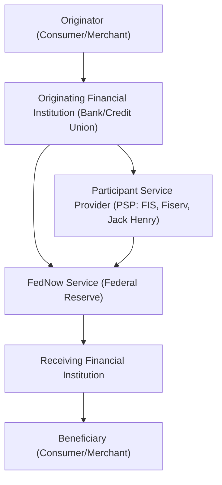

# FedNow: Built by the Fed. Moving Like the Fed

The Federal Reserve's real-time payment rail—government infrastructure meets developer integration challenges.




**Audience:** Backend engineers, fintech architects, payments developers  
**Reading time:** 12 minutes  
**Prerequisites:** Familiarity with ACH, ISO 20022, and real-time payments integration  
**Why now:** FedNow adoption lags behind RTP, yet regulators and community banks are pushing for universal real-time payments. Developers will increasingly be tasked with integrating both.

**TL;DR:**
- FedNow is not fee-free. It charges a $25 monthly participation fee per routing number plus per-transaction fees (e.g., $0.045 for credit transfers), though fees are discounted or waived in 2025.
- The sandbox API endpoint in the example is fictional—developers must use actual Fed sandbox endpoints and documentation.
- Between Jan–Aug 2024, FedNow processed ~414,827 transactions with ~1,000 participating FIs, demonstrating early—but still modest—adoption.
- Fedwire migrated to ISO 20022 on July 14, 2025, adding context to the broader messaging modernization.

⚠️ **Disclaimer:** All scenarios, accounts, names, and data used in examples are not real. They are realistic scenarios provided only for educational and illustrative purposes.

## Problem Definition

**The challenge:** Developers must integrate FedNow into financial institutions already dealing with RTP—or neither—while navigating real-world fee structures, operational considerations, and evolving messaging standards.

**Who faces this:** Fintech engineers, bank developers, platform architects connecting legacy cores to modern payment rails.

**Cost of inaction:** Smaller banks get excluded, developers duplicate integration across non-interoperable rails, and merchants face fragmented payment acceptance.

**Why current solutions fail:** RTP offers speed; FedNow offers access—but costs and interoperability gaps remain unresolved.

## Solution Implementation

### Architecture Overview

FedNow integration requires three layers:

- **Core Banking Layer** — Legacy systems (ACH batch, nightly reconciliation).
- **FedNow Access Layer** — Standardized ISO 20022-based APIs, settlement accounts.
- **Operational Layer** — Compliance, reconciliation, fee monitoring, staff training.



### Step-by-Step: FedNow API Integration

#### Example: Credit Push Payment via FedNow

```python
import requests
import datetime

# NOTE: This endpoint is fictional for demonstration—
# replace with actual Fed sandbox URL from Fed docs.
API_URL = "https://sandbox.fednow.gov/api/v1/payments"

payment_request = {
    "transaction_id": "TXN202509030001",
    "routing_number": "061000052",
    "account_number": "123456789",
    "amount_cents": 12500,
    "transaction_code": "22",
    "individual_name": "JANE DOE",
    "individual_id": "PAY20250903",
    "request_date": datetime.date.today().strftime("%Y%m%d")
}

try:
    response = requests.post(API_URL, json=payment_request, timeout=10)
    response.raise_for_status()
    result = response.json()
    print(f"✅ FedNow Payment Success, Trace: {result['trace_number']}")
except requests.exceptions.RequestException as e:
    print(f"❌ FedNow Payment Failed: {str(e)}")
```

💡 **Tip:** Always clarify that sample endpoints are placeholders—always consult Fed's documentation for real sandbox URLs.

### Pricing Reality Check

- **Participation fee:** $25/month per routing transit number (RTN) that receives credit transfers
- **Transaction fees:**
  - Credit transfers: ~$0.045 each.
  - RFP messages: ~$0.01 each
- **2025 Discounts:** For 2025, the monthly participation fee is waived, and a discount applies to the first 2,500 monthly transactions

### Adoption Metrics (2024)

- **Transactions processed (Jan–Aug 2024):** ~414,827
- **Participating financial institutions:** Grew from ~400 to just under 1,000

### Messaging Modernization Context

FedNow and RTP both use ISO 20022. Meanwhile, Fedwire migrated to ISO 20022 on July 14, 2025. This adds another layer of modernization across U.S. payment rails.

### Integration Challenges Revisited

- **Legacy systems** still prefer batch settlement—it's a cultural and architectural shift.
- **Fee tracking:** Developers must build dashboards to monitor participation, transaction volumes, and fee thresholds.
- **Interoperability:** Without bridges to RTP or Fedwire, dual integration is manual and complex. Consolidated logging and routing logic is essential.
- **Regulatory monitoring:** Real-time fraud detection, audit trails, and trace number logging are mandatory.

❗ **Warning:** Misunderstanding fee structures can lead to unexpected costs, especially during initial rollout beyond the waived 2025 window.

## Validation & Monitoring

**Testing:**
- Use the Fed sandbox environment with ISO 20022 test cases.
- Simulate credit transfers, RFP messages, fee thresholds, and failure paths.

**Key Metrics:**
- Settlement success rate (>99.9%)
- Latency (<10 sec post to customer)
- Fee thresholds (e.g., when 2,500 monthly transactions are exceeded)
- Reconciliation mismatches (FedNow vs. RTP vs. ACH)

**Failure Modes:**
- Exceeding fee thresholds inadvertently.
- Legacy core rejecting real-time posts.
- Fee billing miscalculations.
- Duplicate processing due to retry logic.

ℹ️ **Note:** Track trace numbers from responses—they are essential for reconciliation and dispute resolution.

## Key Takeaways

- FedNow is not fee-free—developers need to plan for ongoing participation and transaction fees.
- Sandbox examples should always clarify placeholder endpoints.
- Adoption is gaining but remains modest—operation scale matters.
- The broader Fed messaging ecosystem shifts to ISO 20022 (Fedwire), making standards awareness critical.
- Dual-rail integration (FedNow + RTP) remains necessary without interoperability.

## Next Steps

1. **Review Fed services pricing docs** – Understand 2025 discounts and prepare for fee reinstatement.
2. **Use Fed sandbox** – Start integration using Fed's real sandbox, not placeholders.
3. **Build fee dashboards** – Monitor RTN participation and transaction tiers.
4. **Normalize ISO 20022 across rails** – Prepare for Fedwire, FedNow, RTP messaging consistency.
5. **Investigate PSP options** – Leverage FIS, Jack Henry, or Fiserv for simplified integration and compliance.

## Acronyms and Terms

- **ACH** — Automated Clearing House
- **FI** — Financial Institution
- **FedNow** — Federal Reserve's real-time payment rail
- **ISO 20022** — Standard messaging format across U.S. payment systems
- **PSP** — Participant Service Provider (e.g., FIS, Fiserv, Jack Henry)
- **RFP** — Request for Payment
- **RTP** — Real-Time Payments (The Clearing House)
- **RTN** — Routing Transit Number

## References

- [FedNow Service 2025 Fee Schedule](https://www.federalregister.gov/documents/2024/12/20/2024-27903/federal-reserve-bank-services-pricing) – Federal Register Pricing, 2024
- [Federal Reserve Board 2025 pricing announcement](https://www.federalreserve.gov/newsevents/pressreleases/other20241220a.htm) – Pricing Effective Jan 1 2025, 2024
- [The Global Treasurer](https://www.theglobaltreasurer.com/2024/12/20/fednow-pricing-2025/) – 2025 Pricing & Adoption Metrics, Dec 2024
- [FedNow participation fee reference](https://www.frbservices.org/financial-services/fednow/participation) – ISG Pricing Overview, 2023
- [ISO 20022 implementation for Fedwire](https://www.frbservices.org/financial-services/fedwire/fedwire-funds-service) – Federal Reserve, single-day go-live July 14 2025
- [Wikipedia](https://en.wikipedia.org/wiki/ISO_20022) – ISO 20022 adoption context, including Fedwire, FedNow, RTP adoption

---
