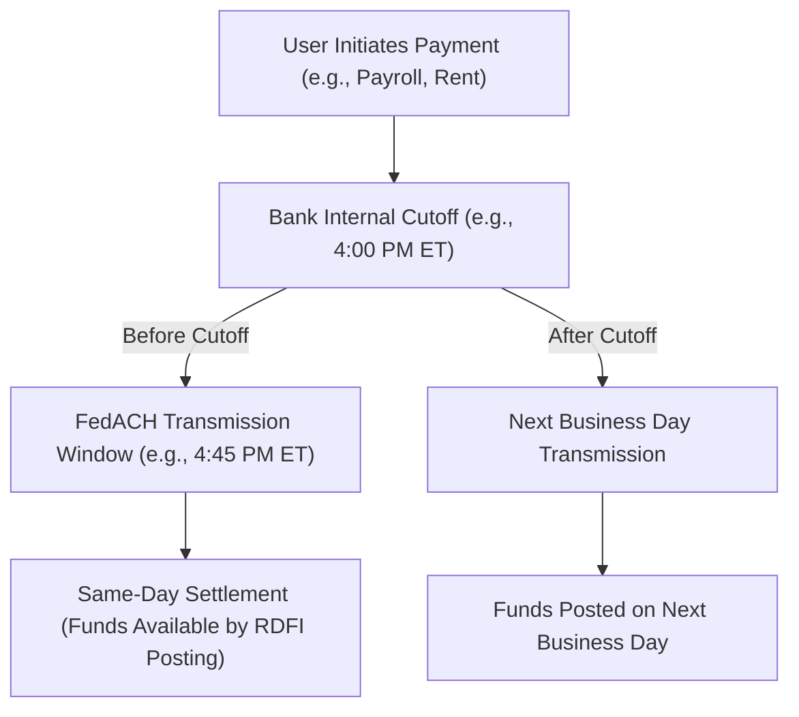

# ACH Cutoffs: The Hidden Clock That Breaks Your UX

*Why "send money today" doesn't always mean it moves today.*




**Audience:** Payments engineers, fintech product managers  
**Reading time:** 9 minutes  
**Prerequisites:** Basic ACH knowledge, awareness of batch settlement windows  
**Why now:** Same-Day ACH volume is crossing \$3T annually, but user frustration remains high due to hidden cutoff times  

> **TL;DR:**
- ACH cutoffs define when a payment makes today’s file vs tomorrow’s. 
- Banks add earlier hidden deadlines, rarely disclosed to users.
- Missing a cutoff shifts a “today” payout to tomorrow (or after weekends).
- Engineers must expose cutoff logic, add weekend/holiday warnings, and route dynamically.

⚠️ **Disclaimer**: All scenarios, accounts, names, and data used in examples are not real. They are realistic scenarios provided only for educational and illustrative purposes.

---

## Problem Definition

**The challenge:** Users expect “instant” money movement, but ACH cutoffs silently delay payments. Missing a 4:00 PM cutoff can mean workers wait three extra days if a weekend intervenes.

**Who faces this:** Fintech apps, payroll platforms, and bill pay providers.

**Cost of inaction:** Lost trust, higher support costs (“Where’s my money?” tickets), and churn to RTP/FedNow competitors.

**Why current solutions fail:** Banks and BaaS providers hide their cutoff logic, leaving product teams blind.

---

## Solution Implementation

### Step 1: Understand ACH Cutoffs

* **FedACH / NACHA Same-Day Windows (as of Sept 2025):**

    * Morning window: \~ **10:30 a.m. ET** transmission deadline
    * Mid-day window: \~ **2:45 p.m. ET** transmission deadline
    * Late-day window: **4:45 p.m. ET** transmission deadline
    * Per-transaction limit: **\$1,000,000**
* **Bank internal cutoffs:** Often 30–60 minutes earlier, and sometimes entire windows are skipped for operational reasons.
* **Processor policies:** Some BaaS providers only use early/mid windows, skipping the late one even if available.

ℹ️ **Note:** These are **transmission deadlines** (when files must be sent to the ACH operator), not guaranteed settlement times at the receiving bank. RDFIs may post later depending on their own processing schedules.

### Step 2: Implement Cutoff-Aware Logic

```javascript
// Improved: find the next available cutoff window
// Adds weekend/holiday handling
defaultHolidays = [
  "2025-01-01", // New Year's Day
  "2025-07-04", // Independence Day
  "2025-12-25"  // Christmas Day
];

function isBusinessDay(date) {
  const day = date.getDay();
  const ymd = date.toISOString().slice(0,10);
  return day !== 0 && day !== 6 && !defaultHolidays.includes(ymd);
}

function nextBusinessDay(date) {
  let d = new Date(date);
  do {
    d.setDate(d.getDate() + 1);
  } while (!isBusinessDay(d));
  return d;
}

function canProcessSameDay(amountCents, currentTime, bankCutoffs) {
  if (!isBusinessDay(currentTime)) return false;

  const nextCutoff = bankCutoffs
    .filter(c => currentTime < c)
    .sort((a, b) => a - b)[0];
  if (!nextCutoff) return false;

  // Assume 15 min processing overhead for realism
  const processingTimeMs = 15 * 60 * 1000;
  return currentTime.getTime() + processingTimeMs < nextCutoff.getTime();
}

// Example usage
const bankCutoffs = [
  new Date("2025-09-15T14:30:00-04:00"), // 2:30 PM ET bank cutoff
  new Date("2025-09-15T16:00:00-04:00")  // 4:00 PM ET bank cutoff
];

console.log(canProcessSameDay(12500, new Date("2025-09-15T14:25:00-04:00"), bankCutoffs)); // ✅ true
console.log(canProcessSameDay(12500, new Date("2025-09-13T14:25:00-04:00"), bankCutoffs)); // ❌ false (Saturday)
```

💡 **Tip:** Extend the holiday calendar with institution-specific non-processing days.

### Step 3: Route to the Best Rail

```javascript
function routePayment(amountCents, urgency, currentTime, bankCutoffs) {
  if (urgency === 'instant' && hasRTPAccess() && amountCents <= 100000000) { // $1M cap
    return 'RTP';
  } else if (canProcessSameDay(amountCents, currentTime, bankCutoffs)) {
    return 'SAME_DAY_ACH';
  } else {
    return 'NEXT_DAY_ACH';
  }
}
```

---

## Validation & Monitoring

### Test Cases

* **Friday 4:30 PM ET submission** → Monday posting (3 days later).
* **Thursday 4:30 PM ET submission** → Friday posting (next day).
* **Holiday eve submission** → Next business day posting.

### Metrics to Track

* % of payments missing cutoff windows.
* Avg settlement delay vs user expectation.
* % of users shown weekend/holiday warnings.

### Failure Modes

❗ **Warning:** Users may interpret “Same-Day ACH” as *instant*. Always clarify in UX copy.

### Troubleshooting

* If payments show “pending” too long, check **processor cutoff policies**.
* If weekend delays surprise users, add **pre-submission warnings**.
* Confirm whether a provider transmits into all three official FedACH windows or only a subset.

---

## Visual: ACH Cutoffs in Action




---

## Takeaways & Next Steps

* **Transparency beats frustration:** Expose cutoff times in UX.
* **Weekend warnings save tickets:** Alert when Monday posting is likely.
* **Dynamic routing matters:** Switch to RTP/FedNow when cutoffs are missed.
* **Cost vs experience trade-off:** Late Same-Day ACH windows cost more but improve UX.
* **Transmission ≠ settlement:** Make clear to teams and users that cutoff deadlines are for file submission, not final fund availability.

**Next Steps for Engineers:**

1. Audit your provider’s cutoff policies and which FedACH windows they actually use.
2. Implement cutoff-aware routing in your payment service.
3. Add proactive UX messaging tied to cutoff windows and settlement delays.

---

## Acronyms and Terms

* **ACH** — Automated Clearing House, U.S. batch payment network.
* **BaaS** — Banking as a Service.
* **EPN** — Electronic Payments Network.
* **FedACH** — Federal Reserve ACH operator.
* **NACHA** — Governing body for ACH.
* **NSF** — Non-Sufficient Funds.
* **OFAC** — Office of Foreign Assets Control.
* **RTP** — Real-Time Payments.
* **T+1** — Settlement one business day after transaction.

---

## References

1. NACHA ACH Volume Stats - [NACHA ACH Volume Statistics, 2024](https://www.nacha.org/rules/ach-operations-bulletins-and-advisories)
2. Fed Payments Study - [Federal Reserve Payments Study Highlights, 2024](https://www.federalreserve.gov/paymentsystems.htm)
3. NACHA Same-Day ACH - [Same-Day ACH Resource Center, 2024](https://www.nacha.org/same-day-ach)
4. FedACH Services - [Federal Reserve ACH Processing Windows, 2024](https://www.frbservices.org)
5. EPN Rules - [The Clearing House EPN ACH Rules and Schedules, 2024](https://www.theclearinghouse.org)
6. Expensify/Mastercard Insights - [ACH and Payments Insights, 2025](https://www.expensify.com)
7. ABA Banking Journal - [ACH and RTP Value Growth, 2024](https://bankingjournal.aba.com)

---
