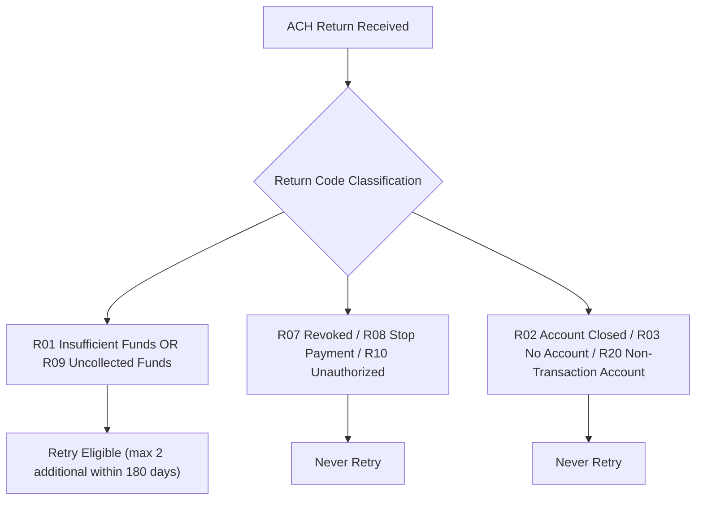

# ACH Retries: Designing a Safe and Compliant Retry Engine
*Why retries are not just a technical decision — they're a regulatory minefield.*  




**For:** Payments engineers, fintech architects, compliance-aware developers  
**Reading Time:** 12 minutes  
**Prerequisites:** Familiarity with ACH basics (ODFI/RDFI, NACHA return codes), Ruby or Python coding skills  
**Why now:** U.S. ACH volumes are at record highs, and CFPB scrutiny is increasing. A retry mistake can mean **CFPB enforcement, NACHA fines, and reputational loss**.  

> **TL;DR:**
>
> * Retries in ACH are **not like HTTP retries** — they’re conditional, regulated, and capped.
> * Only **R01 (NSF)** and **R09 (Uncollected Funds)** are retryable, max **2 additional attempts within 180 days** of the original.
> * A compliant engine must track **POA, revocations, retry counters, and notification logs**.
> * Smart scheduling aligns retries with **pay cycles** and maintains **audit trails** for regulators.

⚠️ **Disclaimer**: All scenarios, accounts, names, and data used in examples are not real. They are realistic scenarios provided only for educational and illustrative purposes.

---

## Problem Definition

**The challenge:** ACH retries are often implemented like API retries — fire until success. But that violates **Reg E**, **NACHA rules**, and customer trust.

**Who faces this:** Any payment originator (lenders, subscription merchants, utilities) that debits customer accounts.

**Cost of inaction:**

* **Regulatory fines** (CFPB settlements regularly exceed \$1M).
* **Class-action lawsuits** (subscription and fitness industries are common targets).
* **Customer churn** when silent or repeated retries feel like fraud.

**Why current approaches fail:** Standard retry libraries don’t encode NACHA/Reg E logic, so teams either over-retry (violating rules) or under-retry (leaving money uncollected).

---

## Reg E, NACHA, and Other Governing Rules

* No reinitiation of **unauthorized debits**.
* Retry only **R01 (Insufficient Funds)** and **R09 (Uncollected Funds)**, max **2 retries within 180 days** of the original entry (3 total attempts).
* Never retry revoked, stopped, or unauthorized debits (R07, R08, R10).
* Include **R20 (Non-Transaction Account)** as non-retryable.
* Maintain **Proof of Authorization (POA)** and revocation logs.
* Consider **UCC Article 4A** for some ACH transactions.
* Review **FFIEC guidance** and state-level consumer protection rules.

ℹ️ **Note:** Retries are **finite, conditional, and consent-bound** — not infinite loops.

---

## The ACH Retry Decision Tree




---

## Solution Implementation: Compliance-First Retry Engine

Here’s how to build a compliant, auditable retry system.

### 1. Return Code Classification

```ruby
RETURN_CODE_CLASSIFICATION = {
  retryable: { 'R01' => 'Insufficient Funds', 'R09' => 'Uncollected Funds' },
  non_retryable: { 'R02' => 'Account Closed', 'R03' => 'No Account',
                   'R07' => 'Authorization Revoked', 'R08' => 'Stop Payment',
                   'R10' => 'Consumer Advises Unauthorized',
                   'R20' => 'Non-Transaction Account' }
}.freeze

def retryable?(code)
  RETURN_CODE_CLASSIFICATION[:retryable].key?(code)
end
```

### 2. Retry Tracking and Limits

```ruby
class RetryTracker
  def initialize(max_retries = 2, retry_window_days = 180)
    @max_retries = max_retries
    @retry_window_days = retry_window_days
    @attempts = {}
  end

  def can_retry?(tx_id, return_code)
    return false unless retryable?(return_code)

    valid_attempts = (@attempts[tx_id] || []).select do |a|
      (Time.now - a[:timestamp]) <= (@retry_window_days * 86400)
    end
    valid_attempts.length < @max_retries
  end

  def record_retry(tx_id)
    @attempts[tx_id] ||= []
    @attempts[tx_id] << { timestamp: Time.now }
  end

  # Ensure retry is within the allowed window
  def validate_retry_window(original_date, retry_date)
    days_elapsed = (retry_date - original_date) / 86400
    days_elapsed <= @retry_window_days
  end
end
```

### 3. POA & Revocation Handling

```ruby
class AuthorizationTracker
  def initialize
    @authorizations = {}
    @revoked = Set.new
  end

  def add_poa(tx_id, customer, amount_cents)
    @authorizations[tx_id] = {
      customer: customer, amount_cents: amount_cents,
      status: 'ACTIVE', created_at: Time.now
    }
  end

  def revoke(tx_id)
    @revoked.add(tx_id)
    if auth = @authorizations[tx_id]
      auth[:status] = 'REVOKED'
      auth[:revoked_at] = Time.now
    end
  end

  def active?(tx_id)
    !@revoked.include?(tx_id)
  end
end
```

💡 **Tip:** Treat revocations as a **kill switch** — stop immediately.

### 4. Smart Scheduling

Retries should align with **paydays** or **known funding dates**, not random intervals.

```ruby
def next_retry_date(initial_date, return_code)
  case return_code
  when 'R01' then initial_date + 2*24*60*60 # retry after 2 days
  when 'R09' then initial_date + 1*24*60*60 # retry after 1 day
  else nil
  end
end
```

### 5. Customer Notifications

```ruby
def notify_retry(customer, amount_cents, retry_date)
  puts "📩  Email to #{customer}: " \
       "We will retry your payment of $#{amount_cents / 100.0} " \
       "on #{retry_date.strftime('%Y-%m-%d')}."
end
```

❗ **Warning:** Silent retries create **CFPB complaints** and chargeback disputes.

---

## Validation & Monitoring

* **Unit Tests:** Simulate R01, R09, R07, R20 to ensure logic blocks invalid retries.
* **Audit Logs:** Store every retry decision (`RETRY`, `NO_RETRY`, `MAX_RETRIES`) with timestamps.
* **Audit Documentation Example:** Keep records of return code, retry count, authorization status, and notification sent. Regulators expect to see this during audits.
* **Metrics to Track:**

    * % of NSF retries that succeed within 2 attempts.
    * Complaint rate (CFPB/chargebacks) per 1,000 retries.
    * Compliance audit log completeness (100%).
* **Failure Modes:**

    * Infinite retries → regulator fines.
    * Retrying revoked → unauthorized transaction liability.
    * Missing notifications → trust erosion.

---

## Takeaways

1. ACH retries are **compliance-first**, not tech-first.
2. Only **R01/R09** can be retried, and only **twice in 180 days** (3 attempts total).
3. Every retry needs **POA, counters, revocation checks, audit logs, and documentation**.
4. Align retries with **pay cycles** — not brute force.
5. Notify customers before retries to preserve **trust and transparency**.
6. Strengthen **audit readiness** with exception handling and regulator-expected logs.

---

## Acronyms & Terms

* **ACH** — Automated Clearing House
* **CFPB** — Consumer Financial Protection Bureau
* **FFIEC** — Federal Financial Institutions Examination Council
* **NACHA** — National Automated Clearing House Association
* **NSF** — Non-Sufficient Funds
* **POA** — Proof of Authorization
* **Reg E** — Regulation E (Electronic Fund Transfer Act)
* **Return Code** — NACHA-defined reason a debit failed
* **UCC Article 4A** — Uniform Commercial Code rules for funds transfers

---

## References

1. NACHA ACH Operating Rules - [NACHA Operating Rules & Guidelines, 2024–2025](https://www.nacha.org/rules/ach-operations-bulletins-and-advisories)
2. CFPB Reg E Guidance - [Electronic Fund Transfers (Regulation E), 12 CFR Part 1005, 2024](https://www.consumerfinance.gov/rules-policy/regulations/1005/)
3. Federal Reserve Compliance Guide - [Compliance Considerations for ACH Originators, 2023](https://www.frbservices.org/resources/resource-centers/ach.html)
4. ABA Banking Journal - [ACH Returns and Retry Risk Management, 2024](https://bankingjournal.aba.com/)
5. UCC Article 4A - [Uniform Commercial Code: Funds Transfers, 2024](https://www.law.cornell.edu/ucc/4A)
6. FFIEC Payments Guidance - [FFIEC Payment System Risk, 2023](https://www.ffiec.gov/)

---